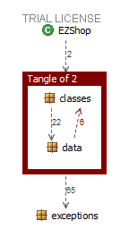

# Design assessment


```
<The goal of this document is to analyse the structure of your project, compare it with the design delivered
on April 30, discuss whether the design could be improved>
```

# Levelized structure map
```
<Applying Structure 101 to your project, version to be delivered on june 4, produce the Levelized structure map,
with all elements explosed, all dependencies, NO tangles; and report it here as a picture>
```


# Structural over complexity chart
```
<Applying Structure 101 to your project, version to be delivered on june 4, produce the structural over complexity chart; and report it here as a picture>
```


# Size metrics

```
<Report here the metrics about the size of your project, collected using Structure 101>
```


| Metric                                    | Measure |
| ----------------------------------------- | ------- |
| Packages                                  |    6    |
| Classes (outer)                           |    50   |
| Classes (all)                             |    65   |
| NI (number of bytecode instructions)      |    8142 |
| LOC (non comment non blank lines of code) |    3501 |


# Items with XS

```
<Report here information about code tangles and fat packages>
```

| Item | Tangled | Fat  | Size | XS   |
| ---- | ------- | ---- | ---- | ---- |
| structural_over_complexity_chart | 19% | 5 | 8142 | 1550 |
| ezshop.ezshop.it.polito.ezshop.classes.TransactionManager.getCreditsAndDebits(java.time.LocalDate, java.time.LocalDate):java.util.List | | 19 | 168 | 35 |
| ezshop.ezshop.it.polito.ezshop.classes.TransactionManager.TransactionManager(it.polito.ezshop.data.EZShop):void | | 16 | 360 | 22 |


# Package level tangles

```
<Report screen captures of the package-level tangles by opening the items in the "composition perspective" 
(double click on the tangle from the Views->Complexity page)>
```

# Summary analysis
```
<Discuss here main differences of the current structure of your project vs the design delivered on April 30>

changes in TransactionManager:
    added TransactionManager --> "*" CreditCard: -cards: Map<String, CreditCard>
    added TransactionManager --> "*" Order: -orders: Map<Integer, Order>
    added TransactionManager --> "*" ReturnTransaction: -returnTransactions: Map<Integer, ReturnTransaction>
    added TransactionManager --> "*" SaleTransaction: -saleTransactions: Map<Integer, SaleTransaction>
    added Shop <-- TransactionManager : -shop:  Shop
    an object instance of TransactionManager now calculates the balance dynamically instead of storing it in a double variable
    
changes in ProductOrderManager:
    added Shop <-- ProductOrderManager : -shop:  Shop

changes in SaleTransaction:    
    added updatePrice method that updates the price field whenever is needed but only if that is not updated by setPrice method
    added SaleTransaction  --> "*" TicketEntry : -entries : ArrayList<TicketEntry>
    added SaleTransaction  --> "*" SaleStatus : -status : SaleStatus
    
changes in ReturnTransaction
    removed ReturnTransaction "*" <- SaleTransaction : -sale: SaleTransaction
    removed ReturnTransaction "*" -> ProductType : -product: ProductType
    added ReturnTransaction --> ReturnStatus: -status: ReturnStatus 
    added ReturnTransaction --> "*" TicketEntry: -entries: List<TicketEntry>
    
structural changes:
    added ReturnStatus enum
    added SaleStatus enum
    added CreditCard class
    Order now has an object instance of Debit instead of extending the Debit class 
    removed class Quantity and each of its dependencies
    added class TicketEntry
    
<Discuss if the current structure shows weaknesses that should be fixed >

Some fixes that could be applied are: 
    The classes TransactionsManager and ProductOrderManager could be merged into one class;
    When an error occurs during the persistance there is no rollback into a consistent state

```
