# Design Document 


Authors: Stefano, Mattia, Nicola, Hossein

Date: 10 May 2021

Version: 3.1


# Contents

- [High level design](#high-level-design)
- [Low level design](#low-level-design)
- [Verification traceability matrix](#verification-traceability-matrix)
- [Verification sequence diagrams](#verification-sequence-diagrams)

# Instructions

The design must satisfy the Official Requirements document, notably functional and non functional requirements

# High level design 

<discuss architectural styles used, if any>

The entire application is based on the MVC architectural pattern, we used Layered style design to divide the GUI from the business logic/data level. The two layers communicate with eachother with a common interface defined by the Façade design pattern.

<report package diagram>

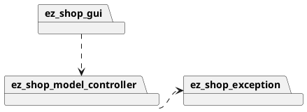


# Low level design

<for each package, report class diagram>


```plantuml

@startuml
scale 0.55
interface EZShopInterface {
    +reset()
    +createUser(username: String, password: String, role: String) : Integer
    +deleteUser(id: Integer): boolean
    +getAllUsers(): List<User>
    +getUser(id: Integer): User
    +updateUserRights(id: Integer, role: String): Boolean


    +login(username: String, password: String): User
    +logout(): boolean

    +createProductType(description: String, productCode: String, pricePerUnit: double, note: String): Integer
    +updateProduct(id: Integer, newDescription: String, newCode: String, newPrice: double, newNote: String): boolean
    +deleteProductType(id: Integer): boolean
    +getAllProductTypes():  List<ProductType>
    +getProductTypeByBarCode(barCode: String): ProductType
    +getProductTypesByDescription(description: String): List<ProductType>

    +updateQuantity(Integer productId, int toBeAdded): boolean
    +updatePosition(Integer productId, String newPos): boolean
    +issueOrder(String productCode, int quantity, double pricePerUnit): Integer
    +payOrderFor(String productCode, int quantity, double pricePerUnit): Integer
    +payOrder(Integer orderId): boolean
    +recordOrderArrival(Integer orderId): boolean
    +getAllOrders(): List<Order> 

    +defineCustomer(customerName: String): Customer
    +modifyCustomer(id: Integer, newCustomerName: String, newCustomerCard): boolean
    +deleteCustomer(id: Integer): boolean
    +getCustomer(id : Integer): Customer
    +getAllCustomers(): List<Customer>

    +createCard(): String
    +attachCardToCustomer(customerCard: String, customerId: String ): boolean
    +modifyPointsOnCard(customerCard: String, pointsToBeAdded: Integer): boolean

    +startSaleTransaction() : Integer
    +addProductToSale(transactionId: Integer, productCode: String, amount: Integer): boolean
    +deleteProductFromSale(transactionId: Integer, productCode: String, amount: Integer): boolean
    +applyDiscountRateToProduct(transactionId: Integer, productCode: String, discountRate: double): boolean
    +applyDiscountRateToSale(transactionId: Integer, discountRate: double) : boolean
    +computePointsForSale(transactionId: Integer): int
    +endSaleTransaction(transactionId: Integer): boolean
    +deleteSaleTransaction(transactionId: Integer) : boolean
    +getSaleTransaction(transactionId: Integer): boolean
    +startReturnTransaction(transactionId: Integer): Integer
    +returnProduct(returnId : Integer, productCode: String, amount: int): boolean
    +endReturnTransaction(returnId : Integer, commit: boolean): boolean
    +deleteReturnTransaction(returnId: Integer): boolean
    +receiveCashPayment(transactionId: Integer, cash: double): double
    +receiveCreditCardPayment(transactionId: Integer, creditCard: String): boolean
    +returnCashPayment(returnId: Integer): double
    +returnCreditCardPayment(returnId: Integer, creditCard: String): double

    +recordBalanceUpdate(toBeAdded: double): boolean
    +getCreditsAndDebits(from: LocalDate, to: LocalDate): List<BalanceOperation>
    +computeBalance(): double
}



class Shop {
    +addOrder(order: Order): boolean
}

Shop.|>EZShopInterface

class UserManager{
    -userIdGen: Integer
    -loggedUser: User
    
    +createUser(username: String, password: String, role: String) : Integer
    +deleteUser(id: Integer) : Boolean
    +getAllUsers() : List<User>
    +getUser(id: Integer) : User
    +updateUserRights(id: Integer, role: String) : Boolean
    +login(username: String, password: String) : User
    +logout() : boolean
    +clear()

    +getLoggedUser() : User
}

class User {
    
    -id: Integer
    -username: String
    -password: String
}
note right : Persistent

enum UserRole{
    CASHIER
    SHOP_MANAGER
    ADMINISTRATOR
}

enum ReturnStatus{
    NEW
    CLOSED
    ENDED
}

UserRole <- User : -role: UserRole

class Customer {
    -id: Integer
    -customerName: String
}

note right : Persistent

LoyaltyCard "0..1" <- Customer: -loyaltyCard: LoyaltyCard

class LoyaltyCard {
    -cardCode: String
    -points: Integer
    -isAttached: boolean
}
note left : Persistent

UserManager -->"*" User: -userList: ArrayList<User>
Customer "*"<-- CustomerManager: -customerMap: HashMap<Integer, Customer>
LoyaltyCard "*"<-- CustomerManager: -cardMap: HashMap<String, LoyaltyCard>

class CustomerManager {
    -customerIdGen: Integer
    -loyaltyCardIdGen: long

    +defineCustomer(customerName: String): Customer
    +modifyCustomer(id: Integer, newCustomerName: String, newCustomerCard): boolean
    +deleteCustomer(id: Integer): boolean
    +getCustomer(id : Integer): Customer
    +getAllCustomers(): List<Customer>
    +createCard(): String
    +attachCardToCustomer(customerCard: String, customerId: String ): boolean
    +modifyPointsOnCard(customerCard: String, pointsToBeAdded: Integer): boolean
    +clear()
}


class ProductOrderManager {

    -productIdGen: Integer
    -orderIdGen: Integer
    
    +checkBarcode(barCode: String): boolean

    +createProductType(description: String, productCode: String, pricePerUnit: double, note: String): Integer
    +updateProduct(id: Integer, newDescription: String, newCode: String, newPrice: double, newNote: String): boolean
    +deleteProductType(id: Integer): boolean
    +getAllProductTypes():  List<ProductType>
    +getProductTypeByBarCode(barCode: String): ProductType
    +getProductTypesByDescription(description: String): List<ProductType>

    +updateQuantity(Integer productId, int toBeAdded): boolean
    +updatePosition(Integer productId, String newPos): boolean

    +issueOrder(String productCode, int quantity, double pricePerUnit): Integer
    +payOrderFor(String productCode, int quantity, double pricePerUnit): Integer
    
    +payOrder(Integer orderId): boolean
    +recordOrderArrival(Integer orderId): boolean
    
    +clear()

}

ProductOrderManager -->"*" ProductType: -productMap: HashMap<String, ProductType>

class TransactionManager {
    +startSaleTransaction() : Integer
    +addProductToSale(transactionId: Integer, productCode: String, amount: Integer): boolean
    +deleteProductFromSale(transactionId: Integer, productCode: String, amount: Integer): boolean
    +applyDiscountRateToProduct(transactionId: Integer, productCode: String, discountRate: double): boolean
    +applyDiscountRateToSale(transactionId: Integer, discountRate: double) : boolean
    +computePointsForSale(transactionId: Integer): int
    +endSaleTransaction(transactionId: Integer): boolean
    +deleteSaleTransaction(transactionId: Integer) : boolean
    +getSaleTransaction(transactionId: Integer): boolean
    +startReturnTransaction(transactionId: Integer): Integer
    +returnProduct(returnId : Integer, productCode: String, amount: int): boolean
    +endReturnTransaction(returnId : Integer, commit: boolean): boolean
    +deleteReturnTransaction(returnId: Integer): boolean
    +receiveCashPayment(transactionId: Integer, cash: double): double
    +receiveCreditCardPayment(transactionId: Integer, creditCard: String): boolean
    +returnCashPayment(returnId: Integer): double
    +returnCreditCardPayment(returnId: Integer, creditCard: String): double
    +recordBalanceUpdate ( double toBeAdded) : boolean
    +getCreditsAndDebits(from: LocalDate, to: LocalDate): List<BalanceOperation>
    +computeBalance(): double
    +getAllOrders(): List<Order>

    +luhnAlgorithm (String creditCard): boolean
    +clear()
     
    +getReturnTransaction(transactionId: Integer): ReturnTransaction
    +addCompletedOrder(orderId: Integer): Order
    +addOrder(order: Order): boolean
}
note right : Persistent

TransactionManager --> "*" BalanceOperation: -operationMap: HashMap<Integer, BlanceOperation>

Shop --> UserManager : -userManager:  UserManager
Shop --> CustomerManager : -customerManager: CustomerManager
Shop --> ProductOrderManager : -productOrderManager: ProductOrderManager
Shop --> TransactionManager : -transactionManager: TransactionManager

Shop <-- UserManager : -shop:  Shop
Shop <-- CustomerManager : -shop:  Shop
Shop <-- ProductOrderManager : -shop:  Shop
Shop <-- TransactionManager : -shop:  Shop


class Credit 
class Debit

Credit --|> BalanceOperation
Debit --|> BalanceOperation

abstract BalanceOperation {
    
    -id: int
    -description: String
    -amount: double
    -date: LocalDate
    
}
note right : Persistent
class Order{
    -orderId: Integer
    -supplier: String
    -pricePerUnit: double
    -quantity: Integer
}
note left : Persistent


enum OrderStatus{
    ISSUED
    PAYED
    COMPLETED
}

Order -> OrderStatus : -status: OrderStatus

Order --> Debit
ReturnTransaction --|> Debit

class ProductType {
    -id: Integer
    -barCode: String

    -description: String
    -sellPrice: double
    -discountRate: double
    -notes: String
    -amount: int
}
note left : Persistent


class Position {
    -aisleID: Integer
    -rackID: Integer
    -levelID: Integer
}
note right : Persistent


ProductType ->"0..1" Position: -position: Position


class SaleTransaction {
    -paymentType : String
    -discountRate : double
    -state: boolean
    updatePrice()
    deleteEntry(entry: TicketEntry)
    addEntry(entry: TicketEntry)
    addProduct(p: ProductType, quantity : Integer) : boolean
    
}
note right: Persistent

SaleTransaction  --> "*" TicketEntry : -productList : ArrayList<TicketEntry>


SaleTransaction -|> Credit

class TicketEntry {
    -  barCode: String
    -  productDescription : String
    - amount: int 
    -  pricePerUnit: double
    -  discountRate: double
}
note right : Persistent



SaleTransaction "*" --> "0..1" LoyaltyCard: -loyaltyCard: LoyaltyCard

Order "*" -> ProductType: -product: ProductType

class ReturnTransaction {
  -quantity
}
ReturnTransaction --> ReturnStatus: -status: ReturnStatus 

ReturnTransaction "*" <- SaleTransaction : -sale: SaleTransaction
ReturnTransaction "*" -> ProductType : -product: ProductType

@enduml

```

# Verification traceability matrix

\<for each functional requirement from the requirement document, list which classes concur to implement it>


|       | Shop  |  CustomerManager |  UserManager |  TransactionManager  | ProductOrderManager | User | Product | Order | Customer | LoyaltyCard | SaleTransaction | ReturnTransaction |
|-------|-------|------------------|--------------|----------------------|---------------------| ---- | ------- | ----- | -------- | ----------- | --------------- | ----------------- |
| FR1.1 |   x   |                  |       x      |                      |                     |  x   |         |       |          |             |                 |                   |
| FR1.2 |   x   |                  |       x      |                      |                     |  x   |         |       |          |             |                 |                   |
| FR1.3 |   x   |                  |       x      |                      |                     |  x   |         |       |          |             |                 |                   |
| FR1.4 |   x   |                  |       x      |                      |                     |  x   |         |       |          |             |                 |                   |
| FR1.5 |   x   |                  |       x      |                      |                     |  x   |         |       |          |             |                 |                   |
| FR3.1 |   x   |                  |              |                      |         x           |      |    x    |       |          |             |                 |                   |
| FR3.2 |   x   |                  |              |                      |         x           |      |    x    |       |          |             |                 |                   |
| FR3.3 |   x   |                  |              |                      |         x           |      |    x    |       |          |             |                 |                   |
| FR3.4 |   x   |                  |              |                      |         x           |      |    x    |       |          |             |                 |                   |
| FR4.1 |   x   |                  |              |                      |         x           |      |    x    |       |          |             |                 |                   |
| FR4.2 |   x   |                  |              |                      |         x           |      |    x    |       |          |             |                 |                   |
| FR4.3 |   x   |                  |              |         x            |         x           |      |    x    |   x   |          |             |                 |                   |
| FR4.4 |   x   |                  |              |         x            |         x           |      |    x    |   x   |          |             |                 |                   |
| FR4.5 |   x   |                  |              |         x            |         x           |      |         |   x   |          |             |                 |                   |
| FR4.6 |   x   |                  |              |         x            |         x           |      |         |   x   |          |             |                 |                   |
| FR4.7 |   x   |                  |              |         x            |                     |      |         |   x   |          |             |                 |                   |
| FR5.1 |   x   |        x         |              |                      |                     |      |         |       |    x     |             |                 |                   |
| FR5.2 |   x   |        x         |              |                      |                     |      |         |       |    x     |             |                 |                   |
| FR5.3 |   x   |        x         |              |                      |                     |      |         |       |    x     |             |                 |                   |
| FR5.4 |   x   |        x         |              |                      |                     |      |         |       |    x     |             |                 |                   |
| FR5.5 |   x   |        x         |              |                      |                     |      |         |       |          |      x      |                 |                   |
| FR5.6 |   x   |        x         |              |                      |                     |      |         |       |    x     |      x      |                 |                   |
| FR5.7 |   x   |        x         |              |                      |                     |      |         |       |          |      x      |                 |                   |
| FR6.1 |   x   |                  |              |         x            |         x           |      |         |       |          |             |       x         |                   |
| FR6.2 |   x   |                  |              |         x            |         x           |      |    x    |       |          |             |       x         |                   |
| FR6.3 |   x   |                  |              |         x            |                     |      |    x    |       |          |             |       x         |                   |
| FR6.4 |   x   |                  |              |         x            |                     |      |         |       |          |             |       x         |                   |
| FR6.5 |   x   |                  |              |         x            |                     |      |    x    |       |          |             |       x         |                   |
| FR6.6 |   x   |                  |              |         x            |                     |      |         |       |          |             |       x         |                   |
| FR6.7 |   x   |                  |              |         x            |         x           |      |    x    |       |          |             |       x         |                   |
| FR6.8 |       |                  |              |                      |                     |      |         |       |          |             |                 |                   |
| FR6.10 |  x   |                  |              |         x            |                     |      |         |       |          |             |       x         |                   |
| FR6.11 |  x   |                  |              |         x            |         x           |      |    x    |       |          |             |       x         |                   |
| FR6.12 |  x   |                  |              |         x            |                     |      |         |       |          |             |                 |        x          |
| FR6.13 |  x   |                  |              |         x            |         x           |      |    x    |       |          |             |       x         |        x          |
| FR6.14 |  x   |                  |              |         x            |                     |      |         |       |          |             |                 |        x          |
| FR6.15 |  x   |                  |              |         x            |         x           |      |    x    |       |          |             |                 |        x          |
| FR7.1 |   x   |                  |              |         x            |                     |      |         |       |          |             |                 |                   |
| FR7.2 |   x   |                  |              |         x            |                     |      |         |       |          |             |                 |                   |
| FR7.3 |   x   |                  |              |         x            |                     |      |         |       |          |             |                 |                   |
| FR7.4 |   x   |                  |              |         x            |                     |      |         |       |          |             |                 |                   |
| FR8.1 |   x   |                  |              |         x            |                     |      |         |       |          |             |                 |                   |
| FR8.2 |   x   |                  |              |         x            |                     |      |         |       |          |             |                 |                   |
| FR8.3 |   x   |                  |              |         x            |                     |      |         |   x   |          |             |       x         |        x          |
| FR8.4 |   x   |                  |              |         x            |                     |      |         |       |          |             |                 |                   |


 # Verification sequence diagrams 
\<select key scenarios from the requirement document. For each of them define a sequence diagram showing that the scenario can be implemented by the classes and methods in the design>

## Scenario 1.1
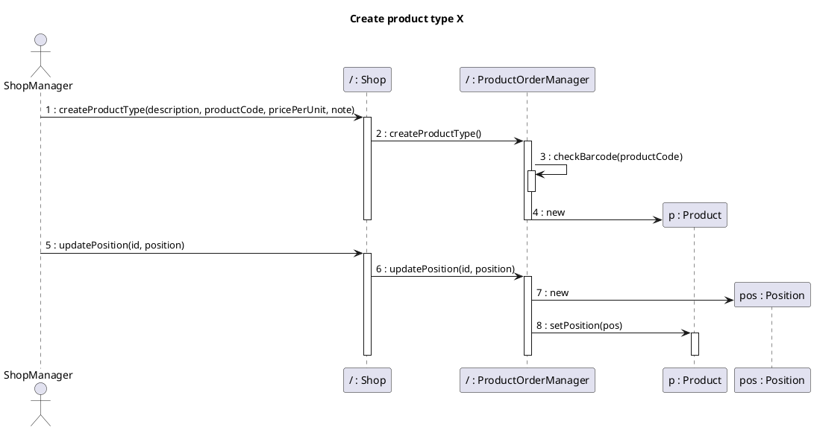

## Scenario 1.2
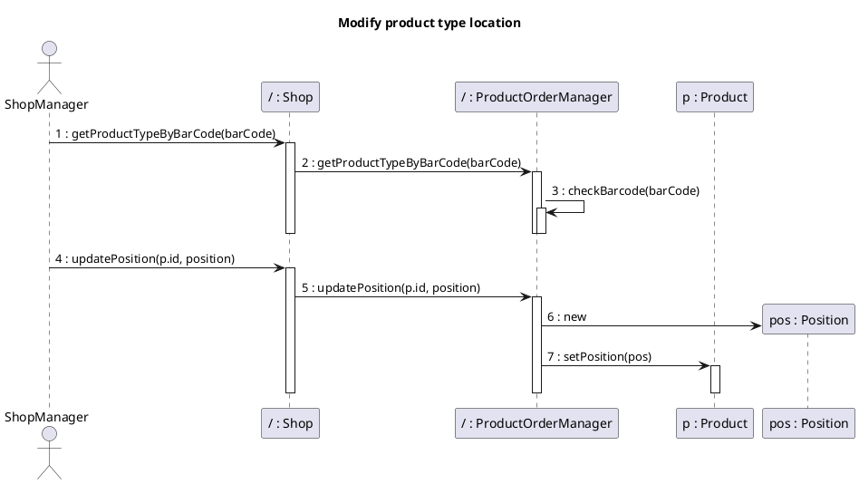

## Scenario 1.3
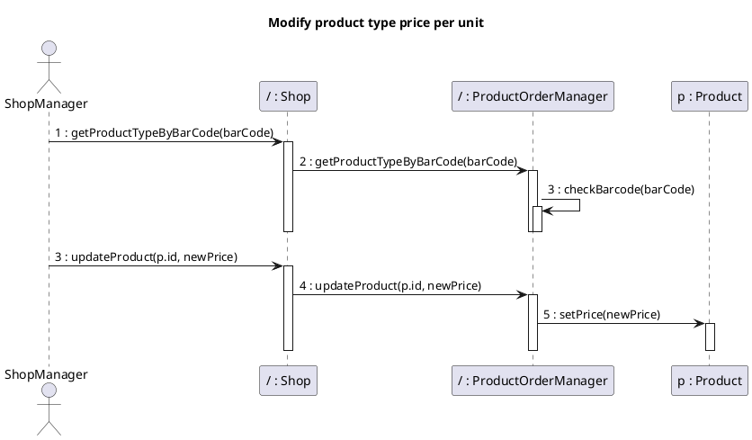

## Scenario 2.1
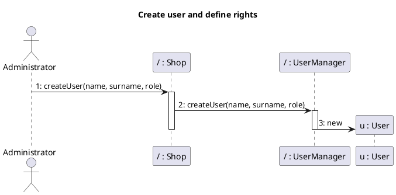
## Scenario 2.2
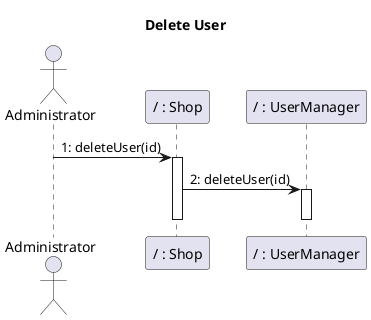
## Scenario 2.3
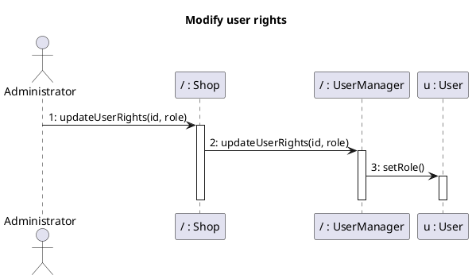
## Scenario 3.1
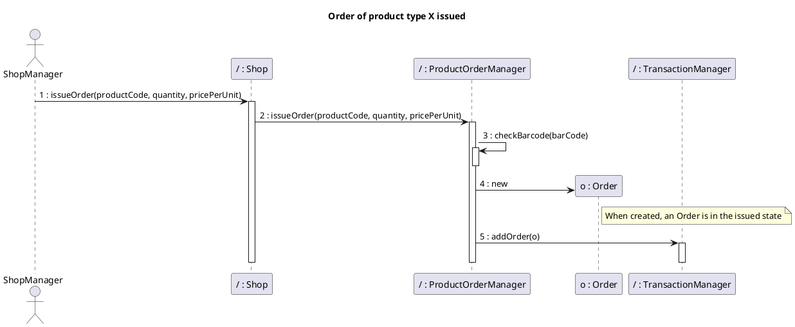
## Scenario 3.2
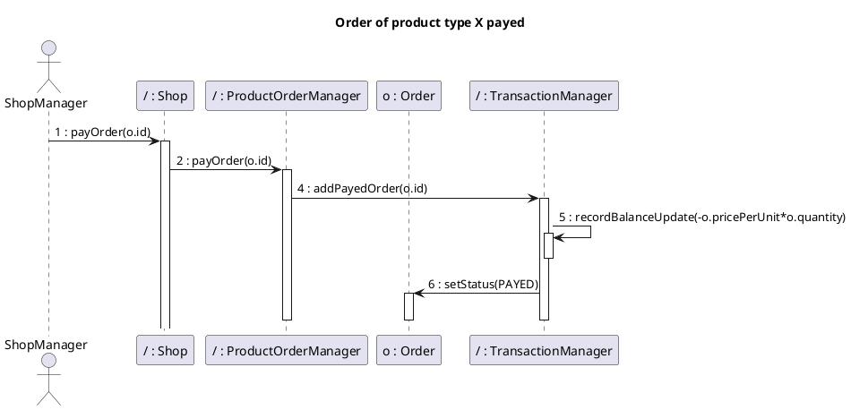
## Scenario 3.3
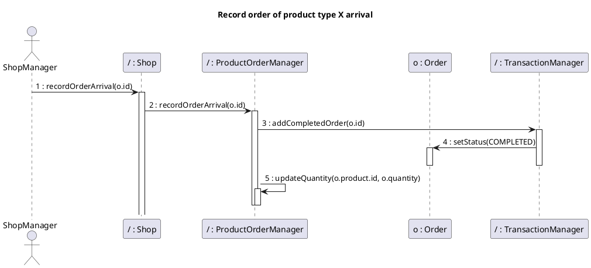

## Scenario 4.1
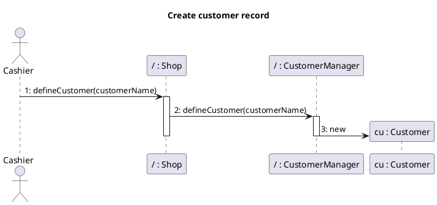

## Scenario 4.2
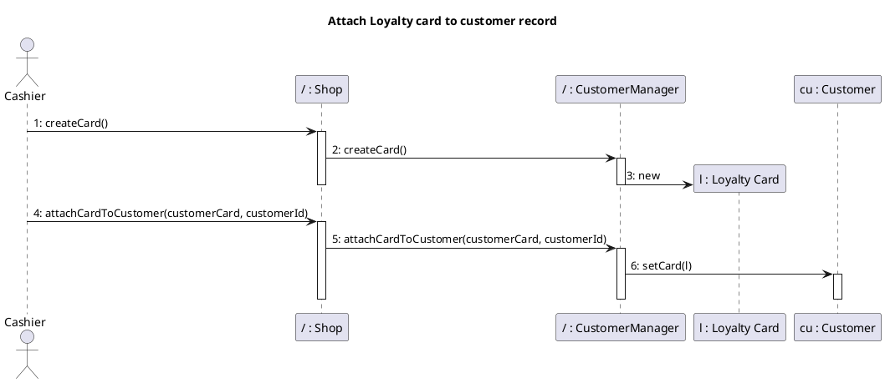
## Scenario 4.3
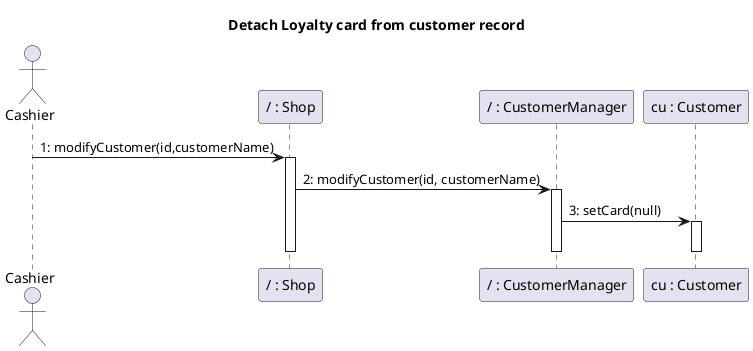

## Scenario 4.4

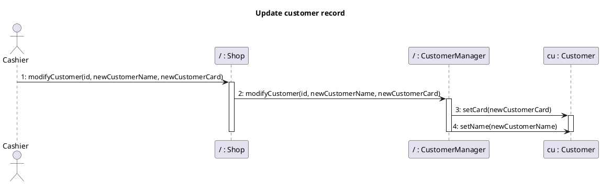


## Scenario 5.1
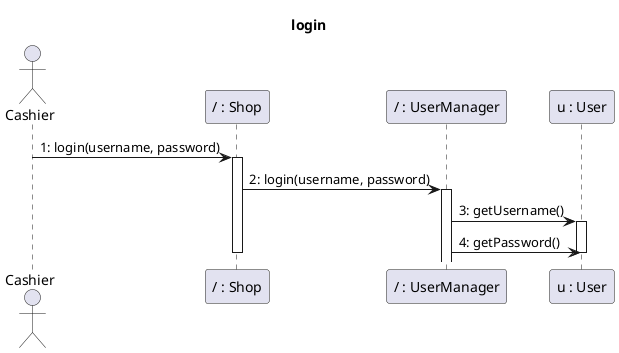

## Scenario 5.2
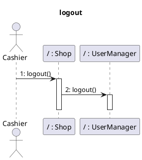


## Scenario 6.1
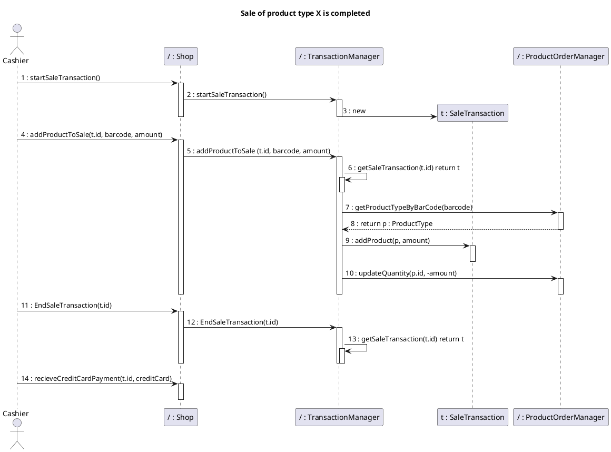


## Scenario 6.2
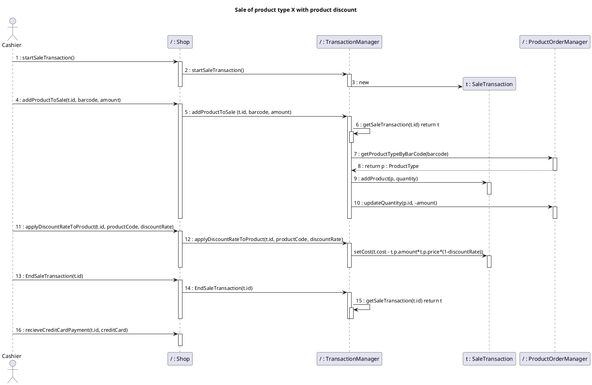


## Scenario 6.3
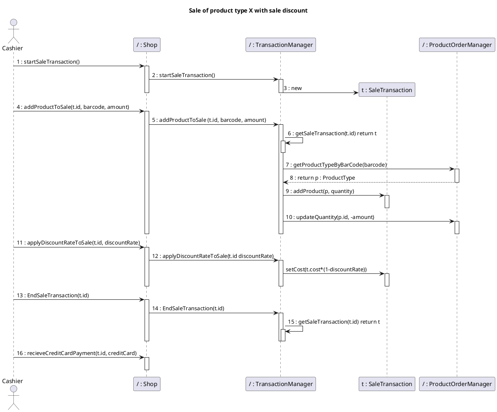


## Scenario 6.4
```plantuml
@startuml

title
Sale of product type X with Loyalty Card update
end title

actor Cashier

participant "/ : Shop" as Shop
participant "/ : TransactionManager" as TransactionManager
participant "t : SaleTransaction"  as SaleTransaction
participant "/ : ProductOrderManager" as ProductOrderManager
participant "/ : CustomerManager" as CustomerManager

Cashier -> Shop: 1 : startSaleTransaction()
activate Shop
Shop -> TransactionManager : 2 : startSaleTransaction()
activate TransactionManager
create SaleTransaction
TransactionManager -> SaleTransaction: 3 : new
deactivate TransactionManager
deactivate Shop
Cashier -> Shop : 4 : addProductToSale(t.id, barcode, amount)
activate Shop
Shop -> TransactionManager: 5 : addProductToSale (t.id, barcode, amount)
 

activate TransactionManager
TransactionManager -> TransactionManager: 6 : getSaleTransaction(t.id) return t
activate TransactionManager
deactivate TransactionManager
TransactionManager -> ProductOrderManager: 7 : getProductTypeByBarCode(barcode)
activate ProductOrderManager


TransactionManager <-- ProductOrderManager : 8 : return p : ProductType
deactivate ProductOrderManager

TransactionManager -> SaleTransaction : 9 : addProduct(p, amount)
activate SaleTransaction
deactivate SaleTransaction
TransactionManager -> ProductOrderManager: 10 : updateQuantity(p.id, -amount)
activate ProductOrderManager
deactivate ProductOrderManager
deactivate TransactionManager
deactivate Shop
Cashier -> Shop : 11 : EndSaleTransaction(t.id)
activate Shop
Shop -> TransactionManager : 12 : EndSaleTransaction(t.id)
activate TransactionManager
TransactionManager -> TransactionManager : 13 : getSaleTransaction(t.id) return t
activate TransactionManager
deactivate TransactionManager
deactivate TransactionManager
deactivate Shop

Cashier -> Shop : 14 : recieveCreditCardPayment(t.id, creditCard)
activate Shop
deactivate Shop

Cashier -> Shop : 15 : computePointsForSale(t.id)
activate Shop
Shop -> TransactionManager : 16 :computePointsForSale(t.id)
activate TransactionManager
TransactionManager --> Shop : 17 : points : integer
deactivate TransactionManager
Shop --> Cashier : 18 : points : integer
deactivate Shop
Cashier -> Shop : 19 : modifyPointsOnCard(customerCard, points)
activate Shop
Shop -> CustomerManager : 20 : modifyPointsOnCard(customerCard, points)
activate CustomerManager
deactivate CustomerManager
deactivate Shop

@enduml
```


## Scenario 6.5
```plantuml
@startuml

title
Sale of product type X cancelled
end title

actor Cashier

participant "/ : Shop" as Shop
participant "/ : TransactionManager" as TransactionManager
participant "t : SaleTransaction"  as SaleTransaction
participant "/ : ProductOrderManager" as ProductOrderManager

Cashier -> Shop: 1 : startSaleTransaction()
activate Shop
Shop -> TransactionManager : 2 : startSaleTransaction()
activate TransactionManager
create SaleTransaction
TransactionManager -> SaleTransaction: 3 : new
deactivate TransactionManager
deactivate Shop
Cashier -> Shop : 4 : addProductToSale(t.id, barcode, amount)
activate Shop
Shop -> TransactionManager: 5 : addProductToSale (t.id, barcode, amount)
 

activate TransactionManager
TransactionManager -> TransactionManager: 6 : getSaleTransaction(t.id) return t
activate TransactionManager
deactivate TransactionManager
TransactionManager -> ProductOrderManager: 7 : getProductTypeByBarCode(barcode)
activate ProductOrderManager


TransactionManager <-- ProductOrderManager : 8 : return p : ProductType
deactivate ProductOrderManager

TransactionManager -> SaleTransaction : 9 : addProduct(p, amount)
activate SaleTransaction
deactivate SaleTransaction
TransactionManager -> ProductOrderManager: 10 : updateQuantity(p.id, -amount)
activate ProductOrderManager
deactivate ProductOrderManager
deactivate TransactionManager
deactivate Shop
Cashier -> Shop : 11 : EndSaleTransaction(t.id)
activate Shop
Shop -> TransactionManager : 12 : EndSaleTransaction(t.id)
activate TransactionManager
TransactionManager -> TransactionManager : 13 : getSaleTransaction(t.id) return t
activate TransactionManager
deactivate TransactionManager
deactivate TransactionManager
deactivate Shop
Cashier -> Shop : 14 : deleteSaleTransaction(t.id)
activate Shop
Shop -> TransactionManager : 15 : deleteSaleTransaction(t.id)
activate TransactionManager
TransactionManager -> ProductOrderManager : 16 : updateQuantity(p.id, amount)
activate ProductOrderManager
deactivate ProductOrderManager
deactivate TransactionManager
deactivate Shop

@enduml
```


## Scenario 6.6
```plantuml
@startuml

title
Sale of product type X completed (Cash)
end title

actor Cashier

participant "/ : Shop" as Shop
participant "/ : TransactionManager" as TransactionManager
participant "t : SaleTransaction"  as SaleTransaction
participant "/ : ProductOrderManager" as ProductOrderManager

Cashier -> Shop: 1 : startSaleTransaction()
activate Shop
Shop -> TransactionManager : 2 : startSaleTransaction()
activate TransactionManager
create SaleTransaction
TransactionManager -> SaleTransaction: 3 : new
deactivate TransactionManager
deactivate Shop
Cashier -> Shop : 4 : addProductToSale(t.id, barcode, amount)
activate Shop
Shop -> TransactionManager: 5 : addProductToSale (t.id, barcode, amount)
 

activate TransactionManager
TransactionManager -> TransactionManager: 6 : getSaleTransaction(t.id) return t
activate TransactionManager
deactivate TransactionManager
TransactionManager -> ProductOrderManager: 7 : getProductTypeByBarCode(barcode)
activate ProductOrderManager


TransactionManager <-- ProductOrderManager : 8 : return p : ProductType
deactivate ProductOrderManager

TransactionManager -> SaleTransaction : 9 : addProduct(p, amount)
activate SaleTransaction
deactivate SaleTransaction
TransactionManager -> ProductOrderManager: 10 : updateQuantity(p.id, -amount)
activate ProductOrderManager
deactivate ProductOrderManager
deactivate TransactionManager
deactivate Shop
Cashier -> Shop : 11 : EndSaleTransaction(t.id)
activate Shop
Shop -> TransactionManager : 12 : EndSaleTransaction(t.id)
activate TransactionManager
TransactionManager -> TransactionManager : 13 : getSaleTransaction(t.id) return t
activate TransactionManager
deactivate TransactionManager
deactivate TransactionManager
deactivate Shop

Cashier -> Shop : 14 : recieveCashPayment(t.id, cash)
activate Shop
deactivate Shop

@enduml
```

## Scenario 7.1
```plantuml
@startuml

title
Manage payment by valid credit card
end title

actor Cashier
participant "/ : Shop" as Shop
participant "/ : TransactionManager" as TransactionManager
participant "/ : BalanceOperation" as BalanceOperation
Cashier -> Shop:1 receiveCreditCardPayment(Integer transactionId, String creditCard)
activate Shop
Shop -> TransactionManager:2 receiveCreditCardPayment(Integer transactionId, String creditCard)
deactivate Shop
activate TransactionManager
TransactionManager -> TransactionManager:3 luhnAlgorithm(String creditCard)
note right: Card validated
activate TransactionManager
deactivate TransactionManager
TransactionManager -> TransactionManager:4 getSaleTransaction(transactionId: Integer)
activate TransactionManager
TransactionManager -> BalanceOperation :5 getAmount()
activate BalanceOperation
deactivate BalanceOperation
deactivate TransactionManager
TransactionManager -> TransactionManager:6 checkCreditCardBalance(String creditCard)
note right: balance is sufficient
activate TransactionManager
deactivate TransactionManager
TransactionManager -> TransactionManager:7 recordBalanceUpdate(double toBeAdded)
activate TransactionManager
deactivate TransactionManager
deactivate TransactionManager
@enduml
```

## Scenario 7.2
```plantuml
@startuml

title
Manage payment by invalid credit card
end title


actor Cashier
participant "/ : Shop" as Shop
participant "/ : TransactionManager" as TransactionManager
Cashier -> Shop:1 receiveCreditCardPayment(Integer transactionId, String creditCard)
activate Shop
Shop -> TransactionManager:2 receiveCreditCardPayment(Integer transactionId, String creditCard)
deactivate Shop
activate TransactionManager
TransactionManager -> TransactionManager:3 luhnAlgorithm(String creditCard)
note right: Card NOT validated
activate TransactionManager
deactivate TransactionManager
deactivate TransactionManager
@enduml
```


## Scenario 7.3
```plantuml
@startuml

title
Manage credit card payment with not enough credit
end title


actor Cashier
participant "/ : Shop" as Shop
participant "/ : TransactionManager" as TransactionManager
participant "/ : BalanceOperation" as BalanceOperation
Cashier -> Shop:1 receiveCreditCardPayment(Integer transactionId, String creditCard)
activate Shop
Shop -> TransactionManager:2 receiveCreditCardPayment(Integer transactionId, String creditCard)
deactivate Shop
activate TransactionManager
TransactionManager -> TransactionManager:3 luhnAlgorithm(String creditCard)
note right: Card validated
activate TransactionManager
deactivate TransactionManager
TransactionManager -> TransactionManager:4 getSaleTransaction(transactionId: Integer)
activate TransactionManager
TransactionManager -> BalanceOperation :5 getAmount()
activate BalanceOperation
deactivate BalanceOperation
deactivate TransactionManager
TransactionManager -> TransactionManager:6 checkCreditCardBalance(String creditCard)
note right: balance is NOT sufficient
activate TransactionManager
deactivate TransactionManager
deactivate TransactionManager
@enduml
```

## Scenario 7.4
```plantuml
@startuml

title
Manage cash payment
end title


actor Cashier
participant "/ : Shop" as Shop
participant "/ : TransactionManager" as TransactionManager
Cashier -> Shop:1 receiveCashPayment(Integer transactionId, double cash)
activate Shop
Shop -> TransactionManager:2 receiveCashPayment(Integer transactionId, double cash)
deactivate Shop
activate TransactionManager
TransactionManager -> TransactionManager:3 recordBalanceUpdate(double toBeAdded)
activate TransactionManager
deactivate TransactionManager
deactivate TransactionManager
@enduml
```

## Scenario 8.1
```plantuml
@startuml

title
Return transaction of product type X completed, credit card
end title


actor Cashier
participant "/ : Shop" as Shop
participant "/ : ProductOrderManager" as ProductOrderManager
participant "/ : TransactionManager" as TransactionManager
participant "/ : BalanceOperation" as BalanceOperation
Cashier -> Shop :1 startReturnTransaction(Integer transactionId)
activate Shop
Shop -> TransactionManager:2 startReturnTransaction(Integer transactionId)
Deactivate Shop
activate TransactionManager
activate TransactionManager
TransactionManager -> TransactionManager:3 getSaleTransaction(transactionId: Integer)
activate TransactionManager
TransactionManager -> BalanceOperation :4 getAmount()
activate BalanceOperation
deactivate BalanceOperation
deactivate TransactionManager
TransactionManager -> TransactionManager:5 new returnTransaction()
activate TransactionManager
deactivate TransactionManager
TransactionManager -> TransactionManager:6 returnProduct(Integer returnId, String productCode, int amount)
activate TransactionManager

deactivate TransactionManager
deactivate TransactionManager 
deactivate TransactionManager 
Cashier -> Shop :7 endReturnTransaction(Integer returnId, boolean commit)
activate Shop
Shop -> TransactionManager:8 endReturnTransaction(Integer returnId, boolean commit)
deactivate Shop
activate TransactionManager
TransactionManager -> TransactionManager:9 getSaleTransaction(transactionId: Integer)
activate TransactionManager
TransactionManager -> BalanceOperation :10 getAmount()
activate BalanceOperation
deactivate BalanceOperation
TransactionManager -> ProductOrderManager:11 updateQuantity(Integer productId, int toBeAdded)
activate ProductOrderManager
deactivate ProductOrderManager
TransactionManager -> TransactionManager:12 returnCreditCardPayment()
activate TransactionManager
deactivate TransactionManager 
TransactionManager -> TransactionManager:13 recordBalanceUpdate(double toBeAdded)
activate TransactionManager 
TransactionManager -> TransactionManager:14 computeBalance()
activate TransactionManager
deactivate TransactionManager
deactivate TransactionManager
deactivate TransactionManager
deactivate TransactionManager 

@enduml
```

## Scenario 8.2

```plantuml
@startuml

title
Return transaction of product type X completed, cash
end title


actor Cashier
participant "/ : Shop" as Shop
participant "/ : ProductOrderManager" as ProductOrderManager
participant "/ : TransactionManager" as TransactionManager
participant "/ : BalanceOperation" as BalanceOperation
Cashier -> Shop :1 startReturnTransaction(Integer transactionId)
activate Shop
Shop -> TransactionManager:2 startReturnTransaction(Integer transactionId)
Deactivate Shop
activate TransactionManager
TransactionManager -> TransactionManager:3 getSaleTransaction(Integer transactionId)
activate TransactionManager
TransactionManager -> BalanceOperation :4 getAmount()
activate BalanceOperation
deactivate BalanceOperation
deactivate TransactionManager
TransactionManager -> TransactionManager:5 new returnTransaction()
activate TransactionManager
deactivate TransactionManager
TransactionManager -> TransactionManager:6 returnProduct(Integer returnId, String productCode, int amount)
activate TransactionManager

deactivate TransactionManager 
deactivate TransactionManager
Cashier -> Shop :7 endReturnTransaction(Integer returnId, boolean commit)
activate Shop
Shop -> TransactionManager:8 endReturnTransaction(Integer returnId, boolean commit)
deactivate Shop
activate TransactionManager
TransactionManager -> TransactionManager:9 getReturnTransaction(Integer transactionId)
activate TransactionManager
deactivate TransactionManager
TransactionManager -> BalanceOperation :10 getAmount()
activate BalanceOperation
deactivate BalanceOperation
TransactionManager -> ProductOrderManager:11 updateQuantity(Integer productId, int toBeAdded)
activate ProductOrderManager
deactivate ProductOrderManager
TransactionManager -> TransactionManager:12 returnCashPayment(Integer returnId)
activate TransactionManager
deactivate TransactionManager
TransactionManager -> TransactionManager:13 recordBalanceUpdate(double toBeAdded)
activate TransactionManager
TransactionManager -> TransactionManager:14 computeBalance()
activate TransactionManager
deactivate TransactionManager
deactivate TransactionManager
deactivate TransactionManager
deactivate TransactionManager 

@enduml
```

## Scenario 9.1
```plantuml
@startuml

title
List credits and debits
end title


actor Cashier
participant "/ : Shop" as Shop
participant "/ : TransactionManager" as TransactionManager
Cashier -> Shop:1 getCreditsAndDebits()
activate Shop
Shop -> TransactionManager:2 getCreditsAndDebits()
deactivate Shop
deactivate TransactionManager 
@enduml
```

## Scenario 10.1

```plantuml
@startuml

title
Return payment by  credit card
end title


actor Cashier
participant "/ : Shop" as Shop
participant "/ : TransactionManager" as TransactionManager
participant "/ : BalanceOperation" as BalanceOperation
Cashier -> Shop :1 receiveCreditCardPayment(Integer transactionId, String creditCard)
activate Shop
Shop -> TransactionManager:2 receiveCreditCardPayment(Integer transactionId, String creditCard)
deactivate Shop
activate TransactionManager
TransactionManager-> TransactionManager:3 getSaleTransaction(Integer transactionId)
activate TransactionManager
deactivate TransactionManager
TransactionManager-> BalanceOperation:4 getAmount()
activate BalanceOperation
deactivate BalanceOperation
TransactionManager -> TransactionManager:5 luhnAlgorithm(String creditCard)
activate TransactionManager
note right : Card validated
TransactionManager -> TransactionManager:6 recordBalanceUpdate(double toBeAdded)
activate TransactionManager
TransactionManager -> TransactionManager:7 computeBalance()
activate TransactionManager
deactivate TransactionManager
deactivate TransactionManager
deactivate TransactionManager
note right: Balance is sufficient
deactivate TransactionManager

@enduml
```

## Scenario 10.2

```plantuml
@startuml

title
Return  cash payment
end title


actor Cashier
participant "/ : Shop" as Shop
participant "/ : TransactionManager" as TransactionManager
participant "/ : BalanceOperation" as BalanceOperation
Cashier -> Shop :1 returnCashPayment(Integer returnId)
activate Shop
Shop -> TransactionManager:2 returnCashPayment(Integer returnId)
deactivate Shop
activate TransactionManager
TransactionManager-> TransactionManager:3 getSaleTransaction(Integer transactionId)
activate TransactionManager
deactivate TransactionManager
TransactionManager-> BalanceOperation:4 getAmount()
activate BalanceOperation
deactivate BalanceOperation
TransactionManager -> TransactionManager:5 recordBalanceUpdate(double toBeAdded)
activate TransactionManager
TransactionManager -> TransactionManager:6 computeBalance()
activate TransactionManager
deactivate TransactionManager
deactivate TransactionManager
note right: Balance is sufficient
deactivate TransactionManager
@enduml
```
