# Design Document 

Authors: 

Date:

Version:

# Contents

- [High level design](#package-diagram)
- [Low level design](#class-diagram)
- [Verification traceability matrix](#verification-traceability-matrix)
- [Verification sequence diagrams](#verification-sequence-diagrams)

# Instructions

The design must satisfy the Official Requirements document, notably functional and non functional requirements

# High level design 

<discuss architectural styles used, if any>

The entire application is based on the MVC architectural pattern, we used Layered style design to divide the GUI from the business logic/data level. The two layers communicate with eachother with a common interface defined by the Façade design pattern.

<report package diagram>

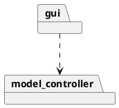

# Low level design

<for each package, report class diagram>

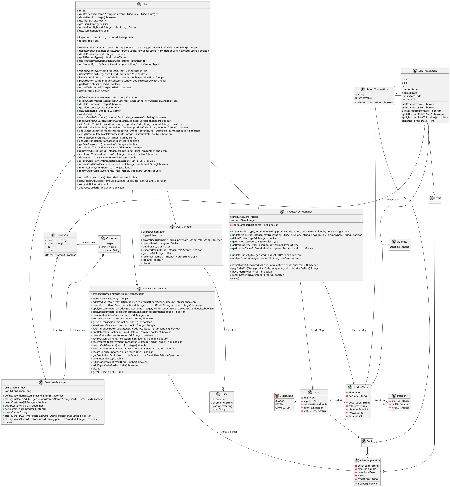

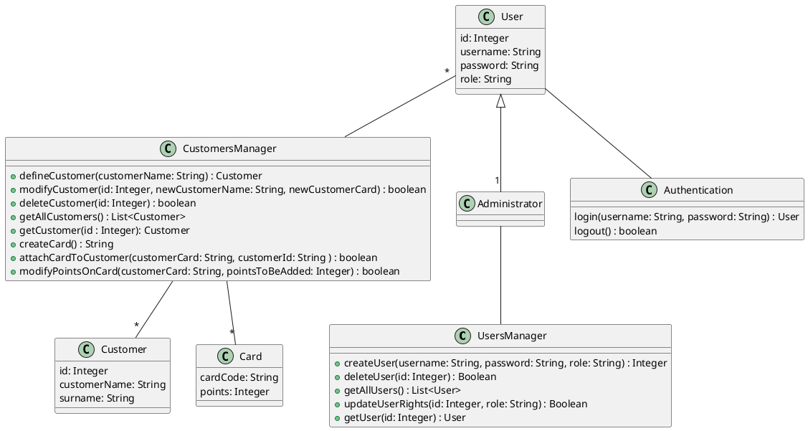

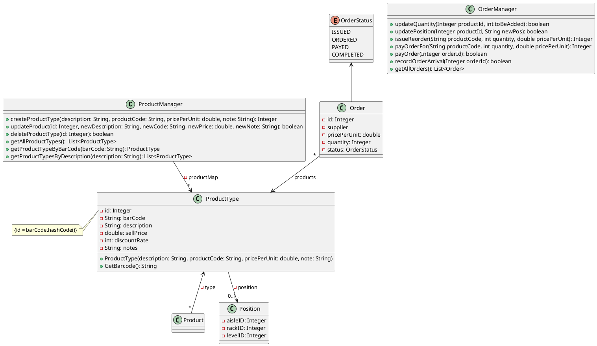

# Verification traceability matrix

\<for each functional requirement from the requirement document, list which classes concur to implement it>

|       | Shop  |  CustomerManager |  UserManager |  TransactionManager  | ProductOrderManager |
|-------|-------|------------------|--------------|----------------------|---------------------|
| FR1.1 |   x   |                  |       x      |                      |                     |
| FR1.2 |   x   |                  |       x      |                      |                     |
| FR1.3 |   x   |                  |       x      |                      |                     |
| FR1.4 |   x   |                  |       x      |                      |                     |
| FR1.5 |   x   |                  |       x      |                      |                     |
| FR3.1 |   x   |                  |              |                      |         x           |
| FR3.2 |   x   |                  |              |                      |         x           |
| FR3.3 |   x   |                  |              |                      |         x           |
| FR3.4 |   x   |                  |              |                      |         x           |
| FR4.1 |   x   |                  |              |                      |         x           |
| FR4.2 |   x   |                  |              |                      |         x           |
| FR4.3 |   x   |                  |              |                      |         x           |
| FR4.4 |   x   |                  |              |                      |         x           |
| FR4.5 |   x   |                  |              |         x            |         x           |
| FR4.6 |   x   |                  |              |                      |         x           |
| FR4.7 |   x   |                  |              |                      |         x           |
| FR5.1 |   x   |                  |              |                      |                     |
| FR5.2 |   x   |                  |              |                      |                     |
| FR5.3 |   x   |                  |              |                      |                     |
| FR5.4 |   x   |                  |              |                      |                     |
| FR5.5 |   x   |                  |              |                      |                     |
| FR5.6 |   x   |                  |              |                      |                     |
| FR5.7 |   x   |                  |              |         x            |                     |
| FR6.1 |   x   |                  |              |         x            |                     |
| FR6.2 |   x   |                  |              |         x            |                     |
| FR6.3 |   x   |                  |              |         x            |                     |
| FR6.4 |   x   |                  |              |         x            |                     |
| FR6.5 |   x   |                  |              |         x            |                     |
| FR6.6 |   x   |                  |              |         x            |                     |
| FR6.7 |   x   |                  |              |         x            |                     |
| FR6.8 |   x   |                  |              |         x            |                     |
| FR6.9 |   x   |                  |              |         x            |                     |
| FR6.10 |  x   |                  |              |         x            |                     |
| FR6.11 |  x   |                  |              |         x            |                     |
| FR6.12 |  x   |                  |              |         x            |                     |
| FR6.13 |  x   |                  |              |         x            |                     |
| FR6.14 |  x   |                  |              |         x            |                     |
| FR6.15 |  x   |                  |              |         x            |                     |
| FR7.1 |   x   |                  |              |          x           |                     |
| FR7.2 |   x   |                  |              |          x           |                     |
| FR7.3 |   x   |                  |              |          x           |                     |
| FR7.4 |   x   |                  |              |          x           |                     |
| FR8.1 |   x   |                  |              |          x           |                     |
| FR8.2 |   x   |                  |              |          x           |                     |
| FR8.3 |   x   |                  |              |          x           |                     |
| FR8.4 |   x   |                  |              |          x           |                     |

 # Verification sequence diagrams 
\<select key scenarios from the requirement document. For each of them define a sequence diagram showing that the scenario can be implemented by the classes and methods in the design>

## Scenario 1.1
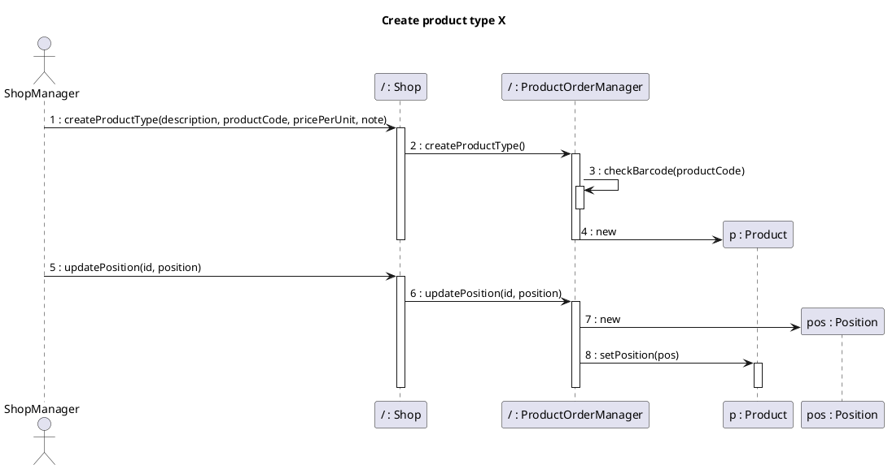

## Scenario 1.2
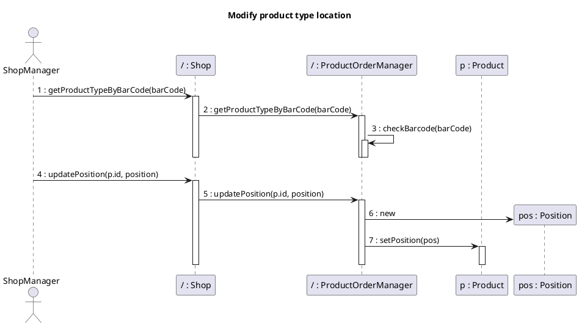

## Scenario 1.3
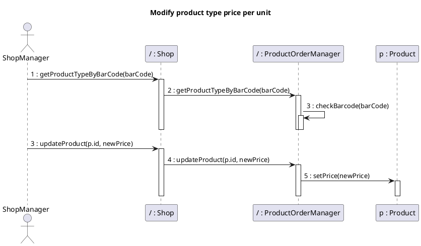

## Scenario 2.1
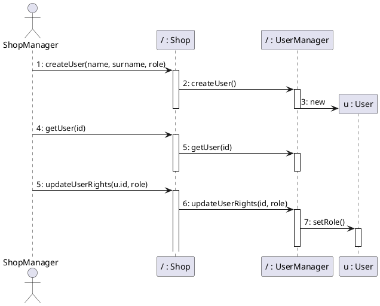
## Scenario 2.2
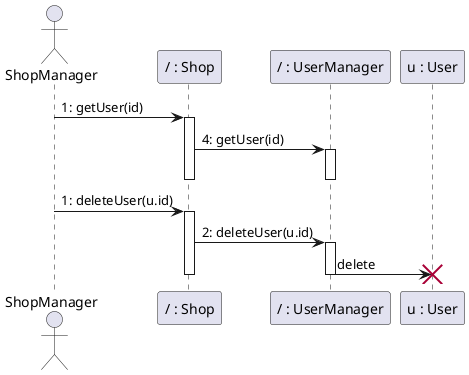
## Scenario 2.3
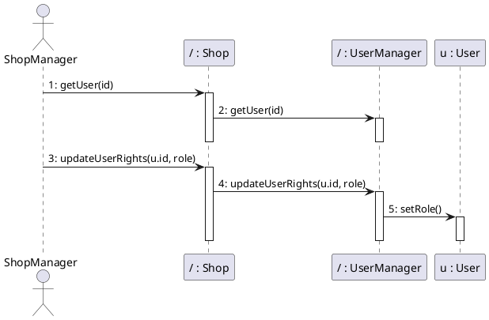
## Scenario 3.1
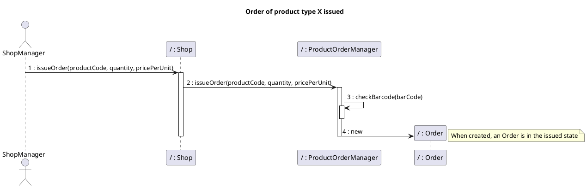
## Scenario 3.2
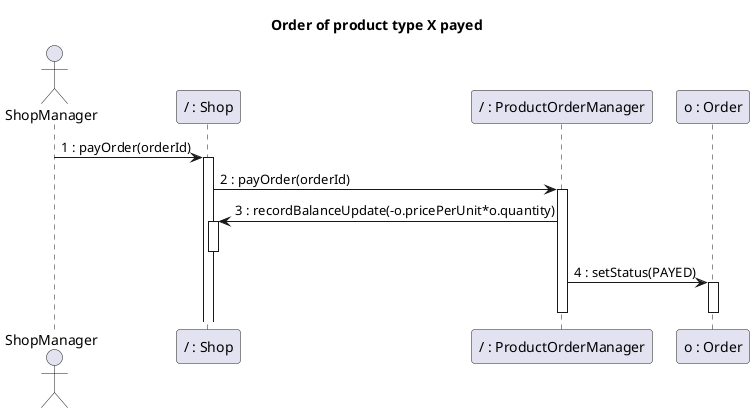
## Scenario 3.3
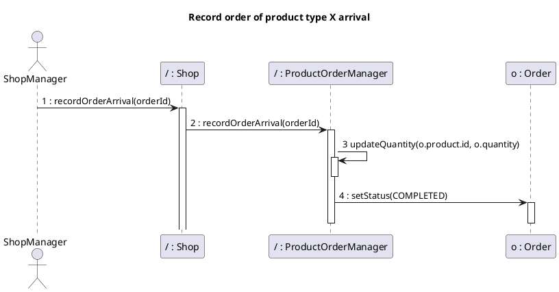

## Scenario 6.1
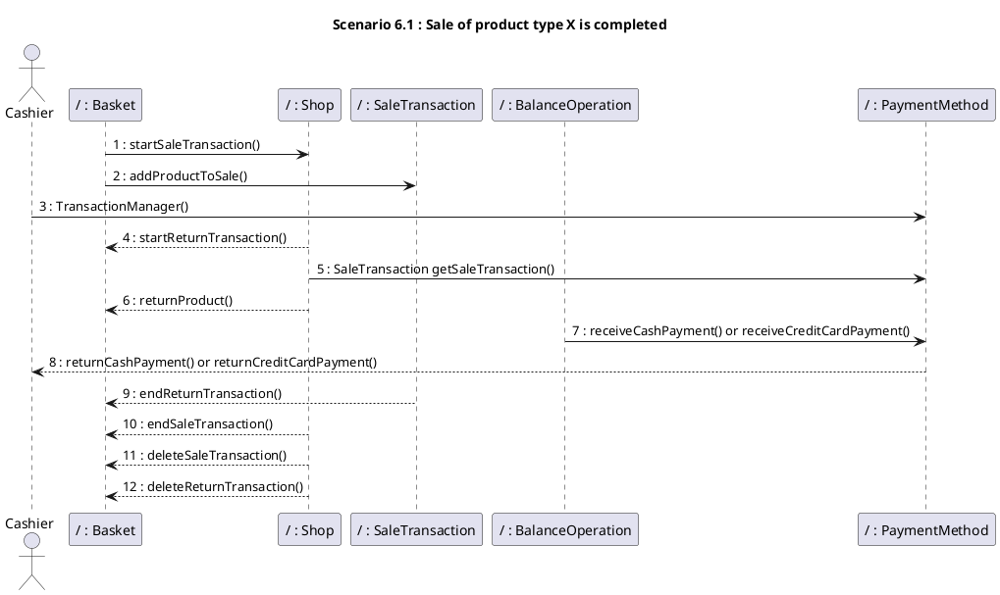

## Scenarion 8.1
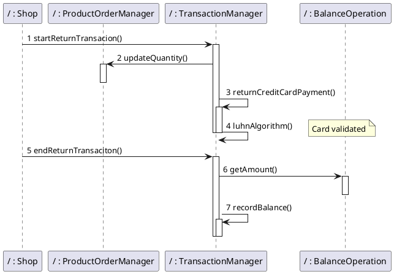

## Scenarion 8.2

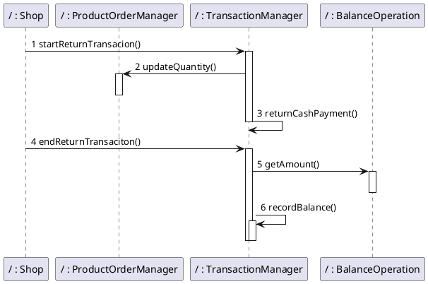

## Scenarin 9.1
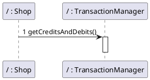

## Scenario 10.1

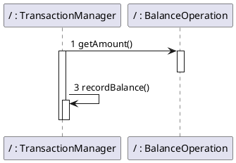

## Scenario 10.2

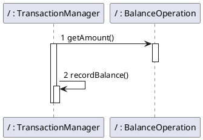
