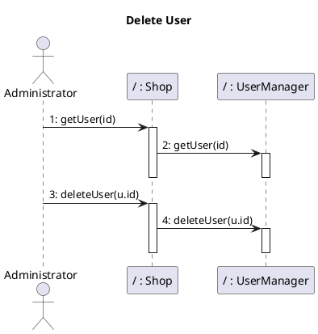
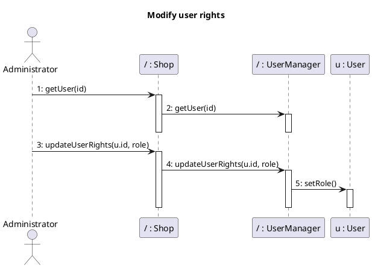
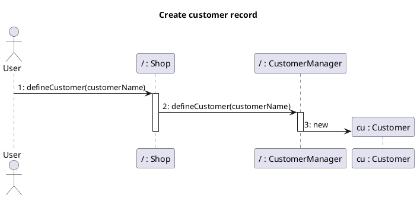
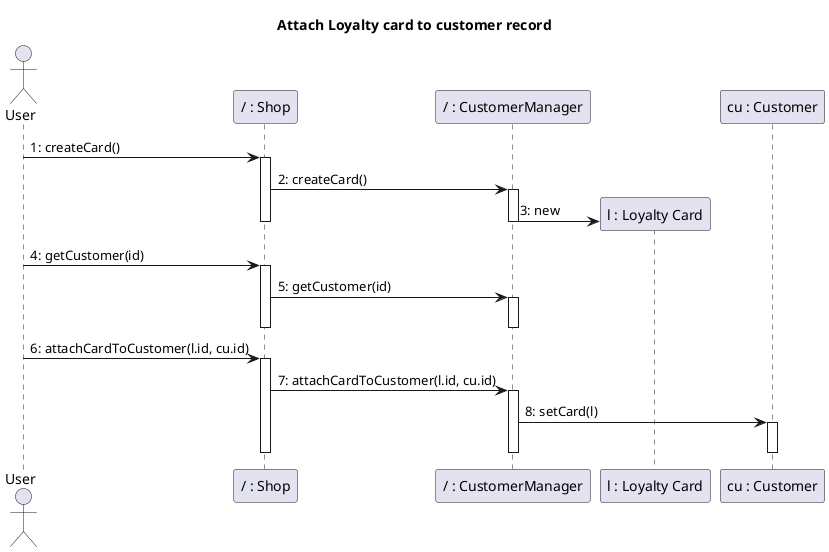
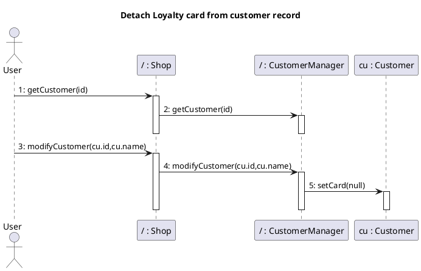
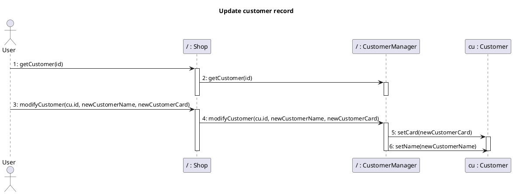
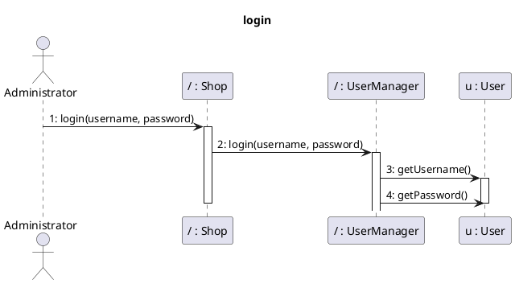
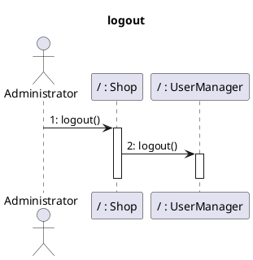
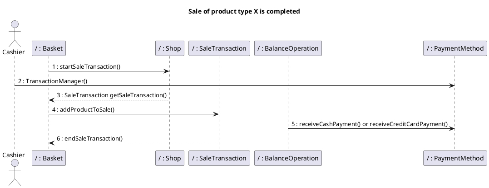

# Design Document 


Authors: 

Date:

Version:


# Contents

- [High level design](#package-diagram)
- [Low level design](#class-diagram)
- [Verification traceability matrix](#verification-traceability-matrix)
- [Verification sequence diagrams](#verification-sequence-diagrams)

# Instructions

The design must satisfy the Official Requirements document, notably functional and non functional requirements

# High level design 

<discuss architectural styles used, if any>

The entire application is based on the MVC architectural pattern, we used Layered style design to divide the GUI from the business logic/data level. The two layers communicate with eachother with a common interface defined by the Façade design pattern.

<report package diagram>


# Low level design

```plantuml

@startuml

interface EZShopInterface {
    +reset()
    +createUser(username: String, password: String, role: String) : Integer
    +deleteUser(id: Integer): boolean
    +getAllUser(): List<User>
    +getUser(id: Integer): User
    +updateUserRights(id: Integer, role: String): Boolean
    +getUser(id: Integer) : User

    +login(username: String, password: String): User
    +logout(): boolean

    +createProductType(description: String, productCode: String, pricePerUnit: double, note: String): Integer
    +updateProduct(id: Integer, newDescription: String, newCode: String, newPrice: double, newNote: String): boolean
    +deleteProductType(id: Integer): boolean
    +getAllProductTypes():  List<ProductType>
    +getProductTypeByBarCode(barCode: String): ProductType
    +getProductTypesByDescription(description: String): List<ProductType>

    +updateQuantity(Integer productId, int toBeAdded): boolean
    +updatePosition(Integer productId, String newPos): boolean
    +issueOrder(String productCode, int quantity, double pricePerUnit): Integer
    +payOrderFor(String productCode, int quantity, double pricePerUnit): Integer
    +payOrder(Integer orderId): boolean
    +recordOrderArrival(Integer orderId): boolean
    +getAllOrders(): List<Order> 

    +defineCustomer(customerName: String): Customer
    +modifyCustomer(id: Integer, newCustomerName: String, newCustomerCard): boolean
    +deleteCustomer(id: Integer): boolean
    +getAllCustomers(): List<Customer>
    +getCustomer(id : Integer): Customer
    +createCard(): String
    +attachCardToCustomer(customerCard: String, customerId: String ): boolean
    +modifyPointsOnCard(customerCard: String, pointsToBeAdded: Integer): boolean
    +addProductToSale(transactionId: Integer, productCode: String, amount: Integer): boolean
    +deleteProductFromSale(transactionId: Integer, productCode: String, amount: Integer): boolean
    +applyDiscountRateToProduct(transactionId: Integer, productCode: String, discountRate: double): boolean
    +applyDiscountRateToSale(transactionId: Integer, discountRate: double) : boolean
    +computePointsForSale(transactionId: Integer): int
    +endSaleTransaction(transactionId: Integer): boolean
    +getSaleTransaction(transactionId: Integer): boolean
    +startReturnTransaction(transactionId: Integer): Integer
    +returnProduct(returnId : Integer, productCode: String, amount: int): boolean
    +endReturnTransaction(returnId : Integer, commit: boolean): boolean
    +deleteReturnTransaction(returnId: Integer): boolean
    +receiveCashPayment(transactionId: Integer, cash: double): double
    +receiveCreditCardPayment(transactionId: Integer, creditCard: String): boolean
    +returnCashPayment(returnId: Integer): double
    +returnCreditCardPayment(returnId: Integer, creditCard: String): double

    +recordBalanceUpdate(toBeAdded: double): boolean
    +getCreditsAndDebits(from: LocalDate, to: LocalDate): List<BalanceOperation>
    +computeBalance(): double
}



class Shop {
    +addPayedOrder(order: Order): boolean
}

Shop.|>EZShopInterface

class UserManager{
    -userIdGen: Integer
    -loggedUser: User
    
    +createUser(username: String, password: String, role: String) : Integer
    +deleteUser(id: Integer) : Boolean
    +getAllUsers() : List<User>
    +updateUserRights(id: Integer, role: String) : Boolean
    +getUser(id: Integer) : User
    +login(username: String, password: String) : User
    +logout() : boolean
    +clear()

}

class User {
    -id: Integer
    -username: String
    -password: String
    -role: String
}

class Customer {
    -id: Integer
    -name: String
    -surname: String
}

LoyaltyCard "0..1" <- Customer: -loyaltyCard

class LoyaltyCard {
    -cardCode: String
    -points: Integer
}

UserManager -->"*" User: -userList
Customer "*"<-- CustomerManager: -customerMap
LoyaltyCard "*"<-- CustomerManager: -cardMap

class CustomerManager {
    -userIdGen: Integer
    -loyaltyCardIdGen: long

    +defineCustomer(customerName: String): Customer
    +modifyCustomer(id: Integer, newCustomerName: String, newCustomerCard): boolean
    +deleteCustomer(id: Integer): boolean
    +getAllCustomers(): List<Customer>
    +getCustomer(id : Integer): Customer
    +createCard(): String
    +attachCardToCustomer(customerCard: String, customerId: String ): boolean
    +modifyPointsOnCard(customerCard: String, pointsToBeAdded: Integer): boolean
    +clear()
}


class ProductOrderManager {

    -productIdGen: Integer
    -orderIdGen: Integer

    -checkBarcode(barCode: String): boolean

    +createProductType(description: String, productCode: String, pricePerUnit: double, note: String): Integer
    +updateProduct(id: Integer, newDescription: String, newCode: String, newPrice: double, newNote: String): boolean
    +deleteProductType(id: Integer): boolean
    +getAllProductTypes():  List<ProductType>
    +getProductTypeByBarCode(barCode: String): ProductType
    +getProductTypesByDescription(description: String): List<ProductType>

    +updateQuantity(Integer productId, int toBeAdded): boolean
    +updatePosition(Integer productId, String newPos): boolean

    +issueOrder(String productCode, int quantity, double pricePerUnit): Integer
    +payOrderFor(String productCode, int quantity, double pricePerUnit): Integer
    
    +payOrder(Integer orderId): boolean
    +recordOrderArrival(Integer orderId): boolean
    
    +clear()

}

ProductOrderManager -->"*" ProductType: -productMap
ProductOrderManager -->"*" Order: -orderMap

class TransactionManager {
    -transactionMap <transactionID, transaction>
    +startSaleTransaction() : Integer
    +addProductToSale(transactionId: Integer, productCode: String, amount: Integer): boolean
    +deleteProductFromSale(transactionId: Integer, productCode: String, amount: Integer): boolean
    +applyDiscountRateToProduct(transactionId: Integer, productCode: String, discountRate: double): boolean
    +applyDiscountRateToSale(transactionId: Integer, discountRate: double) : boolean
    +computePointsForSale(transactionId: Integer): int
    +endSaleTransaction(transactionId: Integer): boolean
    +getSaleTransaction(transactionId: Integer): boolean
    +startReturnTransaction(transactionId: Integer): Integer
    +returnProduct(returnId : Integer, productCode: String, amount: int): boolean
    +endReturnTransaction(returnId : Integer, commit: boolean): boolean
    +deleteReturnTransaction(returnId: Integer): boolean
    +receiveCashPayment(transactionId: Integer, cash: double): double
    +receiveCreditCardPayment(transactionId: Integer, creditCard: String): boolean
    +returnCashPayment(returnId: Integer): double
    +returnCreditCardPayment(returnId: Integer, creditCard: String): double
    +recordBalanceUpdate ( double toBeAdded) : boolean
    +getCreditsAndDebits(from: LocalDate, to: LocalDate): List<BalanceOperation>
    +computeBalance(): double
    -luhnAlgorithm (int creditCardNumber): boolean


    +addPayedOrder(order: Order): boolean
    +clear()
    +getAllOrders(): List<Order> 
}


    

TransactionManager <-- BalanceOperation : -transactionMap





Shop --> UserManager
Shop --> CustomerManager
Shop --> ProductOrderManager
Shop -->TransactionManager

class Credit 
class Debit

Credit --|> BalanceOperation
Debit --|> BalanceOperation

class BalanceOperation {
    -description: String
    -amount: double
    -date: LocalDate
    -iD: int
    -creditCard: String
    +isOrder(): boolean
}

class Order{
    -id: Integer
    -supplier: String
    -pricePerUnit: double
    -quantity: Integer
    -status: OrderStatus
}

enum OrderStatus{
    ISSUED
    PAYED
    COMPLETED
}

OrderStatus <- Order

Order --|> Debit
ReturnTransaction --|> Debit

class ProductType {
    -id: Integer
    -barCode: String

    -description: String
    -sellPrice: double
    -discountRate: int
    -notes: String
    -amount: int
}


class Position {
    -aisleID: Integer
    -rackID: Integer
    -levelID: Integer
}
ProductType ->"0..1" Position: -position


class SaleTransaction {
    ID 
    date
    time
    cost
    paymentType
    discount rate
    loyalityCardCode
    customerId

    addProductToSale() : boolean
    addProductToSale() : boolean
    deleteProductFromSale() : boolean
    applyDiscountRateToSale() : boolean
    applyDiscountRateToProduct() : boolean
    computePointsForSale() : int
}

SaleTransaction -- "*" ProductType
(SaleTransaction,ProductType).. Quantity
SaleTransaction -|> Credit

class Quantity {
    quantity: Integer
}




SaleTransaction "*" --> "0..1" LoyaltyCard: -loyaltyCard

Order "*" -> ProductType: -product

class ReturnTransaction {
  quantity
  returnedValue

endReturnTransaction() : boolean
}

ReturnTransaction "*" - SaleTransaction
ReturnTransaction "*" - ProductType
@enduml

```

<for each package, report class diagram>





# Verification traceability matrix

\<for each functional requirement from the requirement document, list which classes concur to implement it>


|       | Shop  |  CustomerManager |  UserManager |  TransactionManager  | ProductOrderManager |
|-------|-------|------------------|--------------|----------------------|---------------------|
| FR1.1 |   x   |                  |       x      |                      |                     |
| FR1.2 |   x   |                  |       x      |                      |                     |
| FR1.3 |   x   |                  |       x      |                      |                     |
| FR1.4 |   x   |                  |       x      |                      |                     |
| FR1.5 |   x   |                  |       x      |                      |                     |
| FR3.1 |   x   |                  |              |                      |         x           |
| FR3.2 |   x   |                  |              |                      |         x           |
| FR3.3 |   x   |                  |              |                      |         x           |
| FR3.4 |   x   |                  |              |                      |         x           |
| FR4.1 |   x   |                  |              |                      |         x           |
| FR4.2 |   x   |                  |              |                      |         x           |
| FR4.3 |   x   |                  |              |                      |         x           |
| FR4.4 |   x   |                  |              |                      |         x           |
| FR4.5 |   x   |                  |              |         x            |         x           |
| FR4.6 |   x   |                  |              |                      |         x           |
| FR4.7 |   x   |                  |              |                      |         x           |
| FR5.1 |   x   |                  |              |                      |                     |
| FR5.2 |   x   |                  |              |                      |                     |
| FR5.3 |   x   |                  |              |                      |                     |
| FR5.4 |   x   |                  |              |                      |                     |
| FR5.5 |   x   |                  |              |                      |                     |
| FR5.6 |   x   |                  |              |                      |                     |
| FR5.7 |   x   |                  |              |         x            |                     |
| FR6.1 |   x   |                  |              |         x            |                     |
| FR6.2 |   x   |                  |              |         x            |                     |
| FR6.3 |   x   |                  |              |         x            |                     |
| FR6.4 |   x   |                  |              |         x            |                     |
| FR6.5 |   x   |                  |              |         x            |                     |
| FR6.6 |   x   |                  |              |         x            |                     |
| FR6.7 |   x   |                  |              |         x            |                     |
| FR6.8 |   x   |                  |              |         x            |                     |
| FR6.9 |   x   |                  |              |         x            |                     |
| FR6.10 |  x   |                  |              |         x            |                     |
| FR6.11 |  x   |                  |              |         x            |                     |
| FR6.12 |  x   |                  |              |         x            |                     |
| FR6.13 |  x   |                  |              |         x            |                     |
| FR6.14 |  x   |                  |              |         x            |                     |
| FR6.15 |  x   |                  |              |         x            |                     |
| FR7.1 |   x   |                  |              |          x           |                     |
| FR7.2 |   x   |                  |              |          x           |                     |
| FR7.3 |   x   |                  |              |          x           |                     |
| FR7.4 |   x   |                  |              |          x           |                     |
| FR8.1 |   x   |                  |              |          x           |                     |
| FR8.2 |   x   |                  |              |          x           |                     |
| FR8.3 |   x   |                  |              |          x           |                     |
| FR8.4 |   x   |                  |              |          x           |                     |


 # Verification sequence diagrams 
\<select key scenarios from the requirement document. For each of them define a sequence diagram showing that the scenario can be implemented by the classes and methods in the design>

## Scenario 1.1


## Scenario 1.2


## Scenario 1.3


## Scenario 2.1

## Scenario 2.2

## Scenario 2.3

## Scenario 3.1

## Scenario 3.2

## Scenario 3.3


## Scenario 4.1


## Scenario 4.2

## Scenario 4.3


## Scenario 4.4




## Scenario 5.1


## Scenario 5.2



## Scenario 6.1



## Scenario 6.2
```plantuml
@startuml

title
Sale of product type X with product discount
end title

actor Cashier

participant "/ : Basket" as Basket
participant "/ : Shop" as Shop
participant "/ : SaleTransaction" as SaleTransaction
participant "/ : BalanceOperation" as BalanceOperation
participant "/ : PaymentMethod" as PaymentMethod

Basket -> Shop: 1 : startSaleTransaction()
Cashier -> PaymentMethod: 2 : TransactionManager()
Shop --> Basket: 3 : SaleTransaction getSaleTransaction()
Basket ->  SaleTransaction: 4 : addProductToSale()
SaleTransaction -> PaymentMethod : 5 : applyDiscountRateToProduct()
BalanceOperation -> PaymentMethod : 6 : receiveCashPayment()
BalanceOperation --> Shop: 7 : computePointsForSale()
SaleTransaction --> Basket: 8 : endSaleTransaction()

@enduml
```


## Scenario 6.3
```plantuml
@startuml

title
Sale of product type X with sale discount
end title

actor Cashier

participant "/ : Basket" as Basket
participant "/ : Shop" as Shop
participant "/ : SaleTransaction" as SaleTransaction
participant "/ : BalanceOperation" as BalanceOperation
participant "/ : PaymentMethod" as PaymentMethod

Basket -> Shop: 1 : startSaleTransaction()
Cashier -> PaymentMethod: 2 : TransactionManager()
Shop --> Basket: 3 : SaleTransaction getSaleTransaction()
Basket ->  SaleTransaction: 4 : addProductToSale()
SaleTransaction -> PaymentMethod : 5 : applyDiscountRateToSale()
BalanceOperation -> PaymentMethod : 6 : receiveCashPayment()
BalanceOperation --> Shop: 7 : computePointsForSale()
SaleTransaction --> Basket: 8 : endSaleTransaction()

@enduml
```


## Scenario 6.4
```plantuml
@startuml

title
Sale of product type X with Loyalty Card update
end title

actor Cashier

participant "/ : Basket" as Basket
participant "/ : Shop" as Shop
participant "/ : SaleTransaction" as SaleTransaction
participant "/ : BalanceOperation" as BalanceOperation
participant "/ : PaymentMethod" as PaymentMethod

Basket -> Shop: 1 : startSaleTransaction()
Cashier -> PaymentMethod: 2 : TransactionManager()
Shop --> Basket: 3 : SaleTransaction getSaleTransaction()
Basket ->  SaleTransaction: 4 : addProductToSale() or returnProduct()
SaleTransaction -> PaymentMethod : 5 : applyDiscountRateToProduct() or applyDiscountRateToSale()
BalanceOperation -> PaymentMethod : 6 : receiveCashPayment()
BalanceOperation --> Shop: 7 : computePointsForSale()
SaleTransaction --> Basket: 8 : endSaleTransaction()

@enduml
```


## Scenario 6.5
```plantuml
@startuml

title
Sale of product type X cancelled
end title

actor Cashier

participant "/ : Basket" as Basket
participant "/ : Shop" as Shop
participant "/ : SaleTransaction" as SaleTransaction
participant "/ : BalanceOperation" as BalanceOperation
participant "/ : PaymentMethod" as PaymentMethod

Basket -> Shop: 1 : startSaleTransaction()
Cashier -> PaymentMethod: 2 : TransactionManager()
Shop --> Basket: 3 : startReturnTransaction()
Basket ->  SaleTransaction: 4 : returnProduct()
BalanceOperation -> PaymentMethod : 5 : returnCashPayment()
SaleTransaction --> Basket: 6 : endReturnTransaction()
Shop --> Basket : 7 : deleteProductFromSale()
Shop --> Basket : 8 : deleteSaleTransaction()
SaleTransaction --> Basket : 9 : deleteReturnTransaction() 

@enduml
```


## Scenario 6.6
```plantuml
@startuml

title
Sale of product type X completed (Cash)
end title

actor Cashier

participant "/ : Basket" as Basket
participant "/ : Shop" as Shop
participant "/ : SaleTransaction" as SaleTransaction
participant "/ : BalanceOperation" as BalanceOperation
participant "/ : PaymentMethod" as PaymentMethod

Basket -> Shop: 1 : startSaleTransaction()
Cashier -> PaymentMethod: 2 : TransactionManager()
Shop --> Basket: 3 : SaleTransaction getSaleTransaction() or startReturnTransaction()
Basket ->  SaleTransaction: 4 : addProductToSale() or returnProduct()
BalanceOperation -> PaymentMethod : 5 : receiveCashPayment() or returnCashPayment()
BalanceOperation --> Shop: 6 : computePointsForSale() or Null
SaleTransaction --> Basket: 7 : endSaleTransaction() or endReturnTransaction()
Shop --> Basket : 8 : deleteProductFromSale()
Shop --> Basket : 9 : deleteSaleTransaction()
SaleTransaction --> Basket : 10 : deleteReturnTransaction() 

@enduml
```


## Scenarion 8.1
```plantuml
@startuml

participant "/ : Shop" as Shop
participant "/ : ProductOrderManager" as ProductOrderManager
participant "/ : TransactionManager" as TransactionManager
participant "/ : BalanceOperation" as BalanceOperation
Shop -> TransactionManager:1 startReturnTransacion()
activate TransactionManager
TransactionManager -> ProductOrderManager:2 updateQuantity()
activate ProductOrderManager
deactivate ProductOrderManager
TransactionManager -> TransactionManager:3 returnCreditCardPayment()
activate TransactionManager
TransactionManager -> TransactionManager:4 luhnAlgorithm()
note right: Card validated
deactivate TransactionManager 
deactivate TransactionManager 
Shop -> TransactionManager:5 endReturnTransaciton()
activate TransactionManager
TransactionManager-> BalanceOperation:6 getAmount()
activate BalanceOperation
deactivate BalanceOperation
TransactionManager -> TransactionManager:7 recordBalance() 
activate TransactionManager
deactivate TransactionManager
deactivate TransactionManager 
@enduml
```

## Scenarion 8.2

```plantuml
@startuml

participant "/ : Shop" as Shop
participant "/ : ProductOrderManager" as ProductOrderManager
participant "/ : TransactionManager" as TransactionManager
participant "/ : BalanceOperation" as BalanceOperation
Shop -> TransactionManager:1 startReturnTransacion()
activate TransactionManager
TransactionManager -> ProductOrderManager:2 updateQuantity()
activate ProductOrderManager
deactivate ProductOrderManager
TransactionManager -> TransactionManager:3 returnCashPayment()
deactivate TransactionManager 
Shop -> TransactionManager:4 endReturnTransaciton()
activate TransactionManager
TransactionManager-> BalanceOperation:5 getAmount()
activate BalanceOperation
deactivate BalanceOperation
TransactionManager -> TransactionManager:6 recordBalance() 
activate TransactionManager
deactivate TransactionManager
deactivate TransactionManager 
@enduml
```

## Scenarin 9.1
```plantuml
@startuml

participant "/ : Shop" as Shop
participant "/ : TransactionManager" as TransactionManager
Shop -> TransactionManager:1 getCreditsAndDebits()
activate TransactionManager
deactivate TransactionManager 
@enduml
```

## Scenario 10.1

```plantuml
@startuml


participant "/ : TransactionManager" as TransactionManager
participant "/ : BalanceOperation" as BalanceOperation
TransactionManager-> BalanceOperation:1 getAmount()
activate BalanceOperation

deactivate BalanceOperation
activate TransactionManager
TransactionManager -> TransactionManager:3 recordBalance() 
activate TransactionManager
deactivate TransactionManager
deactivate TransactionManager

@enduml
```

## Scenario 10.2

```plantuml
@startuml


participant "/ : TransactionManager" as TransactionManager
participant "/ : BalanceOperation" as BalanceOperation

TransactionManager-> BalanceOperation:1 getAmount()
activate BalanceOperation
deactivate BalanceOperation
activate TransactionManager
TransactionManager -> TransactionManager:2 recordBalance() 
activate TransactionManager
deactivate TransactionManager
deactivate TransactionManager
@enduml
```
