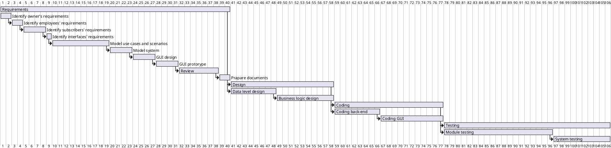

1
2
3
4
5
6
7
8
9
10
11
12
13
14
15
16
17
18
19
20
21
22
23
24
25
26
27
28
29
30
31
32
33
34
35
36
37
38
39
40
41
42
43
44
45
46
47
48
49
50
51
52
# Project Estimation  
Authors: Stefano, Mattia, Nicola, Hossein
Date: 24 April 2021
Version: 1.0
# Contents
- [Estimate by product decomposition]
- [Estimate by activity decomposition ]
# Estimation approach
<Consider the EZGas  project as described in YOUR requirement document, assume that you are going to develop the project INDEPENDENT of the deadlines of the course>
# Estimate by product decomposition
### 
|             | Estimate                        |             
| ----------- | ------------------------------- |  
| NC =  Estimated number of classes to be developed   |            15  +  23               |             
|  A = Estimated average size per class, in LOC       |         (7* 350 + 4* 50 + 4* 10 +  275* 23 )  /48  = 240 |  
| S = Estimated size of project, in LOC (= NC * A) | 9120 |
| E = Estimated effort, in person hours (here use productivity 10 LOC per person hour)  |  912                                    |   
| C = Estimated cost, in euro (here use 1 person hour cost = 30 euro) |27360 | 
| Estimated calendar time, in calendar weeks (Assume team of 4 people, 8 hours per day, 5 days per week ) |      6              |               
# Estimate by activity decomposition
### 
|         Activity name    | Estimated effort (person hours)   |             
| ----------- | ------------------------------- | 
| Requirements | 317 | 
| Review | 60 | 
| Identify interfaces requirements | 12 | 
| Model system| 26 | 
| Model use cases and scenarios| 86 | 
| Identify owner's requirements| 13 | 
| Identify employees' requirements| 15 | 
| Identify subscribers' requirements| 25 | 
| GUI design| 35 | 
| GUI prototype| 33 | 
| Prepare software requirements specification document| 12 |   
| Design| 145 |
| Data level design| 65 |
| Business logic design| 80 |
| Coding| 150 | 
| Coding back-end| 60 |
| Coding GUI| 90|
| Testing| 228 |
| Module testing| 152 |
| System testing| 76 |

###
Insert here Gantt chart with above activities

