# Graphical User Interface Prototype  

Authors: Stefano, Mattia, Nicola, Hossein

Date: 18 April 2021

Version: 1.0

## 0 Welcome and Homepages 

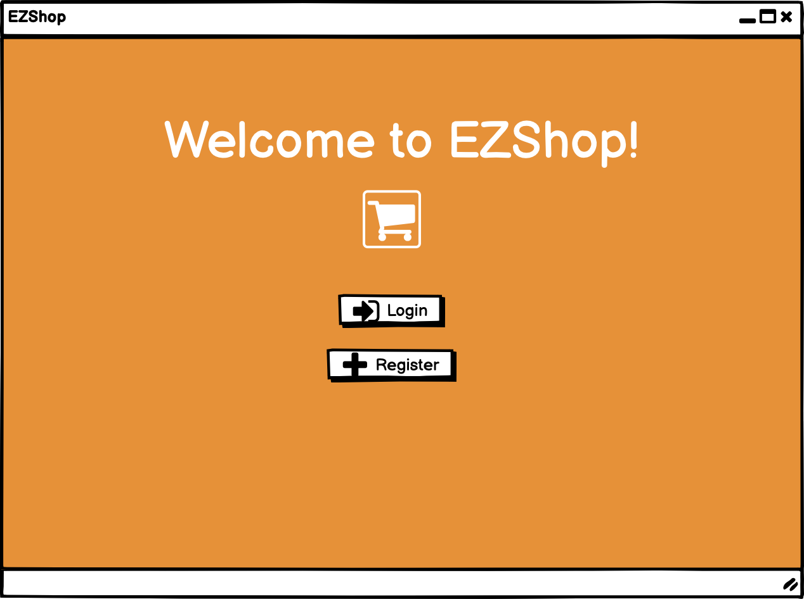
1

This page is the welcome page.  

1. The **subscriber** can log in clicking on *Login*. Page at point '12' appears.
2. A **customer** can register by clicking on *Register*. Page at point '8' appears.

##

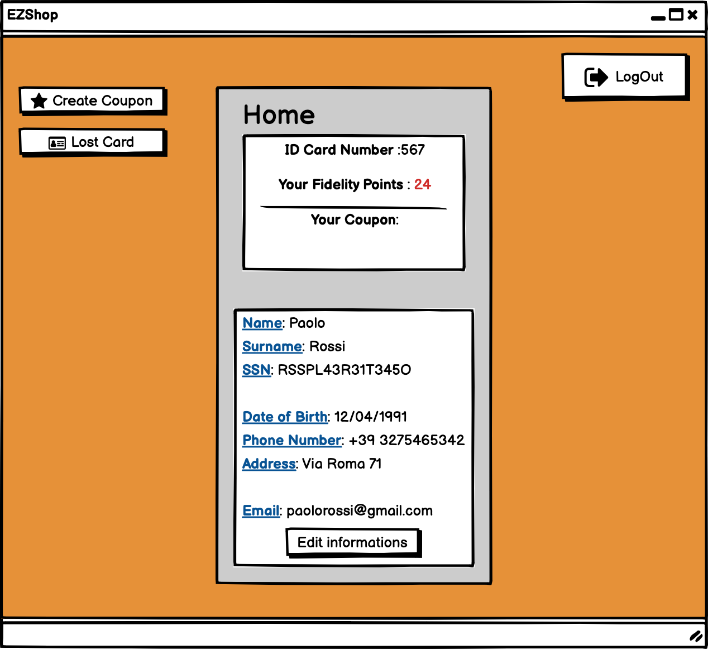
2

This page is the homepage of a normal subscriber. 
1. The **system** shows some informations in the center: ID card number, fidelity points amount, coupons, if any, and all the personal informations.  
2. The **Subscriber** can modify its own infotmations by clicking on the *edit informations* button. Page at point '7' appears.  
3. The **Subscriber** can request a new card if they lost it, by clicking on the *lost card* button. The second page at point '8' appears.  
4. The **Subscriber** can click on the *logout* button on top-right to log out.

##
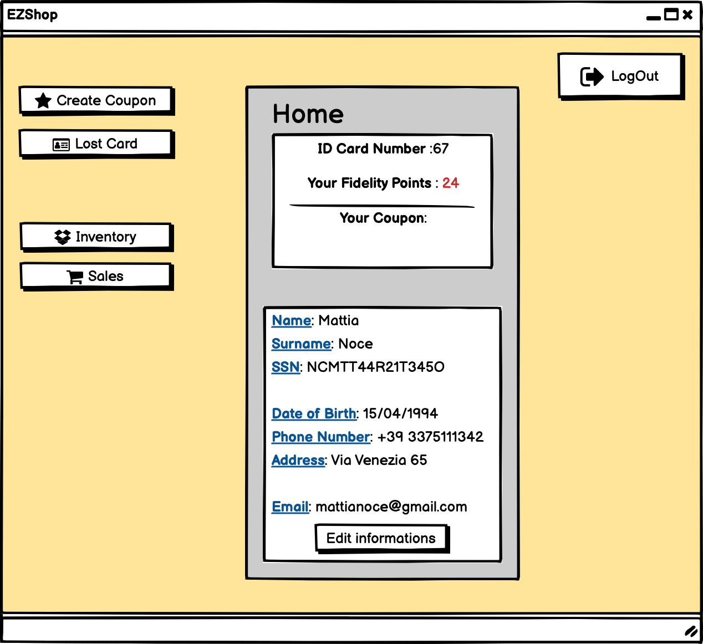
3
This page is the homepage of an employee. It is similar to the Subscriber Homepage, but the Employee has different rights compared to the normal Subscriber and for this reason there are some additional buttons:    
1. The **Employee** can click on *Inventory* button to open the inventory page at point '2' and manage the inventory.  
2. The **Employee** can click on *Sales* button to open the Sales page at point '1' and manage the sales.  

##
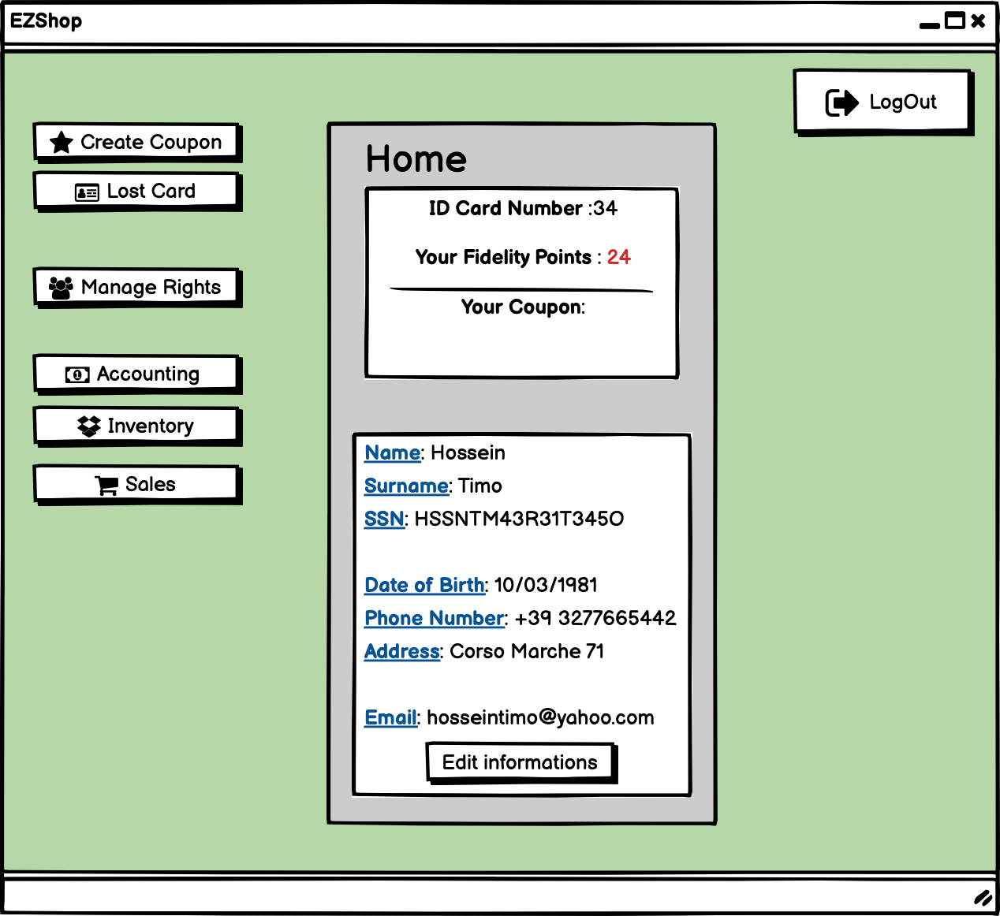
4
This page is the homepage of the Owner. It is similar to the Subscriber Homepage, but the Owner has different rights compared to the normal Subscriber and for this reason there are some additional buttons:    

1. The **Owner** can click on *Manage Rights* button to open the Manage rights page at point '13' and manage the subscribers' rights.    
2. The **Owner** can click on *Accounting* button to open the Accounting page at point '14' and manage the accounting.  
3. The **Owner** can click on *Inventory* button to open the inventory page at point '2' and manage the inventory.  
4. The **Owner** can click on *Sales* button to open the Sales page at point '1' and manage the sales.  

## 1 Manage sale transaction

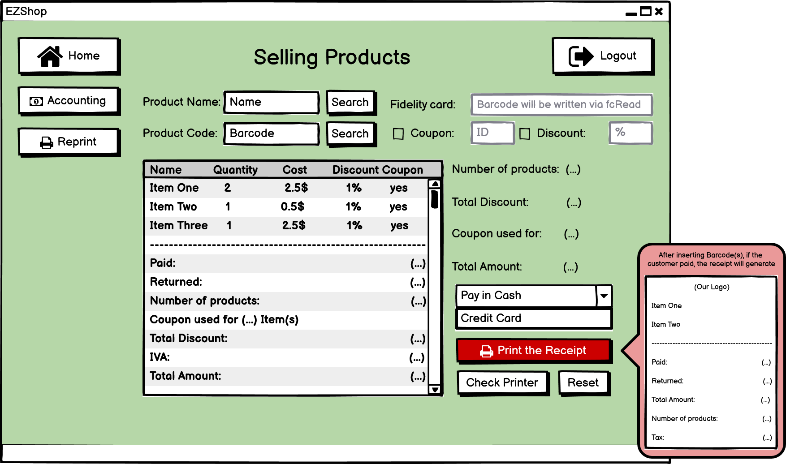
5
This page is described selling steps that **Owner** or **Employee** can use this form, products can insert through the barcode scanner. subscriber/customer buy products with/without coupon/discount. there are 3 buttons:
1. **Home** button that linked to the homepage
2. **Accounting** button that allows owner/employee to have report sales
3. **Reprint** button that can print the previous receipt by searching 
##
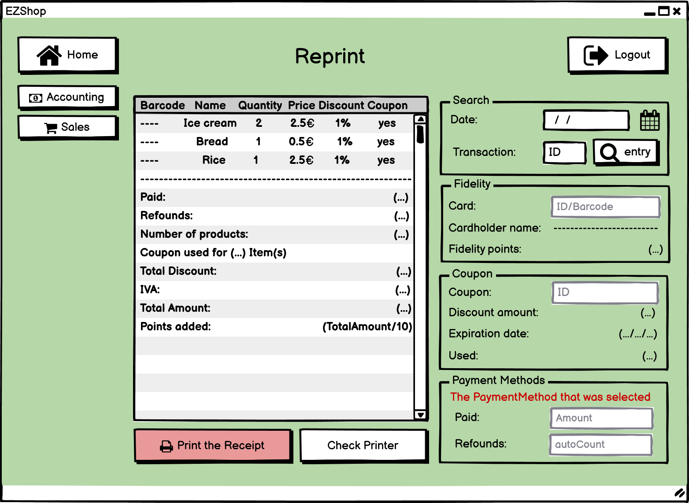
6
This page is described Reprint steps that Owner or Employee can search products by Product Name, Transaction ID,Transaction Date, Fidelity card Barcode. also there are 3 buttons:
1. **Home** button that linked to the homepage
2. **Accounting** button that allows **Owner/Employee** to have report sales
3. **Selling** button that direct us to the **Selling** page

## 2 Waring on low stock, Buy product

7

Owner version.  

The first version of the view is used to show the products that are low in stock to the **owner**. Then the **owner** can decide whether buy or not these products. In the table there are shown: the name, the quantity in stock, the supplier and the buying cost of each product that is low in stock.
1. The **system** shows in the table all products that are low in stock.
2. The **owner** can search the products either by barcode or by name, with the searchbox at the bottom. The search is performed when he/she presses the search button.
3. The **system** shows in the table the products that matches with the search criteria, if any.
4. The **owner**, by checking the checkbox relative to the product that he wants to buy, can select the products to which is interested to.
5. The **owner** can choose the quantity for each product, that is checked, by clicking on the realtive number stepper.
6. The **owner** can buy the products by clicking on the order button.

The **owner** can go back to her/his *home* by clicking on the home button.  
The **owner** can log out by clicking on the LogOut button.  
The **owner** can go to the *check inventory* view by clicking on the relative button.  
The **owner** can go to the *add new products* view by clicking on the relative button.  
The **owner** can go to the *edit product information* view by clicking on the relative button.  
The **owner** can go to the *mark product as not sold anymore* view by clicking on the relative button.  

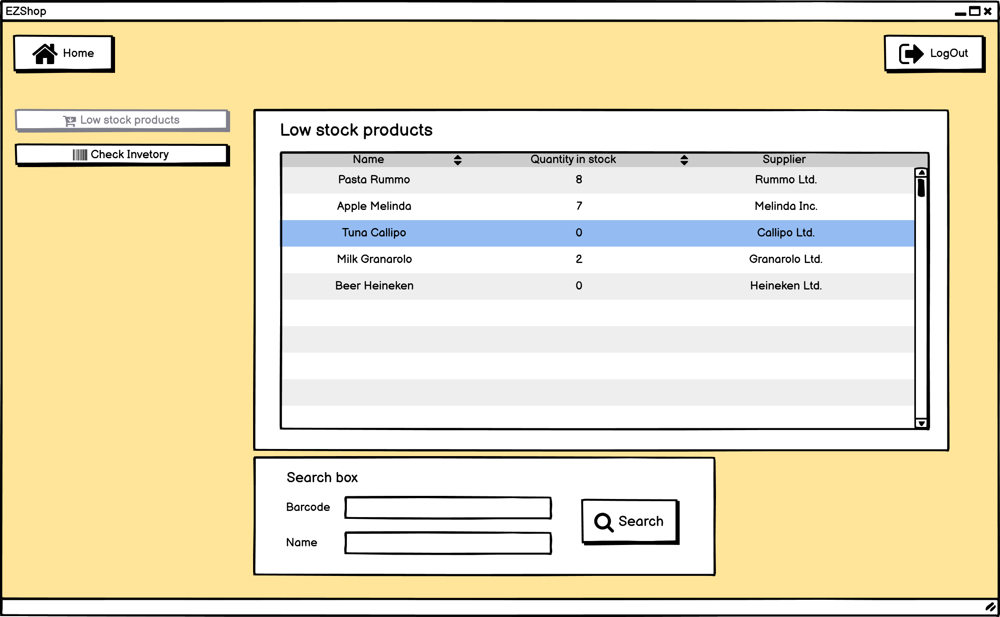
8

*Employee version.*  

The second version of the view is used to show the products that are low in stock to the **employee**. In the table there are shown the name, the quantity in stock and the supplier of each product that is low in stock.
1. The **system** shows in the table all products that are low in stock.
2. The **employee** can search the products either by barcode or by name, using the searchbox at the bottom. The search is performed when he/she presses the search button.
3. The **system** shows in the table the products that matches with the search criteria, if any.

The **employee** can go back to her/his *home* by clicking on the home button.  
The **employee** can log out by clicking on the LogOut button.  
The **employee** can go to the *check inventory* view by clicking on the relative button.  

## 3 Add product

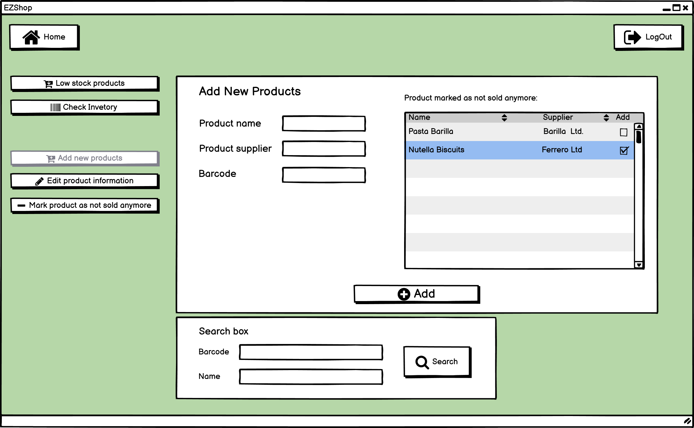
9

With this view the **owner** can add to the buyable products new products that arent in the inventory or products that are not sold anymore. The products that are not sold anymore are shown by a table. For each product not sold anymore, name and supplier are shown.
1. The **system** shows in the table all products that are not sold anymore.
2. The **owner** insert, in the appropriate fields, the information about the product that he/she wants to start to sell.
3. If the **owner** wants, he/she can search among the products that are not sold anymore using the search box at the bottom. The search is performed when he/she presses the search button.
4. The **system** shows in the table all the products that matches with the search criteria, if any.
5. If the **owner** wants, he/she can check, by the checkboxes in the table, the products that he/she want to add to the buyable products.
6. When the **owner** has done, he/she can add the product(s) by pressing the add button.

The **owner** can go back to her/his *home* by clicking on the home button.  
The **owner** can log out by clicking on the LogOut button.  
The **owner** can go to the *low stock products* view by clicking on the relative button.  
The **owner** can go to the *check inventory* view by clicking on the relative button.  
The **owner** can go to the *edit product information* view by clicking on the relative button.  
The **owner** can go to the *mark product as not sold anymore* view by clicking on the relative button.  

## 4 Check inventory

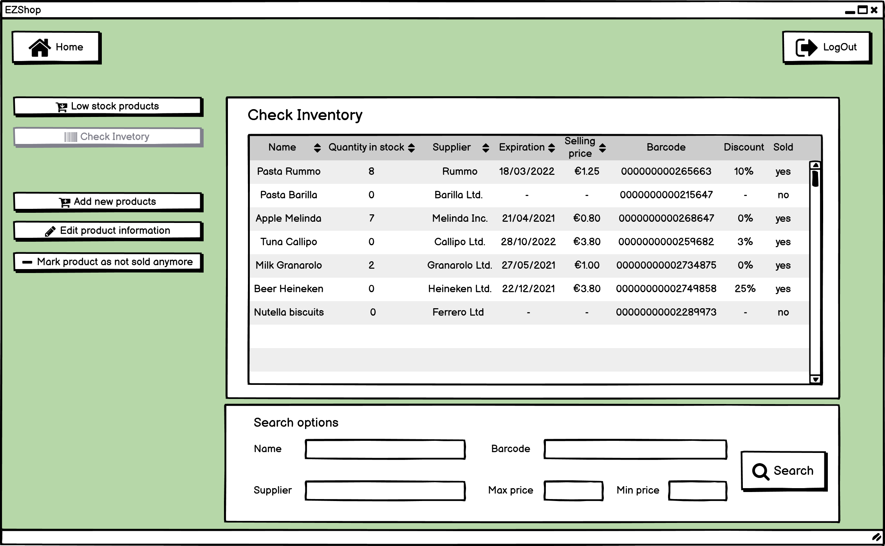
10

*Owner version.*  

With this view the **owner** can view and search the products in the inventory. The products are shown by a table. For each product the table shows: the name , the quantity, the supplier, the expiration, the price, the barcode, the discount and if is sold.
1. The **system** shows in the table all products.
2. The **owner** can search the products: by barcode, by name, by supplier and by price range with the searchbox at the bottom. The search is performed when he/she presses the search button.
3. The **system** shows in the table all the products that matches with the search criteria, if any.

The **owner** can go back to her/his *home* by clicking on the home button.  
The **owner** can log out by clicking on the LogOut button.  
The **owner** can go to the *low stock products* view by clicking on the relative button.  
The **owner** can go to the *add new products* view by clicking on the relative button.  
The **owner** can go to the *edit product information* view by clicking on the relative button.  
The **owner** can go to the *mark product as not sold anymore* view by clicking on the relative button. 

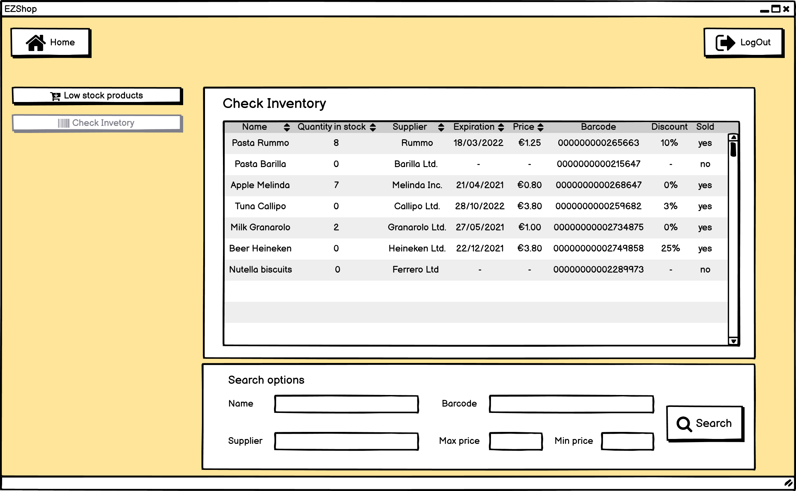
11

*Employee version.*  

With this view the **employee** can view and search the products in the inventory. The products are shown by a table. For each product the table shows: the name , the quantity, the supplier, the expiration, the price, the barcode, the discount and if is sold.
1. The **system** shows in the table all products.
2. The **employee** can search the products: by barcode, by name, by supplier and by price range with the searchbox at the bottom. The search is performed when he/she presses the search button.
3. The **system** shows in the table all the products that matches with the search criteria, if any.

The **employee** can go back to her/his *home* by clicking on the home button.  
The **employee** can log out by clicking on the LogOut button.  
The **employee** can go to the *low stock products* view by clicking on the relative button.  

## 5 Mark product as "not sold anymore"

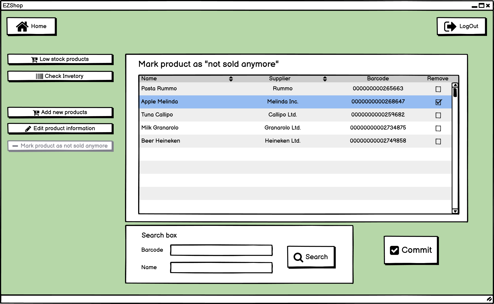
12

With this view the **owner** can signal products in the inventory as not sold anymore. In the table there are shown: the name, the supplier and the barcode.
1. The **system** shows in the table all products that are low in stock.
2. The **owner** can search the products either by barcode or by name, with the searchbox at the bottom. The search is performed when he/she presses the search button.
3. The **system** shows in the table the products that matches with the search criteria, if any.
4. The **owner**, by checking the checkbox relative to the product that he wants to remove, can select the products to which is interested to mark as not sold anymore.
6. The **owner** can save the changes by clicking on the commit button.

The **owner** can go back to her/his *home* by clicking on the home button.  
The **owner** can log out by clicking on the LogOut button.  
The **owner** can go to the *low stock products* view by clicking on the relative button.  
The **owner** can go to the *check inventory* view by clicking on the relative button.  
The **owner** can go to the *add new products* view by clicking on the relative button.  
The **owner** can go to the *edit information* view by clicking on the relative button.

## 6 Edit product information

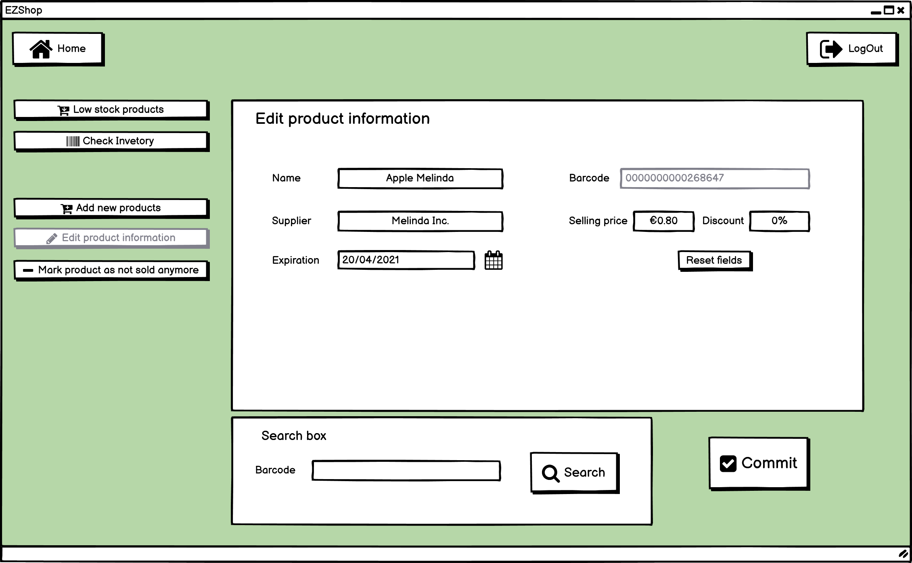
14

With this view the **owner** can edit products in the inventory. It is possible to edit one product at a time. 
1. The **owner** can search, using the barcode, the product that he/she wants to edit. The search is performed when he/she presses the search button.
2. The **owner** can change the information of the product using the relevant text fields.
3. The expiration date can also be modified using the date picker. To use it, the **owner** has to click on the calendar icon.
4. If the **owner** wants, he/she can reset the fields by pressing the reset field button.
5. The **owner** can save the changes by pressing the commit button. 

The **owner** can go back to her/his *home* by clicking on the home button.  
The **owner** can log out by clicking on the LogOut button.  
The **owner** can go to the *low stock products* view by clicking on the relative button.  
The **owner** can go to the *check inventory* view by clicking on the relative button.  
The **owner** can go to the *add new products* view by clicking on the relative button.  
The **owner** can go to the *mark product as not sold anymore* view by clicking on the relative button. 

## 7 Edit informations account

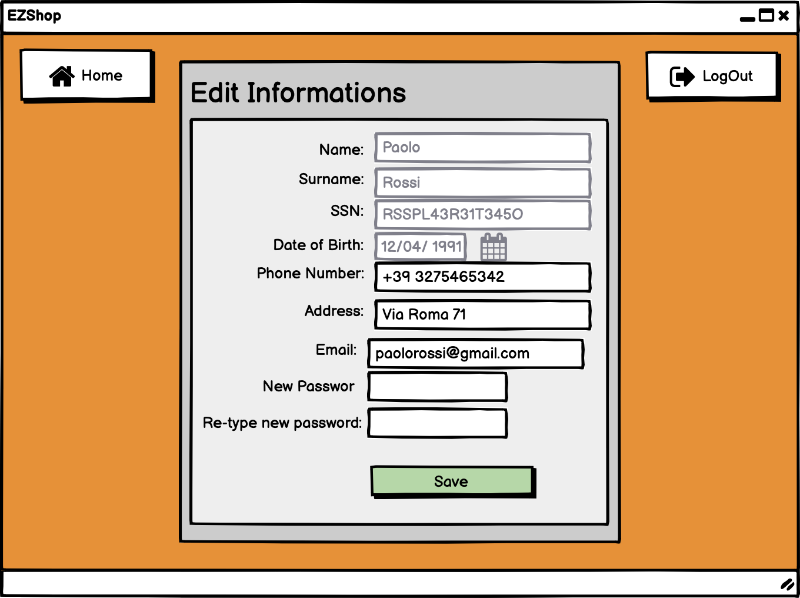
15

This is the page in which the subscriber can modify its own informations. Name, Surname, SSN and date of birth cannot be modified.  
1. The **subscriber** can modify its own informations and the click on *save* to save.  
2. The **subscriber** can click on the *logout* button on top-right to log out.  
3. The **subscriber** can click on *Home* button on the top-left to go back to the Homepage.  

## 8 Registration, Request fidelity card

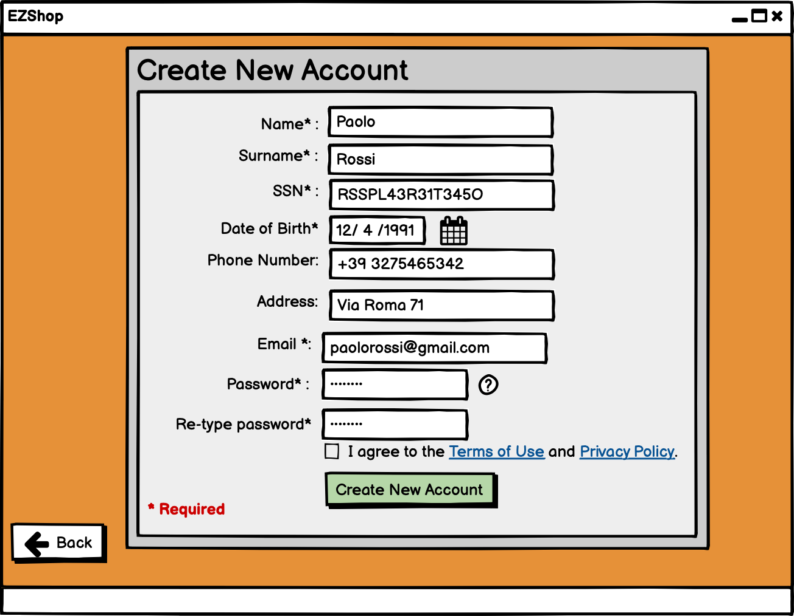

This page is used to create a new account.  
1. The **customer** can insert all the informations and click on *Create New Account* to register in the system. All the fields with * are required.  
2. The **customer** can click on *Back* button to go back to the Welcome Page. 

##
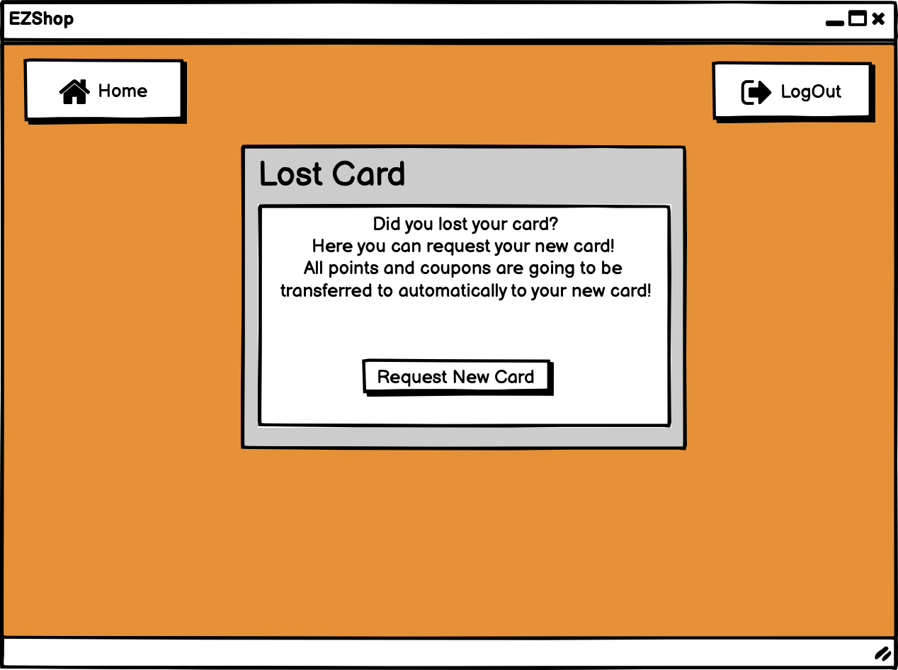
16

Here the subsciber can request a new fidelity card in case they lost it. 
1. The **subscriber** can click on *Request new card* button to request the new card. The old card is automatically marked as lost and all the points and coupons are transferred to the new card.
2. The **subscriber** can click on the *logout* button on top-right to log out.  
3. The **subscriber** can click on *Home* button on the top-left to go back to the Homepage.

##
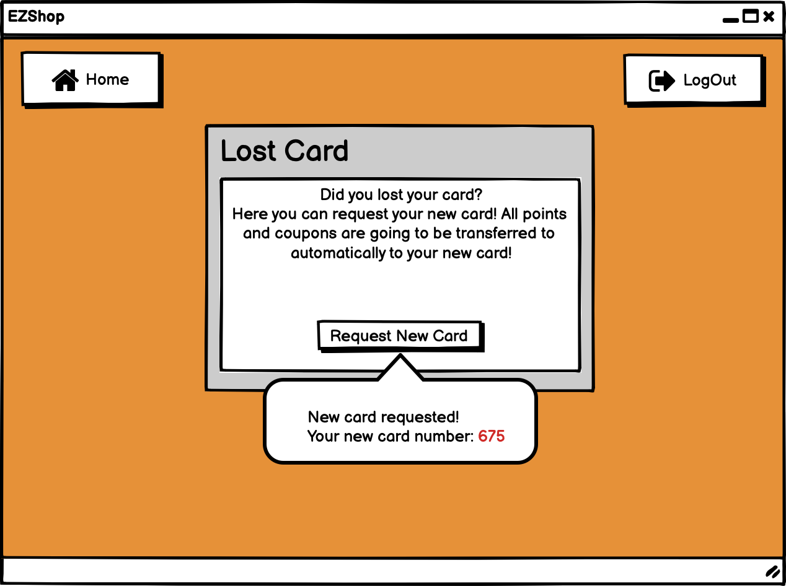
17

This is the page that confirms with a pop up the creation of the new card.

## 9 Create Coupon

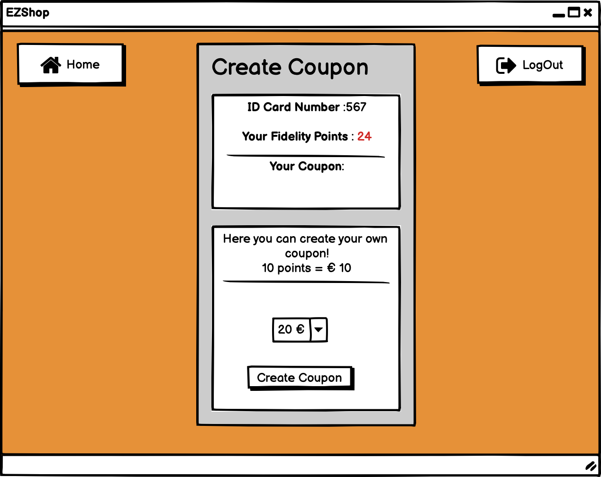
18

This page is used to create a coupon that appears after clicking on *Create Coupon* in the Homepage.   
1. The **subscriber** can choose the amount of the coupon and click on *create coupon*.
2. The **subscriber** can click on the *logout* button on top-right to log out.  
3. The **subscriber** can click on *Home* button on the top-left to go back to the Homepage.

##
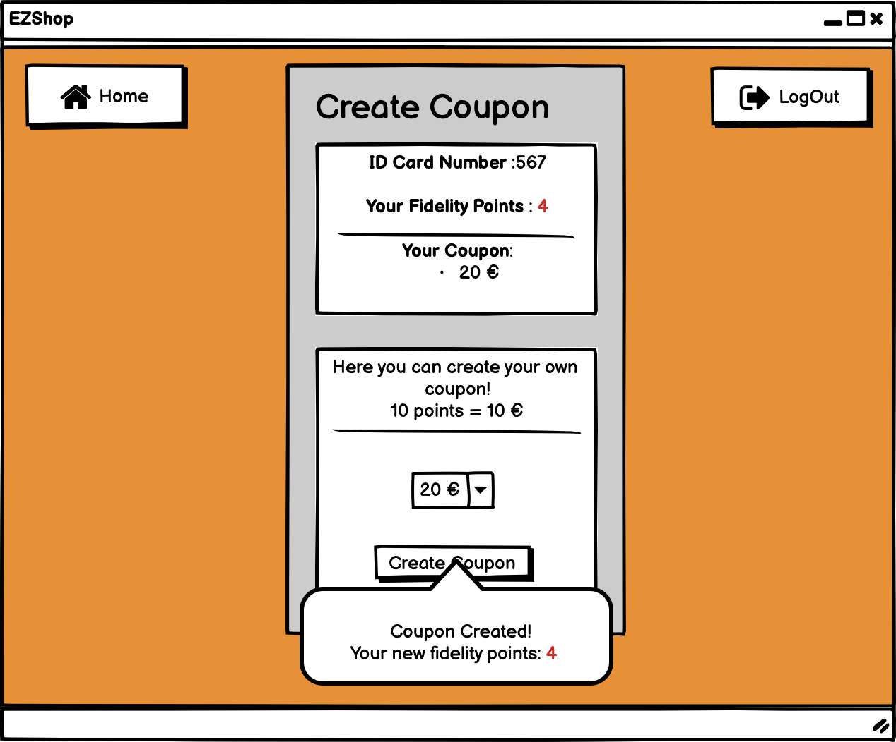
19

This page shows the pop up that appears after the creation of the coupon.

## 10 Check Points

20

This is the homepage where the subsciber can check its own points in the top rectangle.  
1. The **subscriber** can click on the *logout* button on top-right to log out.  
2. The **subscriber** can click on *Home* button on the top-left to go back to the  Homeage.

## 12 Log in 

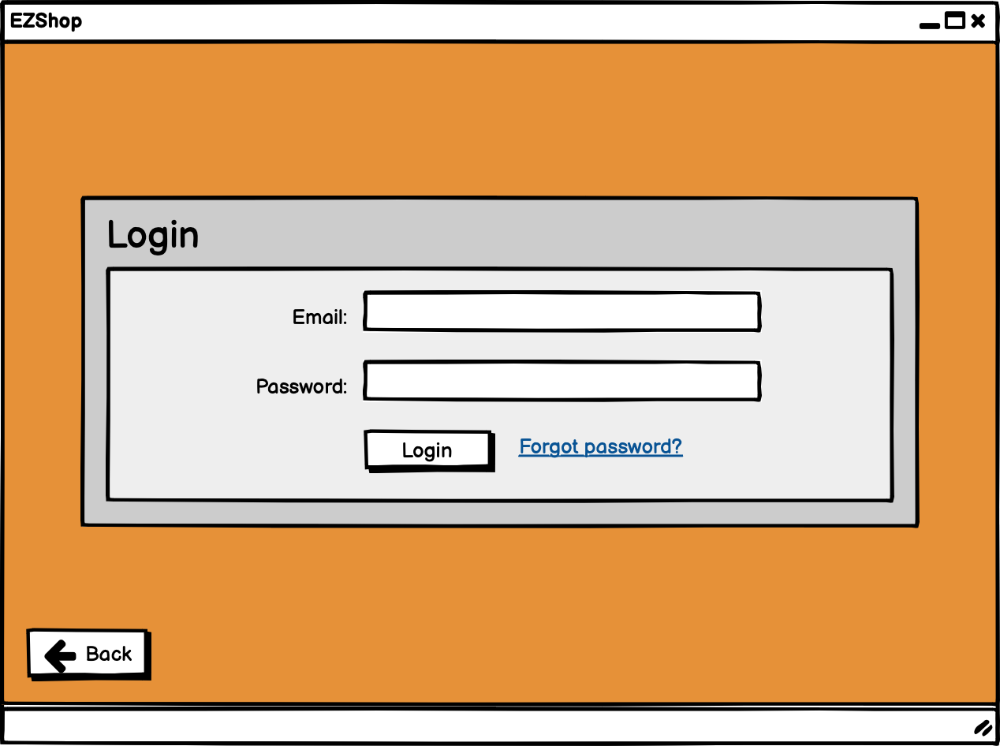
21

This is the login page.  
1. The **subscriber** can insert email and password and then click on *Login*.
2. The **subscriber** can click on *Forgot password* to change the password.  
3. The **subscriber** can click on *Home* button on the top-left to go back to the Welcome Page.

##
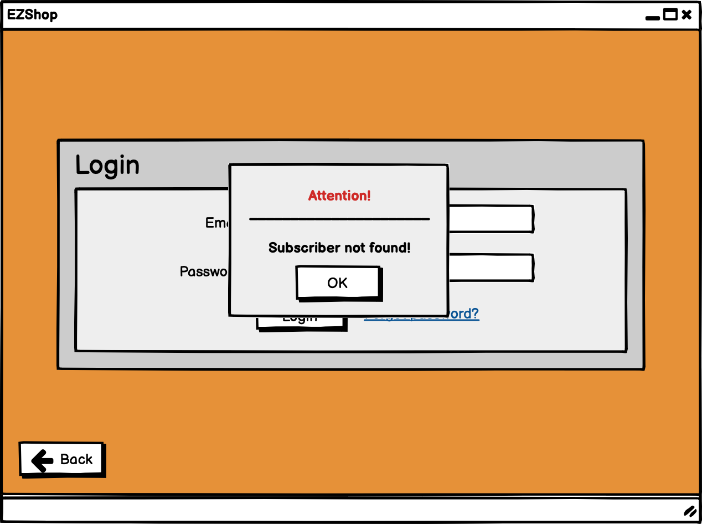
22

This is the error shown when the credentials are wrong.

## 13 Manage Rights

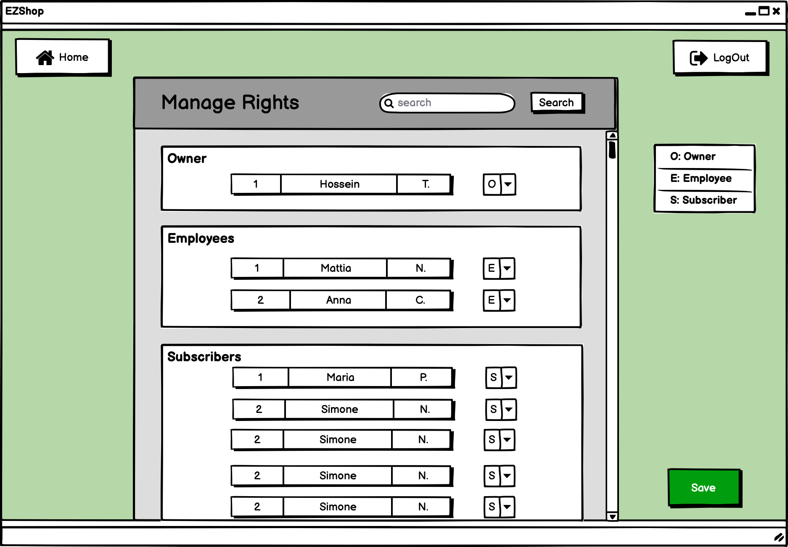
23

In this page the owner can change the subscribers' rights.  

1. The **owner** can click on the left box near the name and choose the subscriber's right: 'O' for the Owner, 'E' for the Employee, 'S' for the normal subsciber.   
2. The **owner** can click on  the *Save* button on the bottom-right saves all the changes.  
3. The **owner** can click on the *logout* button on top-right to log out.   
4. The **owner** can click on *Home* button on the top-left to go back to the Homepage.  

## 14 Accounting and sale transactions
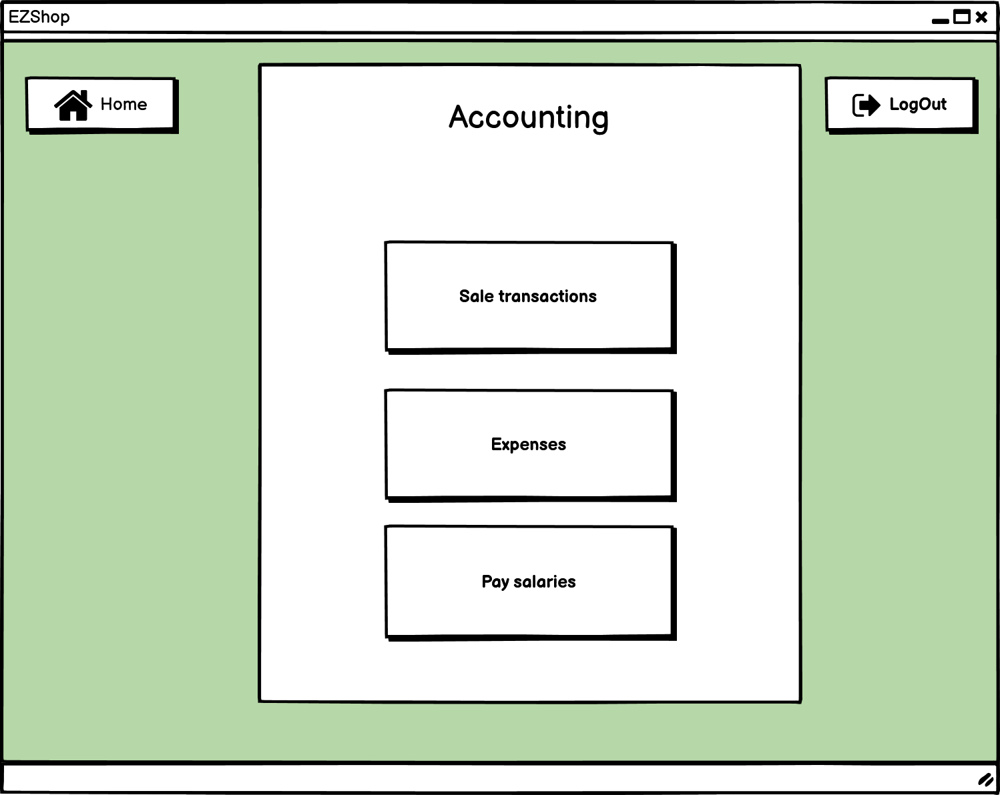
24

This is the main accounting page from which the owner can access to all the accounting features.

1. The **owner** can click on the *Sale transactios* button to view a detailed list of all sale trasanctions.
2. The **owner** can click on the *Expenses* button to view a list of all the expenses.
3. The **owner** can click on the *Pay salaries* button to access a list of all employees and their respective salaries.
4. The **owner** can click on the *Home* button to go back to their home page.
5. The **owner** can click on the *logOut* button to logout.

##
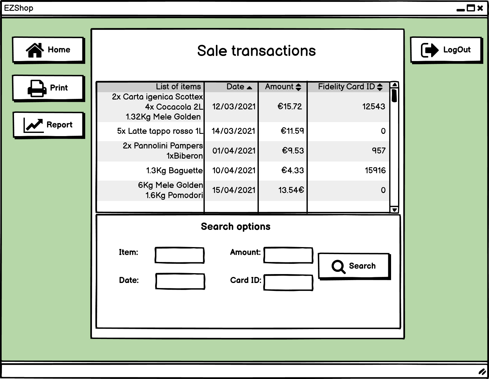
25

This page contains the list of sale transactions. 

1. The **owner** can click on the *Print* button to print the list of transactions.
2. The **owner** can select a few transactions and lick on the *Print* button to print the selected transactions.
3. The **owner** can search for a specific transaction using the search bar. They can look for a transaction containing a certain item, during a specific day, with a certain amount or card ID. 
4. The **owner** can click on the *Home* button to go back to their home page.
5. The **owner** can click on the *logOut* button to logout.

## 15 Expenses

26

This page contains the list of expenses

1. The **owner** can click on the *Print* button to print the list of expenses.
2. The **owner** can select a few expenses and lick on the *Print* button to print the selected transactions.
3. The **owner** can search for a specific expense using the search bar. They can look for an expense containing a certain item, during a specific day, with a certain amount or supplier. 
4. The **owner** can click on the *Home* button to go back to their home page.
5. The **owner** can click on the *logOut* button to logout.

27

1. By clicking on the checkboxes the owner can change the state of each expense. State are boolean and include: invoice sent, payment completed and products delivered.

## 16 Salaries
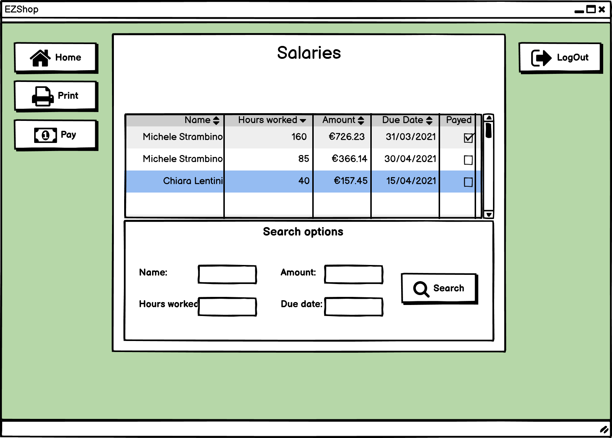
28

This page contais the list of employees and respective salaries. 

1. The **owner** can click on the *Print* button to print the list of employees and past and resent salaries.
2. The **owner** can select a salarie and click on the *Pay* button to pay the salary. The button will open a browser window on the bank web site and will fill the fields necessary to pay said salary.
3. The **owner** can search for a specific employee or salary using the search bar. They can look for a specific employee, a certain number of hours worked, by the amount or by date.
4. The **owner** can click on the *Home* button to go back to their home page.
5. The **owner** can click on the *logOut* button to logout.

## 17 Daily balance

29

## 18 Forgot password

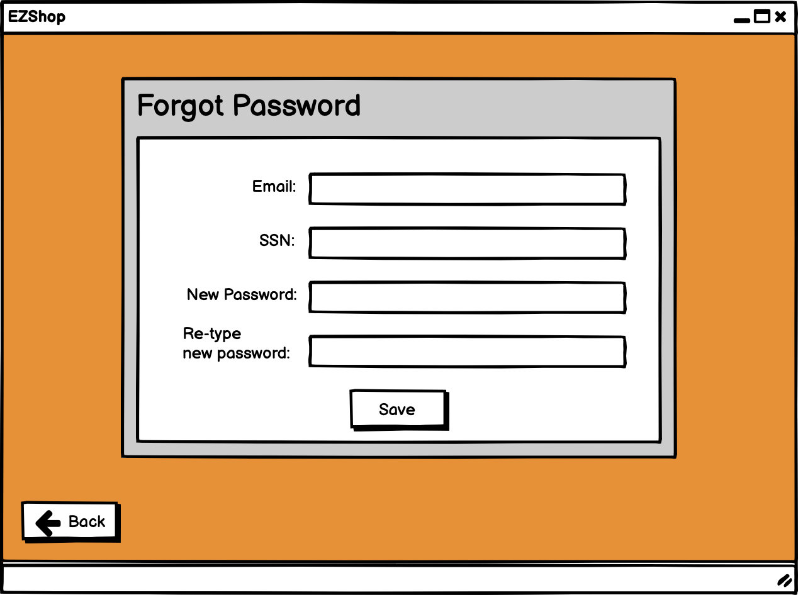
30

This page is used to reset the password in the case the subscriber forgot it.  

1. The **subscriber** can insert the email, SSN and password and then click on *Save* to save the changes.   
2. The **customer** can click on *Back* button to go back to the Welcome Page. 

##
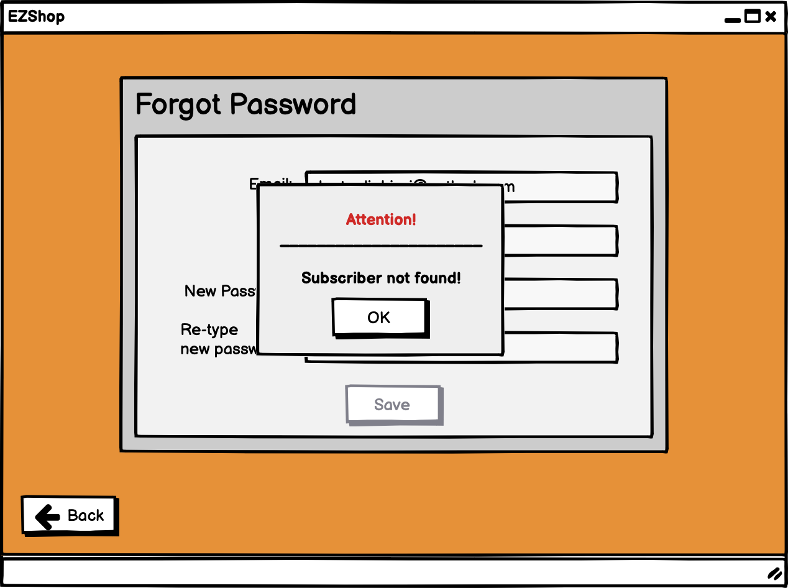
31

This is the error shown when the subscriber isn't in the system.

