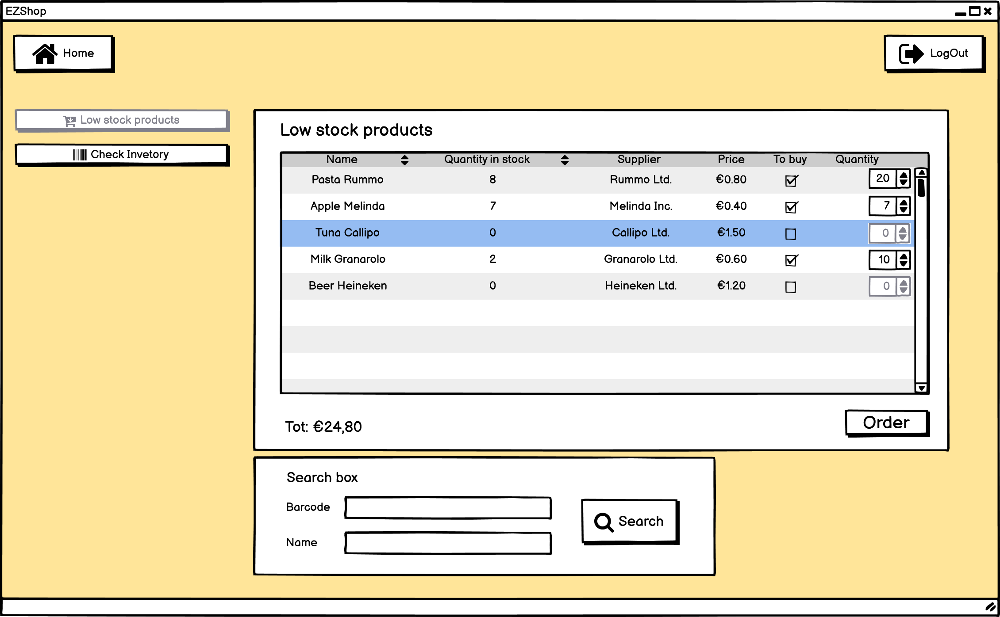

# Graphical User Interface Prototype  

Authors: Stefano, Mattia, Nicola, Hossein

Date: 18 April 2021

Version: 1.0

## 0 Welcome and Homepages 

This page is the welcome page.  

1. The **subscriber** can log in clicking on *Login*. Page at point '12' appears.
2. A **customer** can register by clicking on *Register*. Page at point '8' appears.

##

This page is the homepage of a normal subscriber. 
1. The **system** shows some informations in the center: ID card number, fidelity points amount, coupons, if any, and all the personal informations.  
2. The **Subscriber** can modify its own infotmations by clicking on the *edit informations* button. Page at point '7' appears.  
3. The **Subscriber** can request a new card if they lost it, by clicking on the *lost card* button. The second page at point '8' appears.  
4. The **Subscriber** can click on the *logout* button on top-right to log out.

##

This page is the homepage of an employee. It is similar to the Subscriber Homepage, but the Employee has different rights compared to the normal Subscriber and for this reason there are some additional buttons:    
1. The **Employee** can click on *Inventory* button to open the inventory page at point '2' and manage the inventory.  
2. The **Employee** can click on *Sales* button to open the Sales page at point '1' and manage the sales.  

##

This page is the homepage of the Owner. It is similar to the Subscriber Homepage, but the Owner has different rights compared to the normal Subscriber and for this reason there are some additional buttons:    

1. The **Owner** can click on *Manage Rights* button to open the Manage rights page at point '13' and manage the subscribers' rights.    
2. The **Owner** can click on *Accounting* button to open the Accounting page at point '14' and manage the accounting.  
3. The **Owner** can click on *Inventory* button to open the inventory page at point '2' and manage the inventory.  
4. The **Owner** can click on *Sales* button to open the Sales page at point '1' and manage the sales.  

## 1 Manage sale transaction

This page is described selling steps that Owner or Employee can use this form, products can insert through the barcode scanner.
##

This page is used to Reprint the receipt.

## 2 Waring on low stock, Buy product

First version.

The first version of the view is used to show the products that are low in stock to the owner. Then the **owner** can decide wether buy or not these products.
1. The **owner** can search the products either by barcode or by name, with the searchbox at the bottom.
2. The **system** shows in the table the products that matches with the search criteria, if any.
3. The **owner**, by checking the checkbox relative to the product that he wants to buy, can select the products to which is interested to.
4. The **owner** can choose the quantity for each product by clicking on the realtive number stepper.
5. The **owner** can buy the products by clicking to the order button.

The **owner** can go back to her/his *home* by clicking on the home button.  
The **owner** can log out by clicking on the LogOut button.  
The **owner** can go to the *check inventory* view by clicking on the relative button.  
The **owner** can go to the *add new products* view by clicking on the relative button.  
The **owner** can go to the *edit product information* view by clicking on the relative button.  
The **owner** can go to the *mark product as not sold anymore* view by clicking on the relative button.  

second version.
## 7 Edit informations account

This is the page in which the subscriber can modify its own informations. Name, Surname, SSN and date of birth cannot be modified.  
1. The **subscriber** can modify its own informations and the click on *save* to save.  
2. The **subscriber** can click on the *logout* button on top-right to log out.  
3. The **subscriber** can click on *Home* button on the top-left to go back to the Homepage.  

## 8 Registration, Request fidelity card

This page is used to create a new account.  
1. The **customer** can insert all the informations and click on Save to register in the system. All the fields with * are required.  
2. The **customer** can click on *Back* button to go back to the Welcome Page. 

##

Here the subsciber can request a new fidelity card in case they lost it. 
1. The **subscriber** can click on *Request new card* button to request the new card. The old card is automatically marked as lost and all the points and coupons are transferred to the new card.
2. The **subscriber** can click on the *logout* button on top-right to log out.  
3. The **subscriber** can click on *Home* button on the top-left to go back to the Homepage.

##

This is the page that confirms with a pop up the creation of the new card.

## 9 Create Coupon

This page is used to create a coupon that appears after clicking on *Create Coupon* in the Homepage.   
1. The **subscriber** can choose the amount of the coupon and click on *create coupon*.
2. The **subscriber** can click on the *logout* button on top-right to log out.  
3. The **subscriber** can click on *Home* button on the top-left to go back to the Homepage.

##

This page shows the pop up that appears after the creation of the coupon.

## 10 Check Points

This is the homepage where the subsciber can check its own points in the top rectangle.  
1. The **subscriber** can click on the *logout* button on top-right to log out.  
2. The **subscriber** can click on *Home* button on the top-left to go back to the  Homeage.

## 12 Log in 

This is the login page.  
1. The **subscriber** can insert email and password and then click on *Login*.
2. The **subscriber** can click on *Forgot password* to change the password.  
3. The **subscriber** can click on *Home* button on the top-left to go back to the Welcome Page.

##

This is the error shown when the credentials are wrong.

## 13 Manage Rights

In this page the owner can change the subscribers' rights.  

1. The **owner** can click on the left box near the name and choose the subscriber's right: 'O' for the Owner, 'E' for the Employee, 'S' for the normal subsciber.   
2. The **owner** can click on  the *Save* button on the bottom-right saves all the changes.  
3. The **owner** can click on the *logout* button on top-right to log out.   
4. The **owner** can click on *Home* button on the top-left to go back to the Homepage.  

## 14 Accounting and sale transactions

This is the main accounting page from which the owner can access to all the accounting features.
##

This page contains the list of sale transactions. The report button will lead to the report page.

## 15 Expenses

This page contains the list of expenses

## 16 Salaries

This page contais the list of employees and respective salaries. The pay buttow will open the bank web site and allow the owner to easily pay the salaries.

## 17 Forgot password

This page is used to reset the password in the case the subscriber forgot it.  

1. The **subscriber** can insert the email, SSN and password.  
2. The **customer** can click on *Back* button to go back to the Welcome Page. 

##

This is the error shown when the subscriber isn't in the system.

\<Report here the GUI that you propose. You are free to organize it as you prefer. A suggested presentation matches the Use cases and scenarios defined in the Requirement document. The GUI can be shown as a sequence of graphical files (jpg, png)  >

