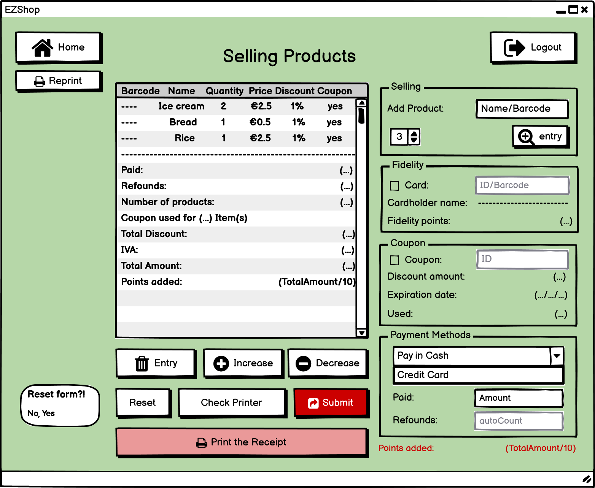
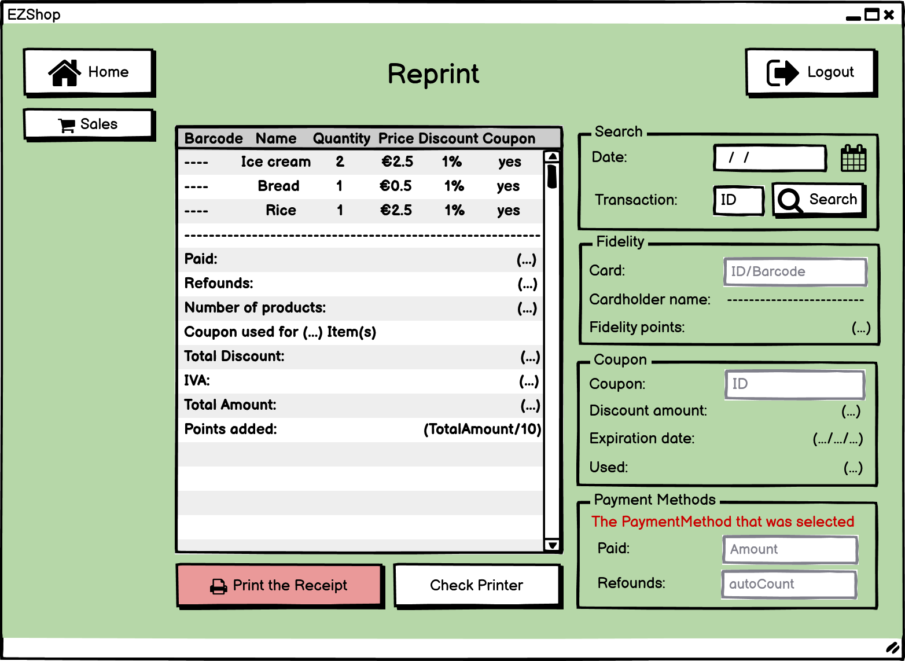

# Graphical User Interface Prototype  

Authors:

Date:

Version:

## 0 Welcome and Homepages 

This page is the welcome page in which a subsciber can log in and a new subsciber can register. 
##

This page is the homepage of a normal subscriber. Here they can check points, request coupon, create a new card, edit informations.
##

This page is the homepage of an employee. In addition to the subscribers' rights, they can magage Sales and Inventory
##

This page is the homepage of the Owner. In addition to the subscribers' rights, they can magage Sales, Inventory, Accounting and Rights of all the subscribers.

## 1 Manage sale transaction

This page is used to selling products.
##

This page is used to Reprint the receipt.

## 2 UC2 Waring on low stock, Buy product

This page is used to show the products that are low in stock. The Owner can also search them by their barcode or name.

## 7 Edit informations account

This is the page in which the subscriber can modify its own informations.

## 8 Registration, Request fidelity card

This page is used to create a new account. All the fields with * are required. 
##

This page is used to request a new fidelity card in case the subscriber lost it.

## 9 Create Coupon

This page is used to create a coupon. Here the subscriber can choose the amount of the coupon and click on "create coupon".
##

This page shows the pop up that appears after the creation of the coupon.

## 10 Check Points

This is the homepage where the subsciber can check its own points.

## 12 Log in 

This is the login page.
##

This is the error shown when the credentials are wrong.

## 13 Manage Rights

In this page the owner can change the subscribers' rights.

## 14 Accounting and sale transactions

This is the main accounting page from which the owner can access to all the accounting features.
##

This page contains the list of sale transactions. The report button will lead to the report page.

## 15 Expenses

This page contains the list of expenses

## 16 Salaries

This page contais the list of employees and respective salaries. The pay buttow will open the bank web site and allow the owner to easily pay the salaries.

## 17 Forgot password

This page is used to reset the password in the case the subscriber forgot it.
##

This is the error shown when the subscriber isn't in the system.

\<Report here the GUI that you propose. You are free to organize it as you prefer. A suggested presentation matches the Use cases and scenarios defined in the Requirement document. The GUI can be shown as a sequence of graphical files (jpg, png)  >

