# Graphical User Interface Prototype  

Authors: Stefano, Mattia, Nicola, Hossein

Date: 21 April 2021

Version: 2.0

## 0 Welcome and Homepages 

0.1  
This page is the welcome page.  

1. The **subscriber** can click on *Login* to login (Page 12.1).
2. A **customer** can click by on *Register* to register (Page 8.1).

##

0.2  
This page is the homepage of a normal subscriber. 
1. The **system** shows some information in the center: ID card number, fidelity points amount, coupons, if any, and all the personal information.  
2. The **Subscriber** can modify its own infotmations by clicking on the *edit information* button. (Page 7.1).  
3. The **Subscriber** can request a new card if they lost it, by clicking on the *lost card* button. (Page 8.2).  
4. The **Subscriber** can click on the *logout* button on top-right to log out. (Page 0.1) 
5. The **Subscriber** can create a coupon  by clicking on the *Create Coupon* button. (Page 9.1).  

##

0.3  
This page is the homepage of an employee. It is similar to the Subscriber Homepage, but the Employee has different rights compared to the normal Subscriber and for this reason there are some additional buttons:    
1. The **Employee** can click on *Inventory* button to open the inventory and manage it. (Page 4.1)  
2. The **Employee** can click on *Sales* button to open the Sales and manage a sale. (Page 1.1)

##

0.4  
This page is the homepage of the Owner. It is similar to the Subscriber Homepage, but the Owner has different rights compared to the normal Subscriber and for this reason there are some additional buttons:    

1. The **Owner** can click on *Manage Rights* button to open the Manage rights and manage the subscribers' rights. (Page 13.1)   
2. The **Owner** can click on *Accounting* button to open the Accounting and manage the accounting. (Page 14.1)
3. The **Owner** can click on *Inventory* button to open the inventory and manage the inventory. (Page 4.1) 
4. The **Owner** can click on *Sales* button to open the Sales and manage the sales. (Page 1.1)

## 1 Manage sale transaction

1.1  

This page is described selling steps that **Owner** or **Employee** can use this form, Subscriber/Customer can buy products with or without coupon/discount. there are some additional buttons:

1. The Owner/Employee can click on the **Home** button that linked to the homepage. (Page 0.3/0.4)
2. The Owner/Employee can click on the **Reprint** button to print the previous receipt by searching. (Page 1.2)
3. The Owner/Employee can click on the **Logout** button will used to logging out. (Page 0.1)

The **List of Products** with information about the receipt (Paid, Refounds, Number of products, Coupon used for (...) Item(s), Total Discount, IVA, Total Amount, Fidelity Points, Points Added) also user can controls item(s) in the List by **Delete / Increase / Decrease** buttons.

The **Search field set** used to **Adding product(s)** with their name/barcode searching and quantitiy of them by clicking on the **Entry** button.

In the **Fidelity field set**, if **Card checkbox** was selected, ID/Barcode will read by cashier and **Cardholder name** and **Fidelity points** will be shown automatically.

The **Coupon field set** if **Coupon checkbox** was selected, ID of the coupon must be put, **Discount amount** and **Expiration date** and **Used** points until before by Subscriber will appear.

In the **Payment Methods field set** if **Pay in Cash** was selected, The amount of **Paid** must be insert and **Refounds** must be automaticaly count =(PaidAmount-TotalAmount)

Then **Points added = (TotalAmount/10) will automatically generating when thr Total Amount were equal and greater than 10

Also there is a Chech Printer button that can open the printer queue in the Windows.

At the end and after inserting / scanning Barcode(s), if the Subscriber / Customer(s) paid theirs and if employee clicked on the submite button, the receipt will be printable by **Print the Receipt button**

##

1.2  

This page is described print again the previous receipt that **Owner** or **Employee** can use this form, No information can be edited. there are some additional buttons:

1. The Owner/Employee can click on the **Home** button that linked to the homepage. (Page 0.3/0.4)
2. The Owner/Employee can click on the **Sales** button to back to the Selling products page. (Page 1.1)
3. The Owner/Employee can click on the **Logout** button will used to logging out. (Page 0.1)

The **List of Products** with information about the receipt (Paid, Refounds, Number of products, Coupon used for (...) Item(s), Total Discount, IVA, Total Amount, Fidelity Points, Points Added) that they never can edited.

The **Search field set** used to searching product(s)** with their Date or Transaction ID by clicking on the **Search** button.

In the **Fidelity field set**, all this information **ID/Barcode, Cardholder name, Fidelity points** will appear automatically when Transaction has been being searched that they never can edited.

In the **Coupon field set** all this information **ID, Discount amount, Expiration date, Used** points until before by Subscriber will appear, they never can edited.

In the **Payment Methods field set** Payment statement will be shown that here we can see information like **Paid, Refounds** which is counted automatically = (PaidAmount-TotalAmount)

Also there is a Check Printer button that can open the printer queue in the Windows.

At the end and after Searching by Date or Transaction ID, if the Owner or Employee had clicked on Print the Receipt button, the receipt will be print again.

## 2 Waring on low stock, Buy product

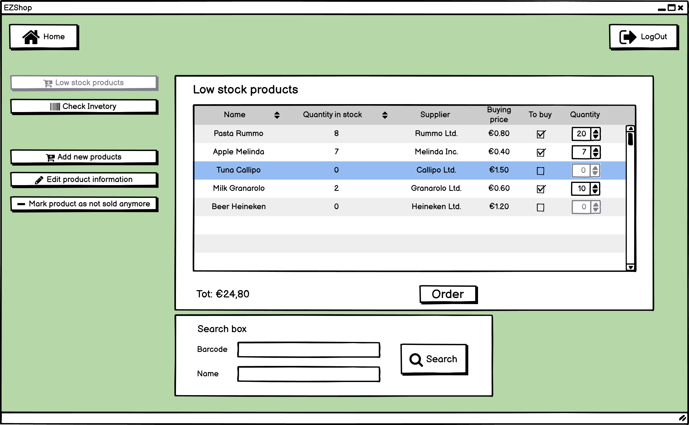
2.1  

Owner version.  

The first version of the view is used to show the products that are low in stock to the **owner**. Then the **owner** can decide whether buy or not these products. In the table there are shown: the name, the quantity in stock, the supplier and the buying cost of each product that is low in stock.
1. The **system** shows in the table all products that are low in stock.
2. The **owner** can search the products either by barcode or by name, with the searchbox at the bottom. The search is performed when he/she presses the search button.
3. The **system** shows in the table the products that matches with the search criteria, if any.
4. The **owner**, by checking the checkbox relative to the product that he wants to buy, can select the products to which is interested to.
5. The **owner** can choose the quantity for each product, that is checked, by clicking on the realtive number stepper.
6. The **owner** can buy the products by clicking on the order button.

The **owner** can go back to her/his *home* by clicking on the home button. (Page 0.2)  
The **owner** can log out by clicking on the LogOut button. (Page 0.1)  
The **owner** can go to the *check inventory* view by clicking on the relative button. (Page 4.1)  
The **owner** can go to the *add new products* view by clicking on the relative button. (Page 3.1)  
The **owner** can go to the *edit product information* view by clicking on the relative button. (Page 6.1)  
The **owner** can go to the *mark product as not sold anymore* view by clicking on the relative button. (Page 5.1)  

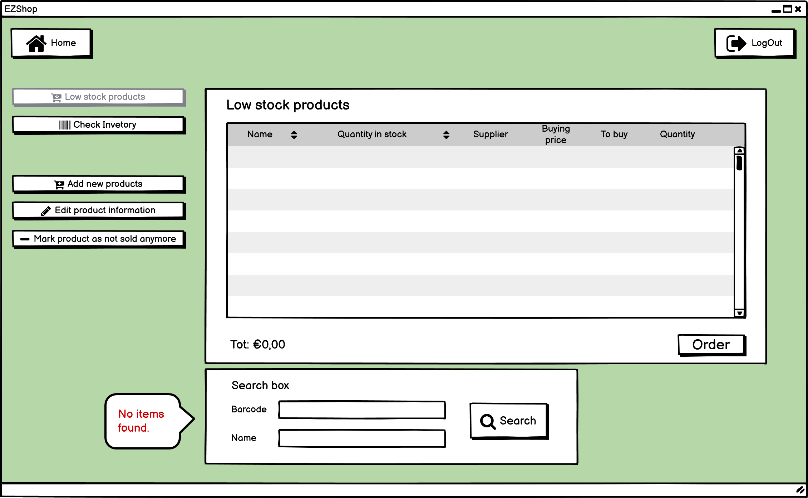
2.1.1 This is the error shown when there are no products that match the search criteria.  

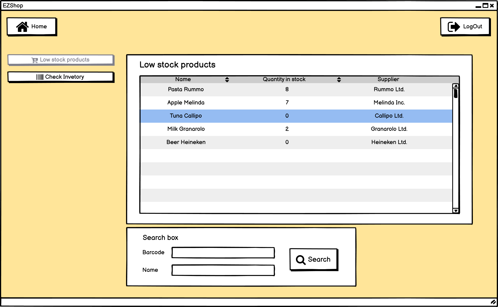
2.2  

*Employee version.*  

The second version of the view is used to show the products that are low in stock to the **employee**. In the table there are shown the name, the quantity in stock and the supplier of each product that is low in stock.
1. The **system** shows in the table all products that are low in stock.
2. The **employee** can search the products either by barcode or by name, using the searchbox at the bottom. The search is performed when he/she presses the search button.
3. The **system** shows in the table the products that matches with the search criteria, if any.

The **employee** can go back to her/his *home* by clicking on the home button. (Page 0.2)  
The **employee** can log out by clicking on the LogOut button. (Page 0.1)  
The **employee** can go to the *check inventory* view by clicking on the relative button. (Page 4.2)  

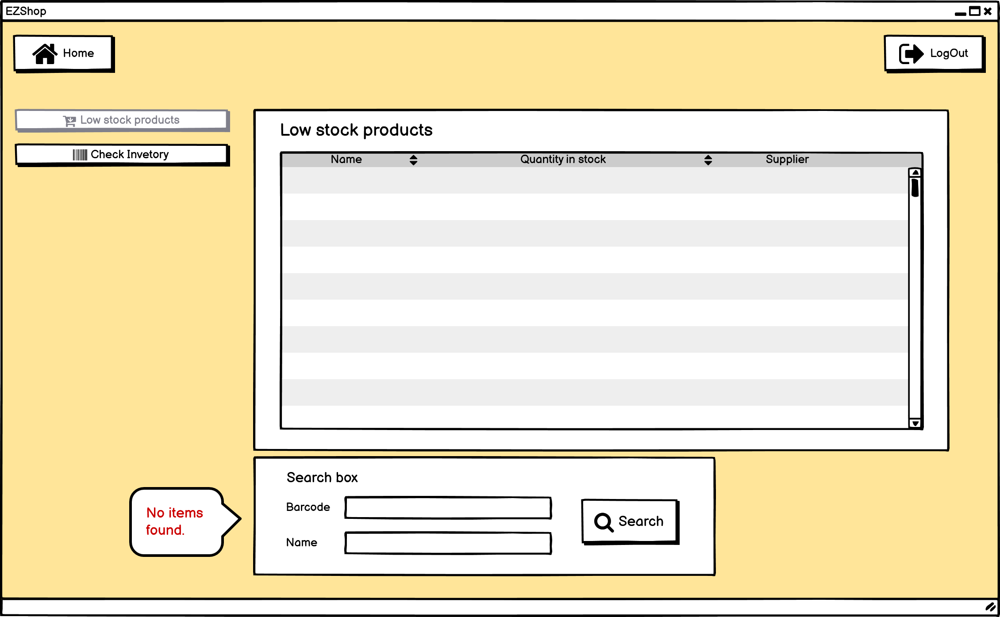
2.2.1 This is the error shown when there are no products that match the search criteria.

## 3 Add product

3.1  

With this view the **owner** can add to the buyable products new products that arent in the inventory or products that are not sold anymore. The products that are not sold anymore are shown by a table. For each product not sold anymore, name and supplier are shown.
1. The **system** shows in the table all products that are not sold anymore.
2. The **owner** insert, in the appropriate fields, the information about the product that he/she wants to start to sell.
3. If the **owner** wants, he/she can search among the products that are not sold anymore using the search box at the bottom. The search is performed when he/she presses the search button.
4. The **system** shows in the table all the products that matches with the search criteria, if any.
5. If the **owner** wants, he/she can check, by the checkboxes in the table, the products that he/she want to add to the buyable products.
6. When the **owner** has done, he/she can add the product(s) by pressing the add button.

The **owner** can go back to her/his *home* by clicking on the home button. (Page 0.2)  
The **owner** can log out by clicking on the LogOut button. (Page 0.1)  
The **owner** can go to the *low stock products* view by clicking on the relative button. (Page 2.1)  
The **owner** can go to the *check inventory* view by clicking on the relative button. (Page 4.1)  
The **owner** can go to the *edit product information* view by clicking on the relative button. (Page 6.1)  
The **owner** can go to the *mark product as not sold anymore* view by clicking on the relative button. (Page 5.1)  

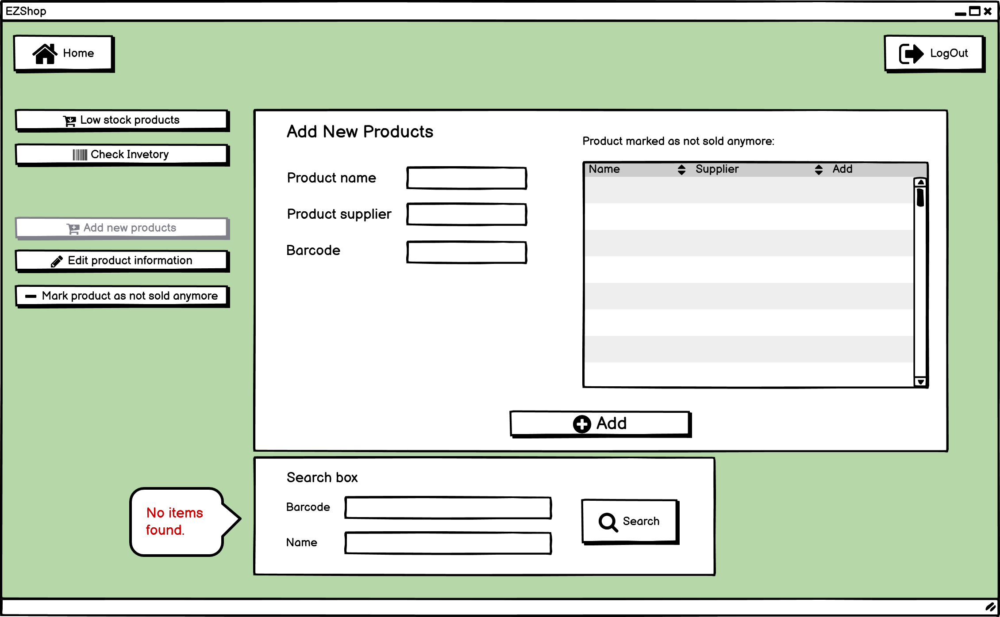
3.1.1 This is the error shown when there are no products that match the search criteria.

## 4 Check inventory

4.1   

*Owner version.*  

With this view the **owner** can view and search the products in the inventory. The products are shown by a table. For each product the table shows: the name , the quantity, the supplier, the expiration, the price, the barcode, the discount and if is sold.
1. The **system** shows in the table all products.
2. The **owner** can search the products: by barcode, by name, by supplier and by price range with the searchbox at the bottom. The search is performed when he/she presses the search button.
3. The **system** shows in the table all the products that matches with the search criteria, if any.

The **owner** can go back to her/his *home* by clicking on the home button. (Page 0.2)  
The **owner** can log out by clicking on the LogOut button. (Page 0.1)  
The **owner** can go to the *low stock products* view by clicking on the relative button. (Page 2.1)  
The **owner** can go to the *add new products* view by clicking on the relative button. (Page 3.1)  
The **owner** can go to the *edit product information* view by clicking on the relative button. (Page 6.1)  
The **owner** can go to the *mark product as not sold anymore* view by clicking on the relative button. (Page 5.1)  

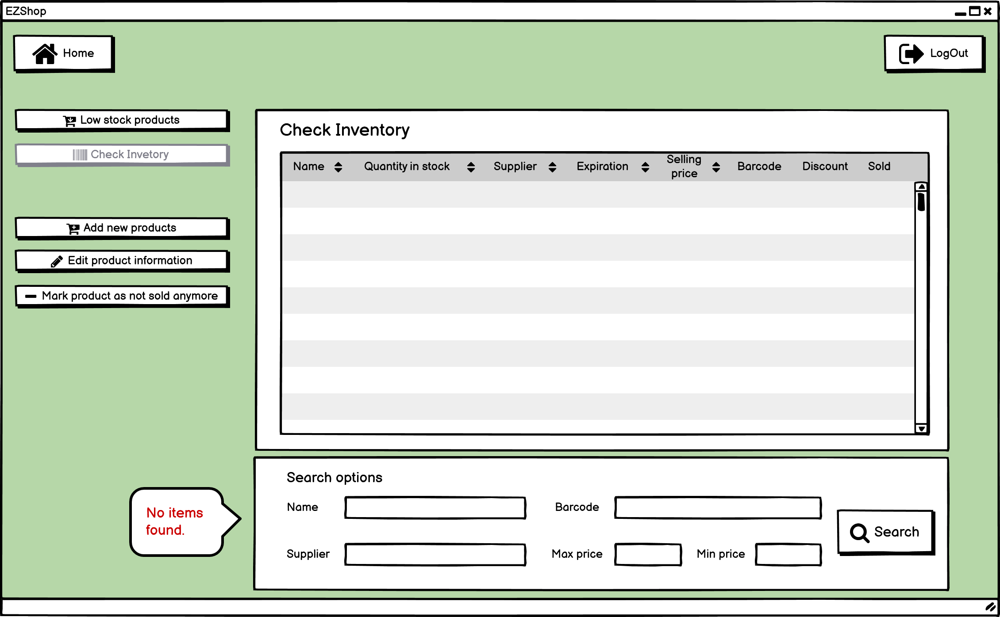
4.1.1 This is the error shown when there are no products that match the search criteria.

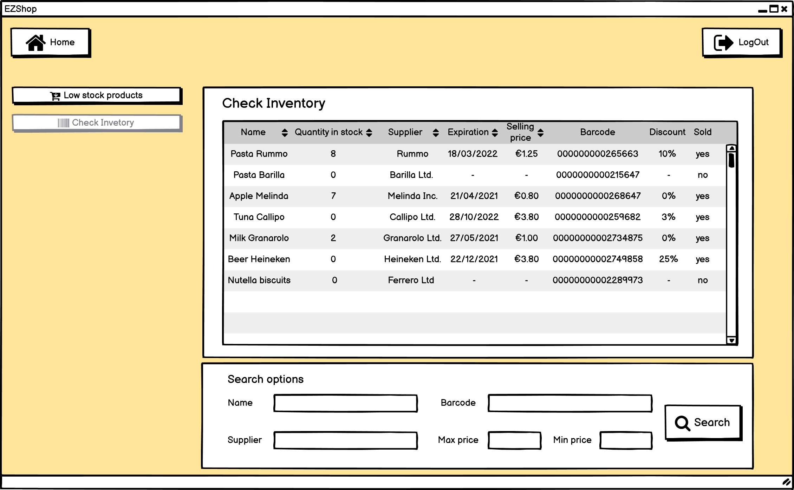
4.2

*Employee version.*  

With this view the **employee** can view and search the products in the inventory. The products are shown by a table. For each product the table shows: the name, the quantity, the supplier, the expiration, the price, the barcode, the discount and if is sold.
1. The **system** shows in the table all products.
2. The **employee** can search the products: by barcode, by name, by supplier and by price range with the searchbox at the bottom. The search is performed when he/she presses the search button.
3. The **system** shows in the table all the products that matches with the search criteria, if any.

The **employee** can go back to her/his *home* by clicking on the home button. (Page 0.2)  
The **employee** can log out by clicking on the LogOut button. (Page 0.1)  
The **employee** can go to the *low stock products* view by clicking on the relative button. (Page 2.2)  

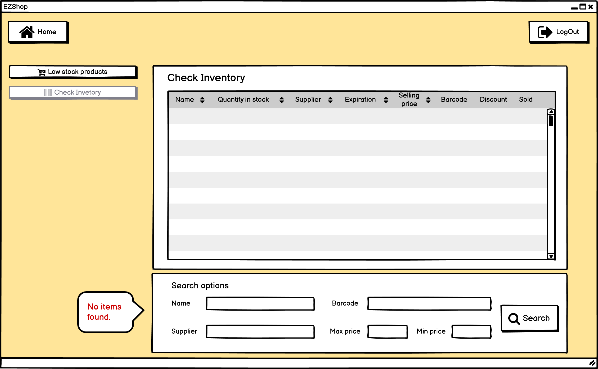
4.2.1 This is the error shown when there are no products that match the search criteria.

## 5 Mark product as "not sold anymore"

5.1

With this view the **owner** can signal products in the inventory as not sold anymore. In the table there are shown: the name, the supplier and the barcode.
1. The **system** shows in the table all products that are low in stock.
2. The **owner** can search the products either by barcode or by name, with the searchbox at the bottom. The search is performed when he/she presses the search button.
3. The **system** shows in the table the products that matches with the search criteria, if any.
4. The **owner**, by checking the checkbox relative to the product that he wants to remove, can select the products to which is interested to mark as not sold anymore.
6. The **owner** can save the changes by clicking on the commit button.

The **owner** can go back to her/his *home* by clicking on the home button. (Page 0.2)  
The **owner** can log out by clicking on the LogOut button. (Page 0.1)  
The **owner** can go to the *low stock products* view by clicking on the relative button. (Page 2.1)  
The **owner** can go to the *check inventory* view by clicking on the relative button. (Page 4.1)  
The **owner** can go to the *add new products* view by clicking on the relative button.(Page 3.1)  
The **owner** can go to the *edit information* view by clicking on the relative button. (Page 6.1)  

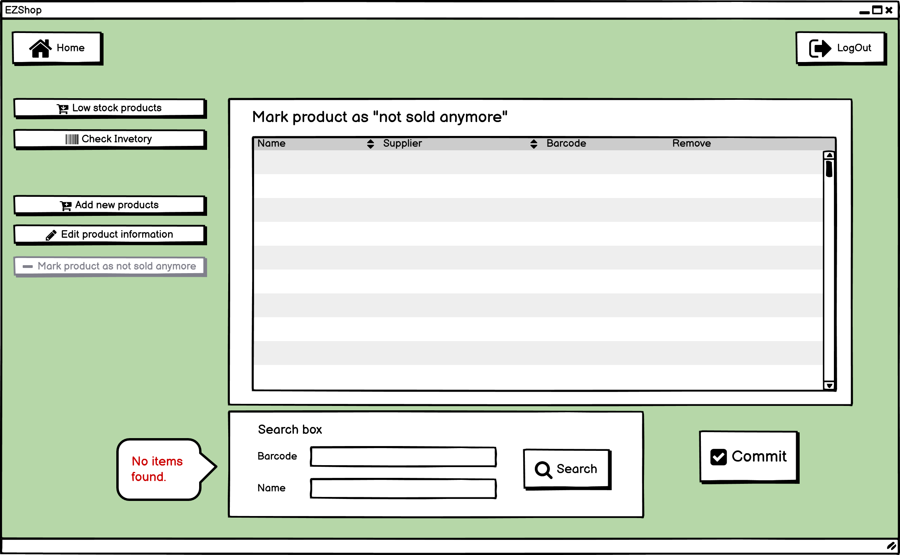
5.1.1 This is the error shown when there are no products that match the search criteria.

## 6 Edit product information

6.1

With this view the **owner** can edit products in the inventory. It is possible to edit one product at a time. 
1. The **owner** can search, using the barcode, the product that he/she wants to edit. The search is performed when he/she presses the search button.
2. The **owner** can change an information of the product using the relevant text fields.
3. The expiration date can also be modified using the date picker. To use it, the **owner** has to click on the calendar icon.
4. If the **owner** wants, he/she can reset the fields by pressing the reset field button.
5. The **owner** can save the changes by pressing the commit button. 

The **owner** can go back to her/his *home* by clicking on the home button. (Page 0.2)  
The **owner** can log out by clicking on the LogOut button. (Page 0.1)  
The **owner** can go to the *low stock products* view by clicking on the relative button. (Page 2.1)  
The **owner** can go to the *check inventory* view by clicking on the relative button. (Page 4.1)  
The **owner** can go to the *add new products* view by clicking on the relative button.(Page 3.1)  
The **owner** can go to the *mark product as not sold anymore* view by clicking on the relative button. (Page 5.1)  

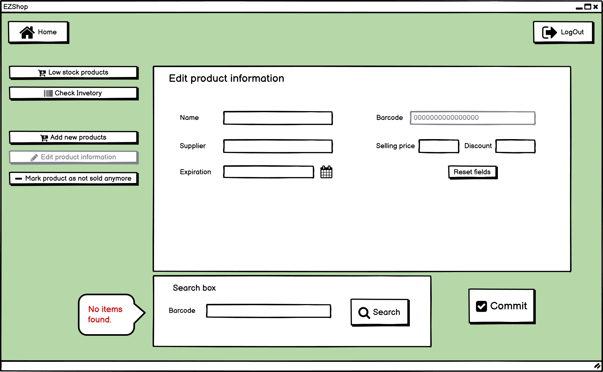
6.1.1 This is the error shown when there are no products that match the search criteria.

## 7 Edit information account

7.1

This is the page in which the subscriber can modify its own information. Name, Surname, SSN and date of birth cannot be modified.  
1. The **subscriber** can modify its own information and the click on *save* to save.  
2. The **subscriber** can click on the *logout* button on top-right to log out. (Page 0.1) 
3. The **subscriber** can click on *Home* button on the top-left to go back to the Homepage. (Page 0.2) 

## 8 Registration, Request fidelity card

8.1

This page is used to create a new account.  
1. The **customer** can insert all the information and click on *Create New Account* to register in the system. All the fields with * are required.  
2. The **customer** can click on *Back* button to go back to the Welcome Page. (Page 0.1) 

##

8.2

Here the subsciber can request a new fidelity card in case they lost it. 
1. The **subscriber** can click on *Request new card* button to request the new card. The old card is automatically marked as lost and all the points and coupons are transferred to the new card.
2. The **subscriber** can click on the *logout* button on top-right to log out. (Page 0.1) 
3. The **subscriber** can click on *Home* button on the top-left to go back to the Homepage.(Page 0.2) 

##

8.3

This is the page that confirms with a pop up the creation of the new card.

## 9 Create Coupon

9.1

This page is used to create a coupon that appears after clicking on *Create Coupon* in the Homepage.   
1. The **subscriber** can choose the amount of the coupon and click on *create coupon*.
2. The **subscriber** can click on the *logout* button on top-right to log out. (Page 0.1) 
3. The **subscriber** can click on *Home* button on the top-left to go back to the Homepage. (Page 0.2) 

##

9.2

This page shows the pop up that appears after the creation of the coupon.

## 10 Check Points

10.1

This is the homepage where the subscriber can check its own points in the top rectangle.  
1. The **subscriber** can click on the *logout* button on top-right to log out. (Page 0.1) 
2. The **subscriber** can click on *Home* button on the top-left to go back to the  Homeage.(Page 0.2) 

## 12 Log in 

12.1

This is the login page.  
1. The **subscriber** can insert email and password and then click on *Login*.
2. The **subscriber** can click on *Forgot password* to change the password. (Page 18.1)
3. The **subscriber** can click on *Home* button on the top-left to go back to the Welcome Page.(Page 0.1) 

##

12.2

This is the error shown when the credentials are wrong.

## 13 Manage Rights

13.1

In this page the owner can change the subscribers' rights.  

1. The **owner** can click on the left box near the name and choose the subscriber's right: 'O' for the Owner, 'E' for the Employee, 'S' for the normal subsciber.   
2. The **owner** can click on  the *Save* button on the bottom-right saves all the changes.  
3. The **owner** can click on the *logout* button on top-right to log out. (Page 0.1) 
4. The **owner** can click on *Home* button on the top-left to go back to the Homepage. (Page 0.4)  

## 14 Accounting and sale transactions

14.1

This is the main accounting page from which the owner can access to all the accounting features.

1. The **owner** can click on the *Sale transactios* button to view a detailed list of all sale trasanctions.(Page 14.2)
2. The **owner** can click on the *Expenses* button to view a list of all the expenses.(Page 15.1)
3. The **owner** can click on the *Pay salaries* button to access a list of all employees and their respective salaries. (Page 16.2)
4. The **owner** can click on the *Daily balance* button to access the daily balance. (Page 17.2)
5. The **owner** can click on the *Home* button to go back to their home page. (Page 0.4)
6. The **owner** can click on the *logOut* button to logout. (Page 0.1)

##

14.2

This page contains the list of sale transactions. 

1. The **owner** can click on the *Print* button to print the list of transactions.
2. The **owner** can select a few transactions and click on the *Print* button to print the selected transactions.
3. The **owner** can search for a specific transaction using the search bar. They can look for a transaction containing a certain item, during a specific day, with a certain total price or card ID. 
4. The **owner** can sort the table by using the first row.
5. The **owner** can click on the *Home* button to go back to their home page. (Page 0.4)
6. The **owner** can click on the *logOut* button to logout. (Page 0.1)

## 15 Expenses
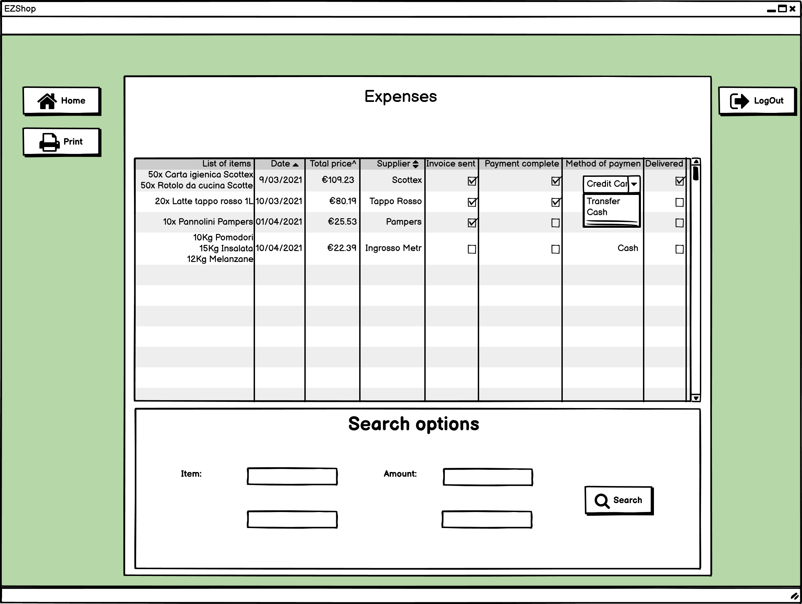
15.1

This page contains the list of expenses

1. The **owner** can click on the *Print* button to print the list of expenses.
2. The **owner** can select a few expenses and click on the *Print* button to print the selected transactions.
3. The **owner** can search for a specific expense using the search bar. They can look for an expense containing a certain item, during a specific day, with a certain total price or supplier. 
4. The **owner** can sort the table by using the first row.
5. The **owner** can click on the *Home* button to go back to their home page. (Page 0.4)
6. The **owner** can click on the *logOut* button to logout. (Page 0.1)

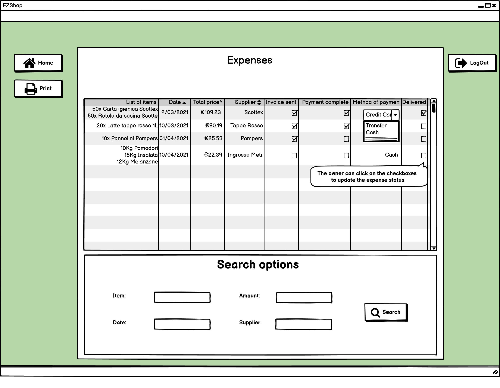
15.2

1. The **owner** can click on the checkboxes to change the state of each expense. State are boolean and include: invoice sent, payment completed and products delivered.

## 16 Salaries

16.1

This page contais the list of employees and respective salaries. 

1. The **owner** can click on the *Print* button to print the list of employees and past and resent salaries.
2. The **owner** can select a salary and click on the *Pay* button to pay the salary. The button will open a browser window on the bank web site and will fill the fields necessary to pay said salary.
3. The **owner** can search for a specific employee or salary using the search bar. They can look for a specific employee, a certain number of hours worked, by the amount or by date.
4. The **owner** can sort the table by using the first row.
5. The **owner** can click on the *Home* button to go back to their home page. (Page 0.4)
6. The **owner** can click on the *logOut* button to logout. (Page 0.1)

## 17 Daily balance
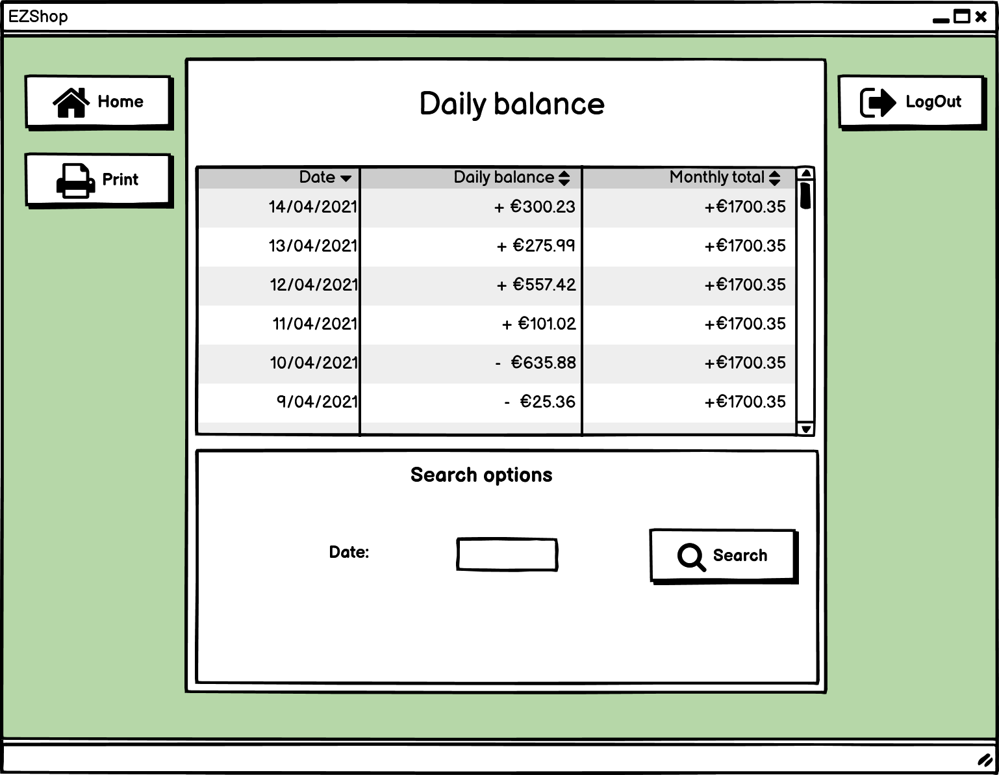
17.1

This page contains the daily balance. 

1. The **owner** can click on the *Print* button to print the daily balance so far.
2. The **owner** can search for a specific date.
3. The **owner** can sort the table by using the first row.
4. The **owner** can click on the *Home* button to go back to their home page. (Page 0.4)
5. The **owner** can click on the *logOut* button to logout. (Page 0.1)

## 18 Forgot password

18.1

This page is used to reset the password in the case the subscriber forgot it.  

1. The **subscriber** can insert the email, SSN and password and then click on *Save* to save the changes.   
2. The **customer** can click on *Back* button to go back to the Welcome Page. (Page 0.1) 

##

18.2

This is the error shown when the subscriber isn't in the system.

