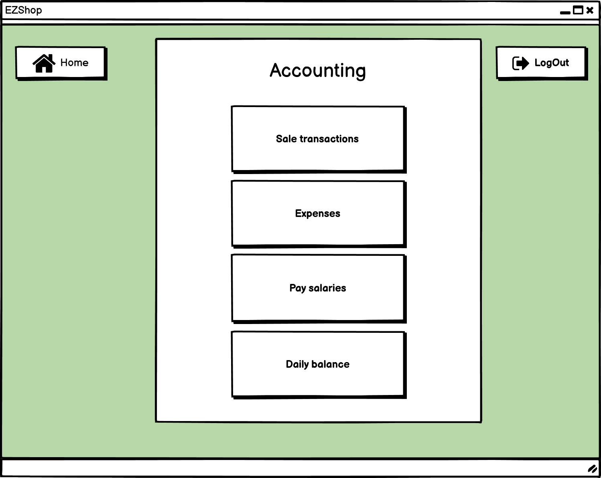

# Graphical User Interface Prototype  

Authors:

Date:

Version:

## 14 accounting and sale transactions

This is the main accounting page from which the owner can access to all the accounting features.

This page contains the list of sale transactions.

## 15 Expenses

This page contains the list of expenses

## 16 Salaries

This page contais the list of employees and respective salaries. The pay buttow will open the bank web site and allow the owner to easily pay the salaries.

\<Report here the GUI that you propose. You are free to organize it as you prefer. A suggested presentation matches the Use cases and scenarios defined in the Requirement document. The GUI can be shown as a sequence of graphical files (jpg, png)  >

