# Integration and API Test Documentation

Authors:

Date:

Version:

# Contents

- [Dependency graph](#dependency graph)

- [Integration approach](#integration)

- [Tests](#tests)

- [Scenarios](#scenarios)

- [Coverage of scenarios and FR](#scenario-coverage)
- [Coverage of non-functional requirements](#nfr-coverage)

# Dependency graph 

```plantuml

@startuml
scale 0.8
interface EZShopInterface {
    +reset()
    +createUser(username: String, password: String, role: String) : Integer
    +deleteUser(id: Integer): boolean
    +getAllUsers(): List<User>
    +getUser(id: Integer): User
    +updateUserRights(id: Integer, role: String): Boolean


    +login(username: String, password: String): User
    +logout(): boolean

    +createProductType(description: String, productCode: String, pricePerUnit: double, note: String): Integer
    +updateProduct(id: Integer, newDescription: String, newCode: String, newPrice: double, newNote: String): boolean
    +deleteProductType(id: Integer): boolean
    +getAllProductTypes():  List<ProductType>
    +getProductTypeByBarCode(barCode: String): ProductType
    +getProductTypesByDescription(description: String): List<ProductType>

    +updateQuantity(Integer productId, int toBeAdded): boolean
    +updatePosition(Integer productId, String newPos): boolean
    +issueOrder(String productCode, int quantity, double pricePerUnit): Integer
    +payOrderFor(String productCode, int quantity, double pricePerUnit): Integer
    +payOrder(Integer orderId): boolean
    +recordOrderArrival(Integer orderId): boolean
    +getAllOrders(): List<Order> 

    +defineCustomer(customerName: String): Customer
    +modifyCustomer(id: Integer, newCustomerName: String, newCustomerCard): boolean
    +deleteCustomer(id: Integer): boolean
    +getCustomer(id : Integer): Customer
    +getAllCustomers(): List<Customer>

    +createCard(): String
    +attachCardToCustomer(customerCard: String, customerId: String ): boolean
    +modifyPointsOnCard(customerCard: String, pointsToBeAdded: Integer): boolean

    +startSaleTransaction() : Integer
    +addProductToSale(transactionId: Integer, productCode: String, amount: Integer): boolean
    +deleteProductFromSale(transactionId: Integer, productCode: String, amount: Integer): boolean
    +applyDiscountRateToProduct(transactionId: Integer, productCode: String, discountRate: double): boolean
    +applyDiscountRateToSale(transactionId: Integer, discountRate: double) : boolean
    +computePointsForSale(transactionId: Integer): int
    +endSaleTransaction(transactionId: Integer): boolean
    +deleteSaleTransaction(transactionId: Integer) : boolean
    +getSaleTransaction(transactionId: Integer): boolean
    +startReturnTransaction(transactionId: Integer): Integer
    +returnProduct(returnId : Integer, productCode: String, amount: int): boolean
    +endReturnTransaction(returnId : Integer, commit: boolean): boolean
    +deleteReturnTransaction(returnId: Integer): boolean
    +receiveCashPayment(transactionId: Integer, cash: double): double
    +receiveCreditCardPayment(transactionId: Integer, creditCard: String): boolean
    +returnCashPayment(returnId: Integer): double
    +returnCreditCardPayment(returnId: Integer, creditCard: String): double

    +recordBalanceUpdate(toBeAdded: double): boolean
    +getCreditsAndDebits(from: LocalDate, to: LocalDate): List<BalanceOperation>
    +computeBalance(): double
}



class Shop {
    +addOrder(order: Order): boolean
}

Shop.|>EZShopInterface

class UserManager{
    -userIdGen: Integer
    -loggedUser: User
    +{static}USERS_PATH: String
    +{static}USERS_ID_PATH: String
    
    +createUser(username: String, password: String, role: String) : Integer
    +deleteUser(id: Integer) : Boolean
    +getAllUsers() : List<User>
    +getUser(id: Integer) : User
    +updateUserRights(id: Integer, role: String) : Boolean
    +login(username: String, password: String) : User
    +logout() : boolean
    -persistUsers()
    -persistUsersId()
    +clear()

    +getLoggedUser() : User
}

class User {
    
    -id: Integer
    -username: String
    -password: String
}

enum UserRole{
    CASHIER
    SHOP_MANAGER
    ADMINISTRATOR
}

enum ReturnStatus{
    NEW
    CLOSED
    ENDED
}

UserRole <. User 

class Customer {
    -id: Integer
    -customerName: String
}



LoyaltyCard  <. Customer

class LoyaltyCard {
    -cardCode: String
    -points: Integer
    -isAttached: boolean
}

UserManager ..> User
Customer <.. CustomerManager
LoyaltyCard <.. CustomerManager

class CustomerManager {
    -customerIdGen: Integer
    -loyaltyCardIdGen: long
    +{static}CARD_PATH: String
    +{static}CARD_ID_PATH: String
    +{static}CUSTOMER_ID_PATH: String
    +{static}CUSTOMER_PATH: String
    
    +defineCustomer(customerName: String): Customer
    +modifyCustomer(id: Integer, newCustomerName: String, newCustomerCard): boolean
    +deleteCustomer(id: Integer): boolean
    +getCustomer(id : Integer): Customer
    +getAllCustomers(): List<Customer>
    +createCard(): String
    +attachCardToCustomer(customerCard: String, customerId: String ): boolean
    +modifyPointsOnCard(customerCard: String, pointsToBeAdded: Integer): boolean
    -persistCards()
    -persistCustomers()
    -persistCardsId()
    -persistCustomersId()
    +clear()
}


class ProductOrderManager {

    -productIdGen: int
    -orderIdGen: int
    +{static}PRODUCTS_PATH: String
    +{static}PRODUCT_GEN_PATH: String
    +{static}ORDER_GEN_PATH: String
    
    +checkBarcode(barCode: String): boolean

    +createProductType(description: String, productCode: String, pricePerUnit: double, note: String): Integer
    +updateProduct(id: Integer, newDescription: String, newCode: String, newPrice: double, newNote: String): boolean
    +deleteProductType(id: Integer): boolean
    +getAllProductTypes():  List<ProductType>
    +getProductTypeByBarCode(barCode: String): ProductType
    +getProductTypesByDescription(description: String): List<ProductType>

    +updateQuantity(Integer productId, int toBeAdded): boolean
    +updatePosition(Integer productId, String newPos): boolean

    +issueOrder(String productCode, int quantity, double pricePerUnit): Integer
    +payOrderFor(String productCode, int quantity, double pricePerUnit): Integer
    
    +payOrder(Integer orderId): boolean
    +recordOrderArrival(Integer orderId): boolean
    -persistGen()
    -persistProducts()
    +clear()

}

ProductOrderManager ..> ProductType

class TransactionManager {
    -saleGen:  int
    -returnGen:int 
    -balanceOperationGen:  int
    -{static}ORDER_PATH: String
    -{static}SALE_PATH: String
    -{static}RETURN_PATH: String
    -{static}CREDITCARD_PATH: String
    -{static}BALANCEOPERATION_PATH: String
    -{static}GENERATOR_PATH: String
    
    +startSaleTransaction() : Integer
    +addProductToSale(transactionId: Integer, productCode: String, amount: Integer): boolean
    +deleteProductFromSale(transactionId: Integer, productCode: String, amount: Integer): boolean
    +applyDiscountRateToProduct(transactionId: Integer, productCode: String, discountRate: double): boolean
    +applyDiscountRateToSale(transactionId: Integer, discountRate: double) : boolean
    +computePointsForSale(transactionId: Integer): int
    +endSaleTransaction(transactionId: Integer): boolean
    +deleteSaleTransaction(transactionId: Integer) : boolean
    +getSaleTransaction(transactionId: Integer): boolean
    +startReturnTransaction(transactionId: Integer): Integer
    +returnProduct(returnId : Integer, productCode: String, amount: int): boolean
    +endReturnTransaction(returnId : Integer, commit: boolean): boolean
    +deleteReturnTransaction(returnId: Integer): boolean
    +receiveCashPayment(transactionId: Integer, cash: double): double
    +receiveCreditCardPayment(transactionId: Integer, creditCard: String): boolean
    +returnCashPayment(returnId: Integer): double
    +returnCreditCardPayment(returnId: Integer, creditCard: String): double
    +recordBalanceUpdate ( double toBeAdded) : boolean
    +getCreditsAndDebits(from: LocalDate, to: LocalDate): List<BalanceOperation>
    +computeBalance(): double
    +getAllOrders(): List<Order>
    
    -persistOrders()
    -persistCards()
    -persistSales()
    -persistReturns()
    -persistBalanceOperations()
    -persistGenerators()
    +luhnAlgorithm (String creditCard): boolean
    +clear()
     
    +getReturnTransaction(transactionId: Integer): ReturnTransaction
    +addCompletedOrder(orderId: Integer): Order
    +addOrder(order: Order): boolean
}


TransactionManager ..> BalanceOperation
TransactionManager ..> CreditCard
TransactionManager ..> Order
TransactionManager ..> SaleTransaction

Shop ..> UserManager
Shop ..> CustomerManager
Shop ..> ProductOrderManager
Shop ..> TransactionManager

Shop <.. UserManager
Shop <.. CustomerManager
Shop <.. ProductOrderManager
Shop <.. TransactionManager

class CreditCard {
    -number: String
    -balance: double
}


class Credit 
class Debit

Credit --|> BalanceOperation
Debit --|> BalanceOperation

abstract BalanceOperation {
    
    -balanceId: int
    -type: String
    -money: double
    -date: LocalDate
    
}
class Order{
    -orderId: Integer
    -supplier: String
    -pricePerUnit: double
    -quantity: Integer
}

enum OrderStatus{
    ISSUED
    PAYED
    COMPLETED
}

Order .> OrderStatus

Order ..> Debit
ReturnTransaction --|> Debit

class ProductType {
    -id: Integer
    -barCode: String

    -description: String
    -sellPrice: double
    -discountRate: double
    -notes: String
    -amount: int
}


class Position {
    -aisleID: Integer
    -rackID: Integer
    -levelID: Integer
    -empty: boolean
}


ProductType .> Position


class SaleTransaction {
    
    -ticketNumber: Integer
    -paymentType : String
    -price: double
    -discountRate : double
   
    
    -updatePrice()
    +deleteEntry(entry: TicketEntry)
    +addEntry(entry: TicketEntry)
    +addProduct(p: ProductType, quantity : Integer) : boolean
    
}

enum SaleStatus {
    STARTED,
    CLOSED,
    PAYED
}

SaleTransaction  ..> TicketEntry
SaleTransaction  ..> SaleStatus 


SaleTransaction -|> Credit

class TicketEntry {
    -  barCode: String
    -  productDescription : String
    -  amount: int 
    -  pricePerUnit: double
    -  discountRate: double
}

SaleTransaction ..> LoyaltyCard

Order .> ProductType

class ReturnTransaction {
    -transactionId: int
    -price: double
}

ReturnTransaction ..> ReturnStatus
ReturnTransaction ..> TicketEntry


TransactionManager ..> ProductOrderManager
@enduml

```

     <report the here the dependency graph of the classes in EzShop, using plantuml>

# Integration approach

    <Write here the integration sequence you adopted, in general terms (top down, bottom up, mixed) and as sequence
    (ex: step1: class A, step 2: class A+B, step 3: class A+B+C, etc)> 
    <Some steps may  correspond to unit testing (ex step1 in ex above), presented in other document UnitTestReport.md>
    <One step will  correspond to API testing>

#  Tests

   <define below a table for each integration step. For each integration step report the group of classes under test, and the names of
     JUnit test cases applied to them> JUnit test classes should be here src/test/java/it/polito/ezshop

## Step 1
| Classes  | JUnit test cases |
|-----|----|
| UnitTesting  |   |

## Step 2 
| Classes  | JUnit test cases |
|-------|------|
|  src.main.java.it.polito.ezshop.classes.UserManager + src.main.java.it.polito.ezshop.classes.UserObj + src.main.java.it.polito.ezshop.classes.UserRole | src.test.it.polito.ezshop.classes.UserManagerTest::**testGetUserLogged**  |
|  src.main.java.it.polito.ezshop.classes.UserManager + src.main.java.it.polito.ezshop.classes.UserObj + src.main.java.it.polito.ezshop.classes.UserRole |  src.test.it.polito.ezshop.classes.UserManagerTest::**testCreateUser**  |
|  src.main.java.it.polito.ezshop.classes.UserManager + src.main.java.it.polito.ezshop.classes.UserObj + src.main.java.it.polito.ezshop.classes.UserRole |  src.test.it.polito.ezshop.classes.UserManagerTest::**testDeleteUser** |
|  src.main.java.it.polito.ezshop.classes.UserManager + src.main.java.it.polito.ezshop.classes.UserObj + src.main.java.it.polito.ezshop.classes.UserRole |  src.test.it.polito.ezshop.classes.UserManagerTest::**testGetAllUsers** |
|  src.main.java.it.polito.ezshop.classes.UserManager +  src.main.java.it.polito.ezshop.classes.UserObj + src.main.java.it.polito.ezshop.classes.UserRole |  src.test.it.polito.ezshop.classes.UserManagerTest::**testGetUser** |
|  src.main.java.it.polito.ezshop.classes.UserManager +  src.main.java.it.polito.ezshop.classes.UserObj + src.main.java.it.polito.ezshop.classes.UserRole |  src.test.it.polito.ezshop.classes.UserManagerTest::**testUpdateUserRights** |
|  src.main.java.it.polito.ezshop.classes.UserManager +  src.main.java.it.polito.ezshop.classes.UserObj + src.main.java.it.polito.ezshop.classes.UserRole |  src.test.it.polito.ezshop.classes.UserManagerTest::**testLogin** |
|  src.main.java.it.polito.ezshop.classes.UserManager +  src.main.java.it.polito.ezshop.classes.UserObj + src.main.java.it.polito.ezshop.classes.UserRole |  src.test.it.polito.ezshop.classes.UserManagerTest::**testLogout** |
| src.main.java.it.polito.ezshop.classes.CustomerManager + src.main.java.it.polito.ezshop.classes.CustomerObj | src.test.it.polito.ezshop.classes.CustomerManagerTest::**testDefineCustomer**  |
| src.main.java.it.polito.ezshop.classes.CustomerManager + src.main.java.it.polito.ezshop.classes.CustomerObj |  src.test.it.polito.ezshop.classes.CustomerManagerTest::**testCheckCardDigits** |
| src.main.java.it.polito.ezshop.classes.CustomerManager + src.main.java.it.polito.ezshop.classes.CustomerObj + src.main.java.it.polito.ezshop.classes.LoyaltyCardObj |  src.test.it.polito.ezshop.classes.CustomerManagerTest::**testModifyCustomer** |
| src.main.java.it.polito.ezshop.classes.CustomerManager + src.main.java.it.polito.ezshop.classes.CustomerObj + src.main.java.it.polito.ezshop.classes.LoyaltyCardObj |  src.test.it.polito.ezshop.classes.CustomerManagerTest::**testDeleteCustomer** |
| src.main.java.it.polito.ezshop.classes.CustomerManager + src.main.java.it.polito.ezshop.classes.CustomerObj |  src.test.it.polito.ezshop.classes.CustomerManagerTest::**testGetCustomer** |
| src.main.java.it.polito.ezshop.classes.CustomerManager + src.main.java.it.polito.ezshop.classes.CustomerObj |  src.test.it.polito.ezshop.classes.CustomerManagerTest::**testGetAllCustomers** |
| src.main.java.it.polito.ezshop.classes.CustomerManager + src.main.java.it.polito.ezshop.classes.LoyaltyCardObj |  src.test.it.polito.ezshop.classes.CustomerManagerTest::**testCreateCard** |
| src.main.java.it.polito.ezshop.classes.CustomerManager + src.main.java.it.polito.ezshop.classes.CustomerObj + src.main.java.it.polito.ezshop.classes.LoyaltyCardObj |  src.test.it.polito.ezshop.classes.CustomerManagerTest::**testAttachCardToCustomer** |
| src.main.java.it.polito.ezshop.classes.CustomerManager + src.main.java.it.polito.ezshop.classes.CustomerObj + src.main.java.it.polito.ezshop.classes.LoyaltyCardObj |  src.test.it.polito.ezshop.classes.CustomerManagerTest::**testModifyPointsOnCard** |
|   |   |

## Step 3 

| Classes  | JUnit test cases |
|------|------|
|  src.main.java.it.polito.ezshop.classes.EZShop + src.main.java.it.polito.ezshop.classes.UserManager + src.main.java.it.polito.ezshop.classes.UserObj + src.main.java.it.polito.ezshop.classes.UserRole |  src.test.it.polito.ezshop.classes.EZShopTest::**testCreateUser**  |
|  src.main.java.it.polito.ezshop.classes.EZShop + src.main.java.it.polito.ezshop.classes.UserManager + src.main.java.it.polito.ezshop.classes.UserObj + src.main.java.it.polito.ezshop.classes.UserRole |  src.test.it.polito.ezshop.classes.EZShopTest::**testDeleteUser** |
|  src.main.java.it.polito.ezshop.classes.EZShop + src.main.java.it.polito.ezshop.classes.UserManager + src.main.java.it.polito.ezshop.classes.UserObj + src.main.java.it.polito.ezshop.classes.UserRole |  src.test.it.polito.ezshop.classes.EZShopTest::**testGetAllUsers** |
|  src.main.java.it.polito.ezshop.classes.EZShop + src.main.java.it.polito.ezshop.classes.UserManager + src.main.java.it.polito.ezshop.classes.UserObj + src.main.java.it.polito.ezshop.classes.UserRole |  src.test.it.polito.ezshop.classes.EZShopTest::**testGetUser** |
|  src.main.java.it.polito.ezshop.classes.EZShop + src.main.java.it.polito.ezshop.classes.UserManager + src.main.java.it.polito.ezshop.classes.UserObj + src.main.java.it.polito.ezshop.classes.UserRole |  src.test.it.polito.ezshop.classes.EZShopTest::**testUpdateUserRights** |
|  src.main.java.it.polito.ezshop.classes.EZShop + src.main.java.it.polito.ezshop.classes.UserManager + src.main.java.it.polito.ezshop.classes.UserObj + src.main.java.it.polito.ezshop.classes.UserRole |  src.test.it.polito.ezshop.classes.EZShopTest::**testLogin** |
|  src.main.java.it.polito.ezshop.classes.EZShop + src.main.java.it.polito.ezshop.classes.UserManager + src.main.java.it.polito.ezshop.classes.UserObj + src.main.java.it.polito.ezshop.classes.UserRole |  src.test.it.polito.ezshop.classes.EZShopTest::**testLogout** |
|  src.main.java.it.polito.ezshop.classes.EZShop + src.main.java.it.polito.ezshop.classes.CustomerManager + src.main.java.it.polito.ezshop.classes.CustomerObj + src.main.java.it.polito.ezshop.classes.LoyaltyCardObj|  src.test.it.polito.ezshop.classes.EZShopTest::**defineCustomer** |
|  src.main.java.it.polito.ezshop.classes.EZShop + src.main.java.it.polito.ezshop.classes.CustomerManager + src.main.java.it.polito.ezshop.classes.CustomerObj + src.main.java.it.polito.ezshop.classes.LoyaltyCardObj |  src.test.it.polito.ezshop.classes.EZShopTest::**testModifyCustomer** |
|  src.main.java.it.polito.ezshop.classes.EZShop + src.main.java.it.polito.ezshop.classes.CustomerManager + src.main.java.it.polito.ezshop.classes.CustomerObj + src.main.java.it.polito.ezshop.classes.LoyaltyCardObj |  src.test.it.polito.ezshop.classes.EZShopTest::**testDeleteCustomer** |
|  src.main.java.it.polito.ezshop.classes.EZShop + src.main.java.it.polito.ezshop.classes.CustomerManager + src.main.java.it.polito.ezshop.classes.CustomerObj |  src.test.it.polito.ezshop.classes.EZShopTest::**testGetCustomer** |
|  src.main.java.it.polito.ezshop.classes.EZShop + src.main.java.it.polito.ezshop.classes.CustomerManager + src.main.java.it.polito.ezshop.classes.CustomerObj |  src.test.it.polito.ezshop.classes.EZShopTest::**testGetAllCustomers** |
|  src.main.java.it.polito.ezshop.classes.EZShop + src.main.java.it.polito.ezshop.classes.CustomerManager + src.main.java.it.polito.ezshop.classes.LoyaltyCardObj |  src.test.it.polito.ezshop.classes.EZShopTest::**testCreateCard** |
|  src.main.java.it.polito.ezshop.classes.EZShop + src.main.java.it.polito.ezshop.classes.CustomerManager + src.main.java.it.polito.ezshop.classes.CustomerObj + src.main.java.it.polito.ezshop.classes.LoyaltyCardObj  |  src.test.it.polito.ezshop.classes.EZShopTest::**testAttachCardToCustomer** |
|  src.main.java.it.polito.ezshop.classes.EZShop + src.main.java.it.polito.ezshop.classes.CustomerManager + src.main.java.it.polito.ezshop.classes.CustomerObj + src.main.java.it.polito.ezshop.classes.LoyaltyCardObj  |  src.test.it.polito.ezshop.classes.EZShopTest::**testModifyPointsOnCard** |
|  src.main.java.it.polito.ezshop.classes.EZShop + src.main.java.it.polito.ezshop.classes.ProductOrderManager + src.main.java.it.polito.ezshop.classes.UserManager + src.main.java.it.polito.ezshop.classes.ProductTypeObj | src.test.it.polito.ezshop.classes.EZShopTest::**testCreateProductType**  |
|  src.main.java.it.polito.ezshop.classes.EZShop + src.main.java.it.polito.ezshop.classes.ProductOrderManager + src.main.java.it.polito.ezshop.classes.UserManager + src.main.java.it.polito.ezshop.classes.ProductTypeObj  | src.test.it.polito.ezshop.classes.EZShopTest::**testUpdateProduct**  |
|  src.main.java.it.polito.ezshop.classes.EZShop + src.main.java.it.polito.ezshop.classes.ProductOrderManager + src.main.java.it.polito.ezshop.classes.UserManager + src.main.java.it.polito.ezshop.classes.ProductTypeObj  | src.test.it.polito.ezshop.classes.EZShopTest::**testDeleteProductType**  |
|  src.main.java.it.polito.ezshop.classes.EZShop + src.main.java.it.polito.ezshop.classes.ProductOrderManager + src.main.java.it.polito.ezshop.classes.UserManager + src.main.java.it.polito.ezshop.classes.ProductTypeObj  | src.test.it.polito.ezshop.classes.EZShopTest::**testGetAllProductTypes**  |
|  src.main.java.it.polito.ezshop.classes.EZShop + src.main.java.it.polito.ezshop.classes.ProductOrderManager + src.main.java.it.polito.ezshop.classes.UserManager + src.main.java.it.polito.ezshop.classes.ProductTypeObj  | src.test.it.polito.ezshop.classes.EZShopTest::**testGetProductTypeByBarCode**  |
|  src.main.java.it.polito.ezshop.classes.EZShop + src.main.java.it.polito.ezshop.classes.ProductOrderManager + src.main.java.it.polito.ezshop.classes.UserManager + src.main.java.it.polito.ezshop.classes.ProductTypeObj | src.test.it.polito.ezshop.classes.EZShopTest::**testGetProductTypesByDescription**  |
|  src.main.java.it.polito.ezshop.classes.EZShop + src.main.java.it.polito.ezshop.classes.ProductOrderManager + src.main.java.it.polito.ezshop.classes.UserManager + src.main.java.it.polito.ezshop.classes.ProductTypeObj + src.main.java.it.polito.ezshop.classes.Position | src.test.it.polito.ezshop.classes.EZShopTest::**testUpdateQuantity**  |
|  src.main.java.it.polito.ezshop.classes.EZShop + src.main.java.it.polito.ezshop.classes.ProductOrderManager + src.main.java.it.polito.ezshop.classes.UserManager + src.main.java.it.polito.ezshop.classes.ProductTypeObj + src.main.java.it.polito.ezshop.classes.Position  | src.test.it.polito.ezshop.classes.EZShopTest::**testUpdatePosition**  |
|  src.main.java.it.polito.ezshop.classes.EZShop + src.main.java.it.polito.ezshop.classes.ProductOrderManager + src.main.java.it.polito.ezshop.classes.UserManager + src.main.java.it.polito.ezshop.classes.ProductTypeObj + src.main.java.it.polito.ezshop.classes.OrderObj | src.test.it.polito.ezshop.classes.EZShopTest::**testIssueOrder**  |
|  src.main.java.it.polito.ezshop.classes.EZShop + src.main.java.it.polito.ezshop.classes.TransactionManager + src.main.java.it.polito.ezshop.classes.ProductOrderManager + src.main.java.it.polito.ezshop.classes.UserManager + src.main.java.it.polito.ezshop.classes.ProductTypeObj + src.main.java.it.polito.ezshop.classes.OrderObj | src.test.it.polito.ezshop.classes.EZShopTest::**testPayOrderForInvalid**  |
|  src.main.java.it.polito.ezshop.classes.EZShop + src.main.java.it.polito.ezshop.classes.TransactionManager + src.main.java.it.polito.ezshop.classes.ProductOrderManager + src.main.java.it.polito.ezshop.classes.UserManager + src.main.java.it.polito.ezshop.classes.ProductTypeObj + src.main.java.it.polito.ezshop.classes.OrderObj | src.test.it.polito.ezshop.classes.EZShopTest::**testPayOrderForAdmin**  |
|  src.main.java.it.polito.ezshop.classes.EZShop + src.main.java.it.polito.ezshop.classes.TransactionManager + src.main.java.it.polito.ezshop.classes.ProductOrderManager + src.main.java.it.polito.ezshop.classes.UserManager + src.main.java.it.polito.ezshop.classes.ProductTypeObj + src.main.java.it.polito.ezshop.classes.OrderObj + src.main.java.it.polito.ezshop.classes.BalanceOperationObj | src.test.it.polito.ezshop.classes.EZShopTest::**testPayOrderForShopManager**  |
|   | src.test.it.polito.ezshop.classes.EZShopTest::**testPayOrderInvalid**  |
|   | src.test.it.polito.ezshop.classes.EZShopTest::**testPayOrderAdmin**  |
|   | src.test.it.polito.ezshop.classes.EZShopTest::**testPayOrderShopManager**  |
|   | src.test.it.polito.ezshop.classes.EZShopTest::**recordOrderArrivalInvalid**  |
|   | src.test.it.polito.ezshop.classes.EZShopTest::**recordOrderAdmin**  |
|   | src.test.it.polito.ezshop.classes.EZShopTest::**recordOrderShopManager**  |
|   | src.test.it.polito.ezshop.classes.EZShopTest::**getAllOrdersInvalid**  |
|   | src.test.it.polito.ezshop.classes.EZShopTest::**testGetAllOrdersOk**  |
|   | src.test.it.polito.ezshop.classes.EZShopTest::**startSaleTransaction**  |
|   | src.test.it.polito.ezshop.classes.EZShopTest::**addProductToSale**  |
|   | src.test.it.polito.ezshop.classes.EZShopTest::**deleteProductFromSale**  |
|   | src.test.it.polito.ezshop.classes.EZShopTest::**applyDiscountRateToProduct**  |
|   | src.test.it.polito.ezshop.classes.EZShopTest::**applyDiscountRateToSale**  |
|   | src.test.it.polito.ezshop.classes.EZShopTest::**computePointsForSale**  |
|   | src.test.it.polito.ezshop.classes.EZShopTest::**endSaleTransaction**  |
|   | src.test.it.polito.ezshop.classes.EZShopTest::**deleteSaleTransaction**  |
|   | src.test.it.polito.ezshop.classes.EZShopTest::**getSaleTransaction**  |
|   | src.test.it.polito.ezshop.classes.EZShopTest::**startReturnTransaction**  |
|   | src.test.it.polito.ezshop.classes.EZShopTest::**returnProduct**  |
|   | src.test.it.polito.ezshop.classes.EZShopTest::**endReturnTransaction**  |
|   | src.test.it.polito.ezshop.classes.EZShopTest::**deleteReturnTransaction**  |
|   | src.test.it.polito.ezshop.classes.EZShopTest::**receiveCashPayment**  |
|   | src.test.it.polito.ezshop.classes.EZShopTest::**receiveCreditCardPayment**  |
|   | src.test.it.polito.ezshop.classes.EZShopTest::**returnCashPayment**  |
|   | src.test.it.polito.ezshop.classes.EZShopTest::**returnCreditCardPayment**  |
|   | src.test.it.polito.ezshop.classes.EZShopTest::**recordBalanceUpdate**  |
|   | src.test.it.polito.ezshop.classes.EZShopTest::**getCreditsAndDebits**  |
|   | src.test.it.polito.ezshop.classes.EZShopTest::**computeBalance**  |
|   | src.test.it.polito.ezshop.classes.EZShopTest::**addOrder**  |
|   |   |
|   | src.test.it.polito.ezshop.classes.TransactionManagerTest::**testBalanceUpdate**  |
|   | src.test.it.polito.ezshop.classes.TransactionManagerTest::**testLuhn**  |
|   | src.test.it.polito.ezshop.classes.TransactionManagerTest::**testComputeBalance**  |
|   | src.test.it.polito.ezshop.classes.TransactionManagerTest::**testStartSaleTransaction**  |
|   | src.test.it.polito.ezshop.classes.TransactionManagerTest::**testAddProductToSale**  |
|   | src.test.it.polito.ezshop.classes.TransactionManagerTest::**testDeleteProductFromSale**  |
|   | src.test.it.polito.ezshop.classes.TransactionManagerTest::**testApplyDiscountRateToProduct**  |
|   | src.test.it.polito.ezshop.classes.TransactionManagerTest::**testApplyDiscountRateToSale**  |
|   | src.test.it.polito.ezshop.classes.TransactionManagerTest::**testComputePointsForSale**  |
|   | src.test.it.polito.ezshop.classes.TransactionManagerTest::**testEndSaleTransaction**  |
|   | src.test.it.polito.ezshop.classes.TransactionManagerTest::**testDeleteSaleTransaction**  |
|   | src.test.it.polito.ezshop.classes.TransactionManagerTest::**testGetSaleTransaction**  |
|   | src.test.it.polito.ezshop.classes.TransactionManagerTest::**testGetAllOrders**  |
|   | src.test.it.polito.ezshop.classes.TransactionManagerTest::**testStartReturnTransaction**  |
|   | src.test.it.polito.ezshop.classes.TransactionManagerTest::**testEndReturnTransaction**  |
|   | src.test.it.polito.ezshop.classes.TransactionManagerTest::**testDeleteReturnTransaction**  |
|   | src.test.it.polito.ezshop.classes.TransactionManagerTest::**testReceiveCashPayment**  |
|   | src.test.it.polito.ezshop.classes.TransactionManagerTest::**testReceiveCreditCardPayment**  |
|   | src.test.it.polito.ezshop.classes.TransactionManagerTest::**testReturnCashPayment**  |
|   | src.test.it.polito.ezshop.classes.TransactionManagerTest::**testReturnCreditCardPayment**  |
|   | src.test.it.polito.ezshop.classes.TransactionManagerTest::**testGetCreditsAndDebits**  |
|   | src.test.it.polito.ezshop.classes.TransactionManagerTest::**testAddCompletedOrderInvalid**  |
|   | src.test.it.polito.ezshop.classes.TransactionManagerTest::**testAddCompletedOrderOk**  |
|   | src.test.it.polito.ezshop.classes.TransactionManagerTest::**testAddIssuedOrder**  |
|   | src.test.it.polito.ezshop.classes.TransactionManagerTest::**testAddPayedOrderFalse**  |
|   | src.test.it.polito.ezshop.classes.TransactionManagerTest::**testAddPayedOrderOk**  |
|   | src.test.it.polito.ezshop.classes.TransactionManagerTest::**testAddCompletedOrderInvalid**  |
|   |   |
|   | src.test.it.polito.ezshop.classes.ProductOrderManagerOrderTest::**testIssueOrderInvalid**  |
|   | src.test.it.polito.ezshop.classes.ProductOrderManagerOrderTest::**testIssueOrderOk**  |
|   | src.test.it.polito.ezshop.classes.ProductOrderManagerOrderTest::**testPayOrderForInvalid**  |
|   | src.test.it.polito.ezshop.classes.ProductOrderManagerOrderTest::**testPayOrderForNoProduct**  |
|   | src.test.it.polito.ezshop.classes.ProductOrderManagerOrderTest::**testPayOrderForNotEnoughBalance**  |
|   | src.test.it.polito.ezshop.classes.ProductOrderManagerOrderTest::**testPayOrderForOk**  |
|   | src.test.it.polito.ezshop.classes.ProductOrderManagerOrderTest::**testPayOrderFor**  |
|   | src.test.it.polito.ezshop.classes.ProductOrderManagerOrderTest::**testPayOrderNotPresent**  |
|   | src.test.it.polito.ezshop.classes.ProductOrderManagerOrderTest::**testPayOrderNotEnoughBalance**  |
|   | src.test.it.polito.ezshop.classes.ProductOrderManagerOrderTest::**testPayOrderOk**  |
|   | src.test.it.polito.ezshop.classes.ProductOrderManagerOrderTest::**testPayOrderPayedAndCompleted**  |
|   | src.test.it.polito.ezshop.classes.ProductOrderManagerOrderTest::**testRecordOrderArrivalInvalidOrderId**  |
|   | src.test.it.polito.ezshop.classes.ProductOrderManagerOrderTest::**testRecordOrderArrivalInvalidProductLocation**  |
|   | src.test.it.polito.ezshop.classes.ProductOrderManagerOrderTest::**testRecordOrderArrivalNotFound**  |
|   | src.test.it.polito.ezshop.classes.ProductOrderManagerOrderTest::**testRecordOrderArrivalOk**  |
|   | src.test.it.polito.ezshop.classes.ProductOrderManagerOrderTest::**testRecordOrderArrivalNotFound**  |
|   |   |
|   | src.test.it.polito.ezshop.classes.ProductOrderManagerOrderTest::**testCheckBarcodeNull**  |
|   | src.test.it.polito.ezshop.classes.ProductOrderManagerOrderTest::**testCheckBarcodeNonNum**  |
|   | src.test.it.polito.ezshop.classes.ProductOrderManagerOrderTest::**testCheckBarcodeLenghtLessThan12**  |
|   | src.test.it.polito.ezshop.classes.ProductOrderManagerOrderTest::**testCheckBarcodeLenghtGreaterThan14**  |
|   | src.test.it.polito.ezshop.classes.ProductOrderManagerOrderTest::**testCheckBarcodeCheckDigitNotValid**  |
|   | src.test.it.polito.ezshop.classes.ProductOrderManagerOrderTest::**testCheckBarcodeCheckDigitValid**  |
|   | src.test.it.polito.ezshop.classes.ProductOrderManagerOrderTest::**testCreateProductTypeOk**  |
|   | src.test.it.polito.ezshop.classes.ProductOrderManagerOrderTest::**testCreateProductTypeInvalidCode**  |
|   | src.test.it.polito.ezshop.classes.ProductOrderManagerOrderTest::**testCreateProductTypeInvalidDescription**  |
|   | src.test.it.polito.ezshop.classes.ProductOrderManagerOrderTest::**testUpdateProductInvalidID**  |
|   | src.test.it.polito.ezshop.classes.ProductOrderManagerOrderTest::**testUpdateProductPriceInvalidPrice**  |
|   | src.test.it.polito.ezshop.classes.ProductOrderManagerOrderTest::**testUpdateProductInvalidBarcode**  |
|   | src.test.it.polito.ezshop.classes.ProductOrderManagerOrderTest::**testUpdateProductPriceCodeAlreadyExist**  |
|   | src.test.it.polito.ezshop.classes.ProductOrderManagerOrderTest::**testUpdateProductIdNotPresent**  |
|   | src.test.it.polito.ezshop.classes.ProductOrderManagerOrderTest::**testUpdateProductOK**  |
|   | src.test.it.polito.ezshop.classes.ProductOrderManagerOrderTest::**testDeleteProductTypeInvalidId**  |
|   | src.test.it.polito.ezshop.classes.ProductOrderManagerOrderTest::**testDeleteProductTypeNotFound**  |
|   | src.test.it.polito.ezshop.classes.ProductOrderManagerOrderTest::**testDeleteProductTypeOk**  |
|   | src.test.it.polito.ezshop.classes.ProductOrderManagerOrderTest::**testGetAllProductTypesEmpty**  |
|   | src.test.it.polito.ezshop.classes.ProductOrderManagerOrderTest::**testGetAllProductTypes**  |
|   | src.test.it.polito.ezshop.classes.ProductOrderManagerOrderTest::**testGetProductTypeByBarCodeInvalidCode**  |
|   | src.test.it.polito.ezshop.classes.ProductOrderManagerOrderTest::**testGetProductTypeByBarCodeOk**  |
|   | src.test.it.polito.ezshop.classes.ProductOrderManagerOrderTest::**testGetProductTypesByDescriptionOk**  |
|   | src.test.it.polito.ezshop.classes.ProductOrderManagerOrderTest::**testGetProductTypesByDescriptionEmpty**  |
|   | src.test.it.polito.ezshop.classes.ProductOrderManagerOrderTest::**testUpdateQuantityOk**  |
|   | src.test.it.polito.ezshop.classes.ProductOrderManagerOrderTest::**testUpdatePositionInvalid**  |
|   | src.test.it.polito.ezshop.classes.ProductOrderManagerOrderTest::**testUpdatePositionReset**  |
|   | src.test.it.polito.ezshop.classes.ProductOrderManagerOrderTest::**testUpdatePositionOk**  |
|   |   |
|   |   |
|   |   |
|   |   |
|   |   |

# Scenarios

<If needed, define here additional scenarios for the application. Scenarios should be named
 referring the UC in the OfficialRequirements that they detail>

## Scenario UCx.y

| Scenario |  name |
| ------------- |:-------------:|
|  Precondition     |  |
|  Post condition     |   |
| Step#        | Description  |
|  1     |  ... |
|  2     |  ... |

# Coverage of Scenarios and FR

<Report in the following table the coverage of  scenarios (from official requirements and from above) vs FR. 
Report also for each of the scenarios the (one or more) API JUnit tests that cover it. >

| Scenario ID | Functional Requirements covered | JUnit  Test(s) |
| ----------- | ------------------------------- | ----------- |
| 1-1         | FR-3.1                          | src.test.it.polito.ezshop.classes.ProductOrderManagerTest::**testCreateProductTypeOk**  src.test.it.polito.ezshop.classes.ProductOrderManagerTest::**testCreateProductTypeInvalidCode** src.test.it.polito.ezshop.classes.ProductOrderManagerTest::**testCreateProductTypeInvalidDescription** |
| 1-1         | FR-4.2                         | src.test.it.polito.ezshop.classes.ProductOrderManagerTest::**testUpdatePositionInvalid** src.test.it.polito.ezshop.classes.ProductOrderManagerTest::**testUpdatePositionReset** src.test.it.polito.ezshop.classes.ProductOrderManagerTest::**testUpdatePositionOk** |
| 1-1         | FR-3.1, FR1.5                 | src.test.it.polito.ezshop.classes.EZShopTest::**testCreateProductType** |
| 1-1         | FR-4.2, FR1.5                  | src.test.it.polito.ezshop.classes.EZShopTest::**testUpdatePosition** |
| 1-2         | FR-3.4                          | src.test.it.polito.ezshop.classes.ProductOrderManagerTest::**testGetProductTypeByBarCodeInvalidCode** src.test.it.polito.ezshop.classes.ProductOrderManagerTest::**testGetProductTypeByBarCodeOk** |
| 1-2         | FR-4.2                          | src.test.it.polito.ezshop.classes.ProductOrderManagerTest::**testUpdatePositionInvalid** src.test.it.polito.ezshop.classes.ProductOrderManagerTest::**testUpdatePositionReset** src.test.it.polito.ezshop.classes.ProductOrderManagerTest::**testUpdatePositionOk** |
| 1-2         | FR-3.4, FR1.5                   | src.test.it.polito.ezshop.classes.EZShopTest::**testGetProductTypeByBarCode** |
| 1-2         | FR-4.2, FR1.5                   | src.test.it.polito.ezshop.classes.EZShopTest::**testUpdatePosition** |
| 1-3 | FR-3.4                          | src.test.it.polito.ezshop.classes.ProductOrderManagerTest::**testGetProductTypeByBarCodeInvalidCode** src.test.it.polito.ezshop.classes.ProductOrderManagerTest::**testGetProductTypeByBarCodeOk** |
| 1-3 | FR-3.1 | src.test.it.polito.ezshop.classes.ProductOrderManagerTest::**testUpdateProductInvalidID** src.test.it.polito.ezshop.classes.ProductOrderManagerTest::**testUpdateProductPriceInvalidPrice** src.test.it.polito.ezshop.classes.ProductOrderManagerTest::**testUpdateProductInvalidBarcode** src.test.it.polito.ezshop.classes.ProductOrderManagerTest::**testUpdateProductPriceCodeAlreadyExist** src.test.it.polito.ezshop.classes.ProductOrderManagerTest::**testUpdateProductIdNotPresent** src.test.it.polito.ezshop.classes.ProductOrderManagerTest::**testUpdateProductOK** |
| 1-3 | FR-3.4, FR1.5 | src.test.it.polito.ezshop.classes.EZShopTest::**testGetProductTypeByBarCode** |
| 1-3 | FR-3.1, FR1.5 | src.test.it.polito.ezshop.classes.EZShopTest::**testUpdateProduct** |
| - | FR-3.2 | src.test.it.polito.ezshop.classes.ProductOrderManagerTest::**testDeleteProductTypeInvalidId** src.test.it.polito.ezshop.classes.ProductOrderManagerTest::**testDeleteProductTypeNotFound** src.test.it.polito.ezshop.classes.ProductOrderManagerTest::**testDeleteProductTypeOk** |
| - | FR-3.2, FR1.5 | src.test.it.polito.ezshop.classes.EZShopTest::**testDeleteProductType** |
| - | FR-3.3 | src.test.it.polito.ezshop.classes.ProductOrderManagerTest::**testGetAllProductTypesEmpty** src.test.it.polito.ezshop.classes.ProductOrderManagerTest::**testGetAllProductTypes** |
| - | FR-3.3, FR1.5 | src.test.it.polito.ezshop.classes.EZShopTest::**testGetAllProductTypes** |
| -           | FR-3.4                          | src.test.it.polito.ezshop.classes.ProductOrderManagerTest::**testGetProductTypesByDescriptionOk** src.test.it.polito.ezshop.classes.ProductOrderManagerTest::**testGetProductTypesByDescriptionEmpty** |
| -           | FR-3.4, FR1.5 | src.test.it.polito.ezshop.classes.EZShopTest::**testGetProductTypesByDescription** |
| 2-1         | FR1.1, FR1.5                    |  src.test.it.polito.ezshop.classes.EZShopTest::**testCreateUser** |
| 2-2         | FR1.2, FR1.5                    |   src.test.it.polito.ezshop.classes.EZShopTest::**testDeleteUser**          |
| 2-3         | FR1.1, FR1.5                    |   src.test.it.polito.ezshop.classes.EZShopTest::**testUpdateUserRights**           |
| -           | FR1.3, FR1.5                    |  src.test.it.polito.ezshop.classes.EZShopTest::**testGetAllUsers**          |
| -           | FR1.4, FR1.5                    |  src.test.it.polito.ezshop.classes.EZShopTest::**testGetUser**        |
| 3-1      | FR4.3 | src.test.it.polito.ezshop.classes.ProductOrderManagerOrderTest::**testIssueOrderInvalid** src.test.it.polito.ezshop.classes.ProductOrderManagerOrderTest::**testIssueOrderOk** |
| 3-1 | FR4.3, FR1.5                    | src.test.it.polito.ezshop.classes.EZShopTest::**testIssueOrder** |
| 3-2 | FR4.5 | src.test.it.polito.ezshop.classes.ProductOrderManagerOrderTest::**testPayOrderInvalid** src.test.it.polito.ezshop.classes.ProductOrderManagerOrderTest::**testPayOrderNotPresent** src.test.it.polito.ezshop.classes.ProductOrderManagerOrderTest::**testPayOrderNotEnoughBalance** src.test.it.polito.ezshop.classes.ProductOrderManagerOrderTest::**testPayOrderOk** |
| 3-2 | FR4.5, FR1.5 | src.test.it.polito.ezshop.classes.EZShopTest::**testPayOrderInvalid** src.test.it.polito.ezshop.classes.EZShopTest::**testPayOrderAdmin** src.test.it.polito.ezshop.classes.EZShopTest::**testPayOrderShopManager** |
| 3-2 | FR8.1 | src.test.it.polito.ezshop.classes.Transaction::**testBalanceUpdate** |
| 3-3 | FR4.6 | src.test.it.polito.ezshop.classes.ProductOrderManagerOrderTest::**testRecordOrderArrivalInvalidOrderId** src.test.it.polito.ezshop.classes.ProductOrderManagerOrderTest::**testRecordOrderArrivalInvalidProductLocation** src.test.it.polito.ezshop.classes.ProductOrderManagerOrderTest::**testRecordOrderArrivalNotFound** src.test.it.polito.ezshop.classes.ProductOrderManagerOrderTest::**testRecordOrderArrivalOk** |
| 3-3 | FR4.6, FR1.5 | src.test.it.polito.ezshop.classes.EZShopTest::**recordOrderArrivalInvalid** src.test.it.polito.ezshop.classes.EZShopTest::**recordOrderAdmin** src.test.it.polito.ezshop.classes.EZShopTest::**recordOrderShopManager** |
| 3-3         | FR4.1                           | src.test.it.polito.ezshop.classes.ProductOrderManagerTest::**testUpdateQuantityInvalid** src.test.it.polito.ezshop.classes.ProductOrderManagerTest::**testUpdateQuantityInvalid** |
| -           | FR4.4                           | src.test.it.polito.ezshop.classes.ProductOrderManagerOrderTest::**testPayOrderForInvalid** src.test.it.polito.ezshop.classes.ProductOrderManagerOrderTest::**testPayOrderForNoProduct** src.test.it.polito.ezshop.classes.ProductOrderManagerOrderTest::**testPayOrderForNotEnoughBalance** src.test.it.polito.ezshop.classes.ProductOrderManagerOrderTest::**testPayOrderForOk** |
| -           | FR4.4, FR1.5 | src.test.it.polito.ezshop.classes.EZShopTest::**testPayOrderForInvalid** src.test.it.polito.ezshop.classes.EZShopTest::**testPayOrderForAdmin** src.test.it.polito.ezshop.classes.EZShopTest::**testPayOrderForShopManager** |
| - | FR4.7 | src.test.it.polito.ezshop.classes.ProductOrderManagerTest::**testGetAllOrders** |
| - | FR4.7, FR1.5 | src.test.it.polito.ezshop.classes.EZShopTest::**getAllOrdersInvalid** src.test.it.polito.ezshop.classes.EZShopTest::**testGetAllOrdersOk** |
| 4-1         | FR5.1, FR1.5                             | src.test.it.polito.ezshop.classes.EZShopTest::**testDefineCustomer**          |
| 4-2         | FR5.6, FR1.5                             |  src.test.it.polito.ezshop.classes.EZShopTest::**testAttachCardToCustomer**       |
| 4-2 | FR5.5, FR1.5                             |src.test.it.polito.ezshop.classes.EZShopTest::**testCreateCard** |
| 4-3         | FR5.1, FR1.5                             |   src.test.it.polito.ezshop.classes.EZShopTest::**testModifyCustomer**        |
| 4-4         | FR5.1, FR1.5                             |    src.test.it.polito.ezshop.classes.EZShopTest::**testModifyCustomer**       |
|  -          | FR5.2, FR1.5                             |    src.test.it.polito.ezshop.classes.EZShopTest::**testDeleteCustomer**      |
|  -          | FR5.3, FR1.5                             |    src.test.it.polito.ezshop.classes.EZShopTest::**testGetCustomer**      |
|  -          | FR5.4, FR1.5                             |  src.test.it.polito.ezshop.classes.EZShopTest::**testGetAllCustomers**     |
|  -          | FR5.7, FR1.5                             |    src.test.it.polito.ezshop.classes.EZShopTest::**testModifyPointsOnCard**   |
| 5-1         | FR1.5                           |  src.test.it.polito.ezshop.classes.EZShopTest::**testLogin**        |
| 5-2         | FR1.5                           |  src.test.it.polito.ezshop.classes.EZShopTest::**testLogout**      |
| 6-1         |                                 |   src.test.java.it.polito.ezshop.classes.TransactionManagerTest::**testStartSaleTransaction**          |
| 6-1            | FR1.5                           |    src.test.java.it.polito.ezshop.classes.EZShopTest::**testStartSaleTransaction**                                                          |
|6-1             |                                 |  src.test.java.it.polito.ezshop.classes.TransactionManagerTest::**testAddProductToSale**            |
|6-1             | FR1.5                           |  src.test.java.it.polito.ezshop.classes.EZShopTest::**testAddProductToSale**            |
|6-1             |                                 |  src.test.java.it.polito.ezshop.classes.TransactionManagerTest::**testGetSaleTransaction**            |
|6-1         | FR-3.4                          | src.test.it.polito.ezshop.classes.ProductOrderManagerTest::**testGetProductTypeByBarCodeInvalidCode**|
|6-1         | FR4.1                           | src.test.it.polito.ezshop.classes.ProductOrderManagerTest::**testUpdateQuantityInvalid** src.test.it.polito.ezshop.classes.ProductOrderManagerTest::**testUpdateQuantityInvalid** |
|6-1             |                                 |  src.test.java.it.polito.ezshop.classes.TransactionManagerTest::**testEndSaleTransaction**            |
|6-1             |FR1.5                                 |  src.test.java.it.polito.ezshop.classes.EZShopTest::**testEndSaleTransaction**            |
|6-1             |                                 |  src.test.java.it.polito.ezshop.classes.TransactionManagerTest::**testEndSaleTransaction**            |
|6-1             |                                 |  src.test.java.it.polito.ezshop.classes.TransactionManagerTest::**testReceiveCreditCardPayment**            |

# Coverage of Non Functional Requirements

<Report in the following table the coverage of the Non Functional Requirements of the application - only those that can be tested with automated testing frameworks.>

### 

| Non Functional Requirement | Test name |
| -------------------------- | --------- |
|                            |           |
|                            |           |
|                            |           |
|                            |           |
|   NFR6                     |  src.test.it.polito.ezshop.classes.UserManager::**testCheckCardDigits**         |

