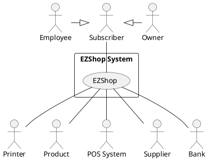
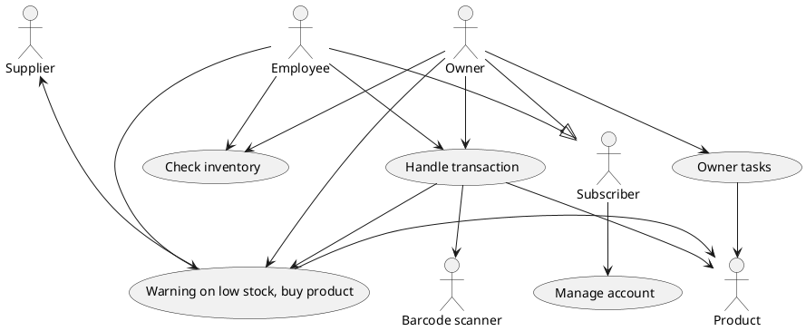
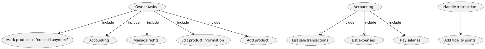
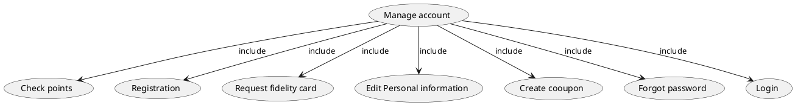
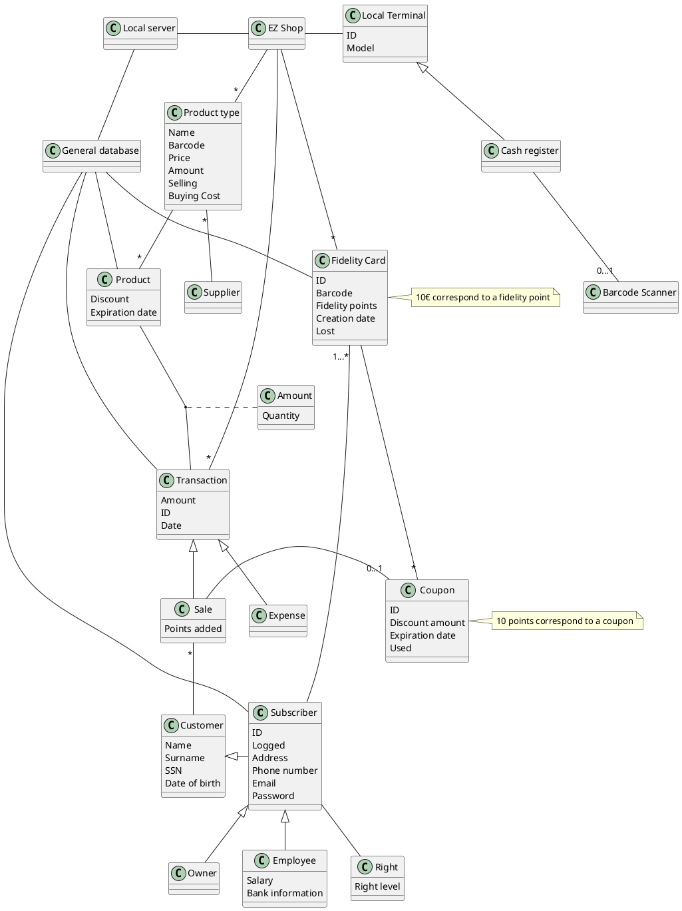
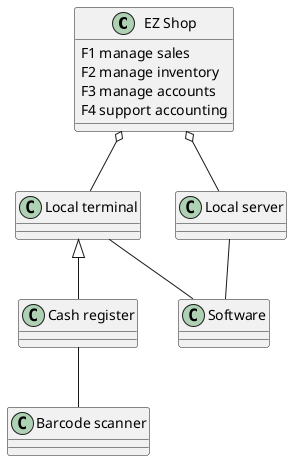
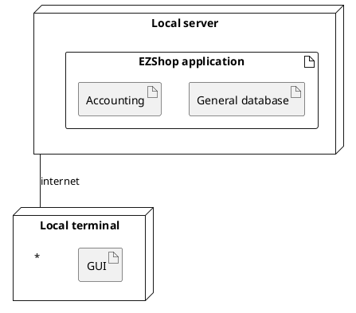

# Requirements Document 

Authors:

Date:

Version:

# Contents

- [Essential description](#essential-description)
- [Stakeholders](#stakeholders)
- [Context Diagram and interfaces](#context-diagram-and-interfaces)
	+ [Context Diagram](#context-diagram)
	+ [Interfaces](#interfaces) 
	
- [Stories and personas](#stories-and-personas)
- [Functional and non functional requirements](#functional-and-non-functional-requirements)
	+ [Functional Requirements](#functional-requirements)
	+ [Non functional requirements](#non-functional-requirements)
- [Use case diagram and use cases](#use-case-diagram-and-use-cases)
	+ [Use case diagram](#use-case-diagram)
	+ [Use cases](#use-cases)
    	+ [Relevant scenarios](#relevant-scenarios)
- [Glossary](#glossary)
- [System design](#system-design)
- [Deployment diagram](#deployment-diagram)

# Essential description

Small shops require a simple application to support the owner or manager. A small shop (ex a food shop) occupies 50-200 square meters, sells 500-2000 different item types, has one or a few cash registers 
EZShop is a software application to:
* manage sales
* manage inventory
* manage customers
* support accounting

# Stakeholders

| Stakeholder name  | Description | 
| ----------------- |:-----------:|
|   Owner     | The owner of the shop            | 
| Subscriber | A customer of that shop that registered using EZ Shop |
| Employee | An employee of the shop |
| Product | A product sold by the shop |
| Fidelity card | A card that contains fidelity points.  |
| POS system | POS system is the place where the customer makes a payment for products in the store |
| Supplier | The supplier from whom the owner buys the products |
| Bank | The bank on which the owner owns an account | 

# Context Diagram and interfaces

## Context Diagram

## Interfaces

Screen, keyboard and mouse on PC: A PC inside the shop that all subscriber can use.

Fidelity card: A card that each subscriber gets when they register.

APIs: Software to connect external systems to EZ Shop logically.

| Actor | Physical Interface | Logical Interface  |
| ------------- |:-------------:| -----:|
| Owner       | Screen keyboard mouse on PC | GUI |
| Employee       | Screen keyboard mouse on PC | GUI |
| Subscriber       | Screen keyboard mouse on PC | GUI |
| Supplier       | Internet connection | Email |
| POS system       | Internet connection | Creditcard API |
| Product       | Laser beam | Barcode |
| Bank | Internet connection | Bank website |
| Printer | Usb cable | Drivers |

# Stories and personas

	-Paolo is 24, he's a student at Polytechnic of Turin. He cannot spend a lot of money because he has a limited budget. For this reason he looks to the biggest discounts in the shop. He likes the fact that he can use the fidelity points to create coupons and have more discounts.
	-Mattia is 27, he works in a little shop in Turin as a cashier. He loves his job and he wants to be as productive as possible. Because of that, he likes to work with a simple system that guarantees simple operations. He hates when there are too many customers in the queue in front of his cash register. Hence he wants to process as many customers as possible.
	-Hossein is 40, he works as an owner in a small shop. He must handle his job and make business decisions. The important part of his task is managing employees in an easy way (He must have an easy Managing App to manage working hours, gain money, reduce human acting …)
	-Stefania is 42, she’s a family mother and she often needs to buy a lot of food  a few times a week. To  quicken this process she would like to waste as little time as possible in line or with the cashier. Due to her fidelity to the shop she would also like to have some kind of reward, such as discounts, based on how much she spends.

# Functional and non functional requirements

## Functional Requirements

| ID        | Description  |
| ------------- |:-------------:| 
|  FR1     | Manage sales |
|  FR1.1     | Handle sale transaction  |
| FR1.2  | Start sale transaction | 
| FR1.3  | End sale transaction| 
| FR1.4  | Apply discount| 
| FR2  | Manage Inventory| 
| FR2.1  | Add new product|
| FR2.2  | Warning on low stock product| 
| FR2.3  | Buy product| 
| FR2.4  | Check inventory| 
| FR2.5  | Mark product as "not sold anymore"| 
| FR2.6  | Increase stock amount| 
| FR2.7  | Decrease stock amount| 
| FR2.8  | Edit product information| 
| FR3  | Manage accounts| 
| FR3.1  | Check fidelity points| 
| FR3.2  | Registration| 
| FR3.3  | Edit personal information| 
| FR3.4  | Add fidelity points| 
| FR3.5  | Create a coupon with fidelity points| 
| FR3.6  | Request fidelity card| 
| FR3.7  | Login| 
| FR3.8  | Logout| 
| FR3.9  | Manage rights| 
| FR3.10  | Forgot Password| 
| FR4  | Support accounting| 
| FR4.1  | Keep track of sale transactions| 
| FR4.2  | Keep track of expenses| 
| FR4.3  | Pay salaries| 
| FR4.4  | List sale transactions| 
| FR4.5  | List expenses| 

## Access right, actor vs function
| Function| Owner| Employee| Subscriber|
| ------------- |:-------------:| :-----:| -----:|
| FR1| Yes| Yes| No|
| FR2.1| Yes| No| No|
| FR2.2| Yes| Yes| No|
| FR2.3| Yes| No| No|
| FR2.4| Yes| Yes| No|
| FR2.5| Yes| No| No|
| FR2.6| Yes| Yes| No|
| FR2.7| Yes| Yes| No|
| FR2.8| Yes| No| No|
| FR3.1| Yes| Yes| Yes|
| FR3.2| Yes| Yes| Yes|
| FR3.3| Yes| Yes| Yes|
| FR3.4| Yes| Yes| No|
| FR3.5| Yes| Yes| Yes|
| FR3.6| Yes| Yes| Yes|
| FR3.7| Yes| Yes| Yes|
| FR3.8| Yes| Yes| Yes|
| FR3.9| Yes| No| No|
| FR3.10| Yes| Yes| Yes|
| FR4| Yes| No| No|

## Non Functional Requirements

| ID        | Type (efficiency, reliability, ..)           | Description  | Refers to |
| ------------- |:-------------:| :-----:| -----:|
|  NFR1     | Usability  | EZ Shop is easy to undestand and use in less than 5 minutes | All|
|  NFR2     | Efficiency | Operations should take less than 10 seconds | All|
|  NFR3     | Portability | EZ Shop should be available on several OS (Windows, MacOS and Linux)| All|
| NFR4 | Privacy | Database data are encrypted| Fr3, Fr4| 
|NFR5 |Localisation | Decimal numbers use . (dot) as decimal separator|

# Use case diagram and use cases

## Use case diagram

## Use cases
### Use case 1, UC1 Manage sale transaction
| Actors Involved        | Employee, Owner, Subscriber, Product |
| ------------- |:-------------:| 
|  Precondition     | Employee E or Owner O are logged in and Product P1, ... , Pn are in the inventory|  
|  Post condition     | Transation T is registered and P1.amount -= T.P1.amount, ... , Pn.amount -= T.Pn.amount |
|  Nominal Scenario     | Read the barcode(s) through manually, scanner or auto-machine. Start sale transaction with scanning each barcode of product(s). End sale transaction and handle product(s) to the customer |
|  Variants     | if there is a discount on a product -> apply discount |
|      | if a subscriber requests a discount and also have a coupon -> apply discount |
|      | if the customer is a subscriber -> add fidelity points |
 
##### Scenario 1.1
| Scenario | Subscriber not registered |
| ------------- |:-------------:| 
|  Precondition     | Employee E or Owner O are logged in, Product P1, ... , Pn are in the inventory and Subscriber S is not registered |
|  Post condition     | Transation T is registered and P1.amount -= T.P1.amount, ... , Pn.amount -= T.Pn.amount |
| Step#        | Description  |
|  1     | The customer approaches the cashier with the products they intent to buy |  
|  2     | The cashier read the barcode(s) through manually or scanner |
|  3     | Start sale transaction |
|  4     | End sale transaction |
|  5     | Decrease quantity of products in the inventory |
  
##### Scenario 1.2
| Scenario | Subscriber without coupon |
| ------------- |:-------------:| 
|  Precondition     | Employee E or Owner O are logged in, Product P1, ... , Pn are in the inventory and Subscriber S is registered |
|  Post condition     | Transation T is registered, P1.amount -= T.P1.amount, ... , Pn.amount -= T.Pn.amount and Subscriber S.FidelityCard.points += newPoints|
| Step#        | Description  |
|  1     | The subscriber approaches the cashier with the products they intent to buy |  
|  2     | The cashier read the barcode(s) through manually or scanner |
|  3     | Start sale transaction |
|  4     | The cashier reads the barcode of fidelity cart |
|  5     | Depending on the total amount of transaction, points will be added (Every 10 euro is equal to 1 point) |
|  6     | End sale transaction |
|  7     | Decrease quantity of products in the inventory |

##### Scenario 1.3
| Scenario |  Add Points |
| ------------- |:-------------:| 
|  Precondition     | Employee E or Owner O are logged in, Product P1, ... , Pn are in the inventory and Subscriber S is registered |
|  Post condition     | Transation T is registered, P1.amount -= T.P1.amount, ... , Pn.amount -= T.Pn.amount and Subscriber S.FidelityCard.points += newPoints |
| Step#        | Description  |
|  1     | The subscriber approaches the cashier with the products they intent to buy and at least a coupon |  
|  2     | The cashier read the barcode(s) through manually or scanner |
|  3     | Start sale transaction |
|  4     | The cashier reads the barcode of fidelity card |
|  5     | The cashier asks the subscriber if they want to use coupon |
|  6     | Depending on the total amount of transaction, points will be added (Every 10 euro is equal to 1 point) |
|  7     | End sale transaction |
|  8     | Decrease quantity of products in the inventory |

### Use case 2, UC2 Waring on low stock, Buy product
| Actors Involved        | Owner, Employee, Product |
| ------------- |:-------------:| 
|  Precondition     | Owner O is logged in or Employee E is logged in, Product P1, ... , Pn have an amount below 10 units and P1, ... , Pn are maked as sold | 
|  Post condition     | P1.amount += newAmount1, ... , Pn.amount += newAmountn | 
|  Nominal Scenario     | Owner decides to buy the product(s) |
|  Variants     | - |
 
##### Scenario 2.1
| Scenario  | Owner decides to buy the product(s)|
| ------------- |:-------------:| 
|  Precondition     | Owner O is logged in, Product P1, ... , Pn have an amount below 10 units and P1, ... , Pn are maked as sold |
|  Post condition     | P1.amount += newAmount1, ... , Pn.amount += newAmountn |
| Step#        | Description  |
|  1     | The system shows that one on more products are low on stock (less than 10 units)  |
|  2     | The owner select the product(s) and the quantity that he/she want to buy |
|  3     | The owner decides to buy the product(s) |
|  4	 | The owner select the amount of the product(s) |
|  4 	 | The product(s) is/are added to the list of expenses |
|  5     | An order is issued |
|  6     | The product(s) is/are delivered |
|  7     | The amount of the product(s) is increased |

##### Scenario 2.1
| Scenario  | Employee wants to view the product(s)|
| ------------- |:-------------:| 
|  Precondition     | Employee E is logged in, Product P1, ... , Pn have an amount below 10 units and P1, ... , Pn are maked as sold |
|  Post condition     | - |
| Step#        | Description  |
|  1     | The system shows that one on more products are low on stock (less than 10 units)  |

 
### Use case 3, UC3 Add product
 
| Actors Involved        | Product, Owner |
| ------------- |:-------------:| 
|  Precondition     | Owner O is logged in, Product P is not in the inventory or P is marked as “not sold anymore” |  
|  Post condition     | Product P is added in the inventory and P is marked as sold |
|  Nominal Scenario     | New product is added to the inventory  |
|  Variants     | If the product(s) is marked as “not sold anymore”-> Product is readded to the inventory |
 
 ##### Scenario 3.1
| Scenario  | New product is added to the inventory |
| ------------- |:-------------:| 
|  Precondition     | Owner O is logged in, Product P is not in the inventory |
|  Post condition     | Product P is added in the inventory and P is marked as sold|
| Step#        | Description  |
|  1     | Owner insert the information about the product that he wants to add to the inventory |  
|  2     | The product(s) is added to the inventory |
|  3     | The system shows the product as low in stock |

 ##### Scenario 3.2
| Scenario  | Product is added to the inventory |
| ------------- |:-------------:| 
|  Precondition     | Owner O is logged in, Product P1, ..., Pn are marked as “not sold anymore” |
|  Post condition     | Product P is added in the inventory and P is marked as sold|
| Step#        | Description  |
|  1     | Owner searches the product(s) that he wants to unmark as "not sold anymore" |  
|  2     | The product(s) is/are unmarked as "not sold anymore"|
|  3     | The system shows the product(s) as low in stock |

### Use case 4, UC4 Check inventory

| Actors Involved        | Owner, Employee, Product |
| ------------- |:-------------:| 
|  Precondition     | Owner O is logged in or Employee E is logged in |  
|  Post condition     | - |
|  Nominal Scenario     | Product(s) is found |
|  Variants     | Product(s) not found |

##### Scenario 4.1
| Scenario  | Product(s) are found |
| ------------- |:-------------:| 
|  Precondition     | Owner O is logged in or Employee E is logged in and Product P1, ... , Pn are in the inventory |
|  Post condition     | - |
| Step#        | Description  |
|  1     | Owner inserts the information about the product(s) that he wants to search |  
|  2     | The product(s) is/are shown |

##### Scenario 4.2
| Scenario  | Product(s) are not found |
| ------------- |:-------------:| 
|  Precondition     | Owner O is logged in or Employee E is logged in and Product P1, ... , Pn are not in the inventory |
|  Post condition     | - |
| Step#        | Description  |
|  1     | Owner inserts the information about the product(s) that he wants to search |  
|  2     | The system shows an empty list |

### Use case 5, UC5 Mark product as "not sold anymore"

| Actors Involved        | Owner, Product |
| ------------- |:-------------:| 
|  Precondition     | Owner O is logged in and Product P1, ... , Pn are not marked as “not sold anymore” |  
|  Post condition     | P1, ... , Pn are marked as not sold anymore|
|  Nominal Scenario     | Product(s) are not sold anymore |
|  Variants     | - |
 
##### Scenario 5.1
| Scenario  | Product(s) are not sold anymore |
| ------------- |:-------------:| 
|  Precondition     | Owner O is logged in and Product P1, ... , Pn are not marked as “not sold anymore” |
|  Post condition     | P1, ... , Pn are marked as not sold anymore|
| Step#        | Description  |
|  1     | Owner searches the product(s) that he wants to not sell anymore |  
|  2     | The system add the product(s) into a list |
|  3     | The owner checks if everything is correct |
|  4     | The owner commit the changes |
|  5     | The product(s) is/are then marked as not sold anymore |

 
 ### Use case 6, UC6 Edit product information

| Actors Involved        | Owner, Product |
| ------------- |:-------------:| 
|  Precondition     | Product P is not marked as “not sold anymore” |  
|  Post condition     | - |
|  Nominal Scenario     | Edit product information |
|  Variants     | - |

##### Scenario 6.1
| Scenario  | Edit product information |
| ------------- |:-------------:| 
|  Precondition     | Product P is not marked as “not sold anymore” |
|  Post condition     | Product P information are changed |
| Step#        | Description  |
|  1     | Owner inserts the barcode about the product that he wants to edit |  
|  3     | The onwner edits the product's information |
|  4     | The onwner commit the changes |

### Use case 7, UC7 Edit Personal information 

| Actors Involved        | Subscriber  |
| ------------- |:-------------:| 
|  Precondition     | Subscriber S is logged in |  
|  Post condition     | Subscriber S information are changed |
|  Nominal Scenario     | The subscriber logs in and changes one or more fields regarding their information.|
|  Variants     | - |

#### Scenario 7.1
|Scenario | Edit Personal information |
| ------------- |:-------------:| 
|  Precondition     | Subscriber S is logged in|  
|  Post condition     | Subscriber S information are changed |
| Step#        | Description  |
|  1     | The subscriber log in |
|  2     | The subscriber clicks on "edit information" in the homepage |
| 3      | The subscriber changes personal information (e-mail, password, date of birth, address(optional), phone number (optional))|
| 4 	   | The subscriber confirms their information clicking on save |

### Use case 8, UC8 Registration, Request fidelity card
| Actors Involved        | Subscriber |
| ------------- |:-------------:| 
|  Precondition     | - |  
|  Post condition     | Subscriber S is created , FidelityCard F is created and S.FidelityCard = F |
|  Nominal Scenario     | Someone requests the registration, new fidelity card is created associated to the subscriber |
|  Variants     | if subscriber entry is already present in the system -> request only the new fidelity card |
 
#### Scenario 8.1
|Scenario | Registration and card requested|
| ------------- |:-------------:| 
|  Precondition     | - |
|  Post condition     | Subscriber S is created, FidelityCard F is created and S.FidelityCard = F |
| Step#        | Description  |
|  1     | New Registration request is issued |
| 2      | The subscriber inserts personal information (e-mail, password, name, surname, SSN, date of birth, address(optional), phone number (optional))|
| 3 	   | The subscriber confirms their information |
| 4	   | The system links the subscriber with a new already printed card  (they will receive it from the cashier when they ask for it)|
 
#### Scenario 8.2
| Scenario | New card requested|
| ------------- |:-------------:| 
|  Precondition     | Subscriber S is logged in|
|  Post condition     | FidelityCard F is created and S.FidelityCard = F |
| Step#        | Description  |
|  1     | The subscriber clicks on “Lost card”|  
|  2     | The system marks the previous card as lost |
|  3     | The system links the subscriber with a new already printed card |
|  4     | The system transfer fidelity points (if any) from the lost fidelity card to the new one |
|  5     | The system transfer coupons (if any) from the lost fidelity card to the new one |
 
 
### Use case 9, UC9 Create a coupon
| Actors Involved        | Subscriber |
| ------------- |:-------------:| 
|  Precondition     | Subscriber S is logged in and S.FidelityCard.points >= 10|  
|  Post condition     | A Coupon is added to the Subscriber S.FidelityCard and S.FidelityCard.points -= N points |
|  Nominal Scenario     | New coupon is generated and added to the Subscriber's Fidelity Card, 10 points for each 10 euro added to the coupon's amount are subtracted from the subscriber’s total |
|  Variants     | - |

#### Scenario 9.1
| Scenario | Create coupon|
| ------------- |:-------------:| 
|  Precondition     | Subscriber S is logged in and S.FidelityCard.points >= 10|
|  Post condition     | A Coupon is added to the Subscriber S.FidelityCard and S.FidelityCard.points -= N points |
| Step#        | Description  |
|  1     | The subscriber clicks on “Create Coupon” in the home page|  
|  2     | The subscriber chooses the amount of the coupon |
|  3     | The subscriber clicks on “Create coupon”  |
|  4     | The system adds the coupon on the fidelity card and subtracts 10 points for each 10 euro added to the coupon's amount from the subscriber’s total |
 
### Use case 10, UC10 Check points
| Actors Involved        | Subscriber |
| ------------- |:-------------:| 
|  Precondition     | Subscriber S is logged in |  
|  Post condition     | - |
|  Nominal Scenario     | The Subscriber views their points |

#### Scenario 10.1
| Scenario | Check Points|
| ------------- |:-------------:| 
|  Precondition     | Subscriber S is logged in |
|  Post condition     | - |
| Step#        | Description |
|  1     | The subscriber checks his/her points | 

 
### Use case 11, UC11 Add Fidelity point
| Actors Involved        | Subscriber, Employee, Owner |
| ------------- |:-------------:| 
|  Precondition     | Employee E is logged in or Owner O is logged in|  
|  Post condition     | Subscriber S.FidelityCard.points += newPoints |
|  Nominal Scenario     |  Adding new points  |
|  Variants     | - |
 
#### Scenario 11.1
| Scenario | Adding new points|
| ------------- |:-------------:| 
|  Precondition     | Employee E is logged in or Owner O is logged in|
|  Post condition     | Subscriber S.FidelityCard.points += newPoints |
| Step#        | Description  |
|  1     | The subscriber buys one or more products |  
|  2     | The employee/owner reads the fidelity card via barcode scanner  |
|  3     | The system calculates the points based on the total of the transaction (Every 10 euro buying, 1 Fidelity point is earned)|
|  4     | The points are added to the subscriber total |
 

### Use case 12, UC12 Login
| Actors Involved        | Subscriber |
| ------------- |:-------------:| 
|  Precondition     | Subscriber S is not logged in |  
|  Post condition     | Subscriber S is logged in |
|  Nominal Scenario     | The subscriber logs in |
|  Variants     | if subscriber is not in the system -> error: Subscriber not found |

#### Scenario 12.1
| Scenario | Login |
| ------------- |:-------------:| 
|  Precondition     |  Subscriber S is not logged in |
|  Post condition     | Subscriber S is logged in |
| Step#        | Description  |
|  1     | The subscriber inserts email and password |  
|  2     | The subscriber click on log in |

#### Scenario 12.2
| Scenario | Login but subscriber not found |
| ------------- |:-------------:| 
|  Precondition     | Subscriber S is not logged in |
|  Post condition     | Subscriber S is not logged in |
| Step#        | Description  |
|  1     | The subscriber insert email and password |  
|  2     | The subscriber clicks on log in |
|  3     | The system shows an error: Subscriber not found |
 
 
### Use case 13, UC13 Manage rights
| Actors Involved        | Owner |
| ------------- |:-------------:| 
|  Precondition     | Owner O is logged in|  
|  Post condition     | Subscriber S information are changed |
|  Nominal Scenario     | The owner changes rights of a subscriber |
|  Variants     | This operation is performed both when there is a new employee or when an employee is dismissed|

#### Scenario 13.1
| Scenario | Manage Rights|
| ------------- |:-------------:| 
|  Precondition     | Owner O is logged in |
|  Post condition     | Subscriber S information are changed |
| Step#        | Description  |
|  1     | The owner clicks on “Manage Rights” |  
|  2     | The owner clicks on the box to change rights |
|  3     | The owner select the new right for the specific subscriber (O: Owner, E: Employee, S: Subscriber)|
|  4     | The owner clicks on “Save”  |

### Use case 14, UC14 List sale transaction
| Actors Involved        | Owner |
| ------------- |:-------------:| 
|  Precondition     | Owner O is logged in and Transaction T1, ..., Tn are recorded |  
|  Post condition     | - |
|  Nominal Scenario     | The owner requests the list of transactions. The list is printed |
|  Variants     | - |

#### Scenario 14.1
| Scenario | Print List of sale transaction|
| ------------- |:-------------:| 
|  Precondition     | Owner O is logged in and Transaction T1, ... , Tn are recorded |
|  Post condition     | - |
| Step#        | Description  |
|  1     | The owner logs in |  
|  2     | The owner clicks on the accounting button on their home page  |
|  3     | The owner clicks on the "Sale transactions" button|
|  4     | The system dispalys a list of all sale transactions |
|  5 	 | The owner clicks on the print button |

 
### Use case 15, UC15 List expenses
| Actors Involved        | Owner |
| ------------- |:-------------:| 
|  Precondition     | Owner O is logged in and Expenses E1, ... , En are recorded |  
|  Post condition     | - |
|  Nominal Scenario     |The owner requests a list of expenses. The list is printed|
|  Variants     | information about payment and delivery is stored in this list |

#### Scenario 15.1
| Scenario | Print List of expenses|
| ------------- |:-------------:| 
|  Precondition     | Owner O is logged in and Expenses E1, ... , En are recorded |
|  Post condition     | - |
| Step#        | Description  |
|  1     | The owner logs in |  
|  2     | The owner clicks on the accounting button on their home page  |
|  3     | The owner clicks on the "Expenses" button|
|  4     | The system dispalys a list of all expenses |
|  5 	 | The owner clicks on the print button |

#### Scenario 15.2
| Scenario | Update information about expenses|
| ------------- |:-------------:| 
|  Precondition     | Owner O is logged in and Expenses E1, ... , En are recorded |
|  Post condition     | Owner O is logged in and Expenses E1, ... , En information are changed  |
| Step#        | Description  |
|  1     | The owner logs in |  
|  2     | The owner clicks on the accounting button on their home page  |
|  3     | The owner clicks on the "Expenses" button|
|  4     | The system dispalys a list of all expenses |
|  5 	 | The owner clicks on one of the checkboxes regurding a specific expense (Invoice, payment or delivery) |
|  6	 | The state of the checkbox is changed and saved by the system |

 
### Use case 16, UC16 Pay salaries 
| Actors Involved        | Owner, Employee |
| ------------- |:-------------:| 
|  Precondition     | Owner O is logged in |  
|  Post condition     | - |
|  Nominal Scenario     | The owner can access a list of all employees, the hours they worked and their respective salaries. The owner can also pay salaries from this window |
|  Variants     | - |

#### Scenario 16.1
| Scenario | Print list of salaries|
| ------------- |:-------------:| 
|  Precondition     | Owner O is logged in and Employee E1, ... , En are registered |
|  Post condition     | - |
| Step#        | Description  |
|  1     | The owner logs in |  
|  2     | The owner clicks on the accounting button on their home page  |
|  3     | The owner clicks on the "Pay salaries" button|
|  4     | The system dispalys a list of all employees and their respective salary |
|  5 	 | The owner clicks on the print button |

#### Scenario 16.2
| Scenario | Pay a salary|
| ------------- |:-------------:| 
|  Precondition     | Owner O is logged in and Employee E1, ... , En are registered |
|  Post condition     | - |
| Step#        | Description  |
|  1     | The owner logs in |  
|  2     | The owner clicks on the accounting button on their home page  |
|  3     | The owner clicks on the "Pay salaries" button|
|  4     | The system dispalys a list of all employees and their respective salary |
|  5 	 | The owner clicks on one of the record in the table |
|  6	 | The system highlights the record |
|  7	 | The "Pay" button is enabled by the system |
|  8	 | The onwer clicks on the button |
|  8	 | The system opens a web page on the bank web site |
|  9 	 | The system initiates a transfer to the employee bank account with the correct amount |
| 10	 | The owner completes the transfer |

### Use case 17, UC17 Display daily balance
| Actors Involved	 	| Owner |
| ------------- |:-------------:| 
|  Precondition     | Owner O is logged in and Transaction T1, ... , Tn are recorded |  
|  Post condition     | - |
| Nominal Scenario | Owner O requests a daily balance and the balance is printed on screen |
|  Variants     | - |

#### Scenario 17.1
| Scenario | Print daily balance|
| ------------- |:-------------:| 
|  Precondition     | Owner O is logged in and Transaction T1, ... , Tn are recorded |
|  Post condition     | - |
| Step#        | Description  |
|  1     | The owner logs in |  
|  2     | The owner clicks on the accounting button on their home page  |
|  3     | The owner clicks on the "Daily balance" button|
|  4     | The system dispalys the daily balance so far |
|  5 	 | The owner clicks on the print button |

### Use case 18, UC18 Forgot Password 
| Actors Involved        | Subscriber |
| ------------- |:-------------:| 
|  Precondition     | Subscriber S is registered |  
|  Post condition     | S.Password = newPassword |
|  Nominal Scenario     | Subscriber insert the email, SSN and the new password. |
|  Variants     | if subscriber is not in the system -> error: Subscriber not found |

#### Scenario 18.1
| Scenario | Forgot Password|
| ------------- |:-------------:| 
|  Precondition     | Subscriber S is registered |
|  Post condition     | S.Password = newPassword |
| Step#        | Description  |
|  1     | The subscriber clicks on Forgot Password |  
|  2     | The subscriber insert the email, SSN and new password  |
|  3     | The subscriber clicks on save |

#### Scenario 18.2
| Scenario | Forgot Password but subscriber not found |
| ------------- |:-------------:| 
|  Precondition     | Subscriber S is not registered|
|  Post condition     | - |
| Step#        | Description  |
|  1     | The subscriber clicks on Forgot Password |  
|  2     | The subscriber inserts the email, SSN and new password  |
|  3     | The subscriber clicks on save |
|  4     | The system shows an error: Subscriber not found |
# Glossary

# System Design

# Deployment Diagram

