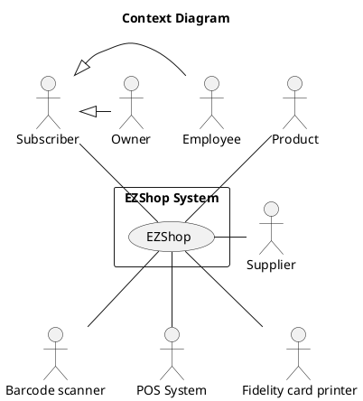
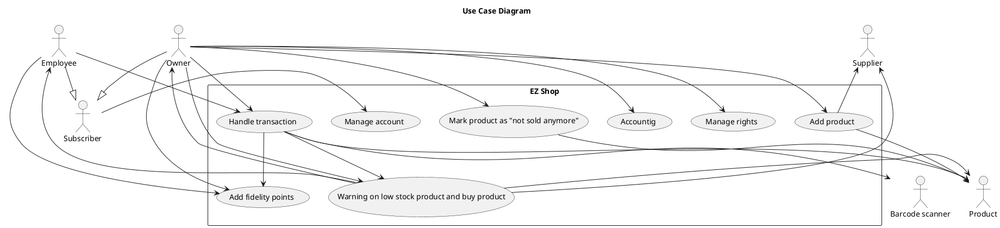
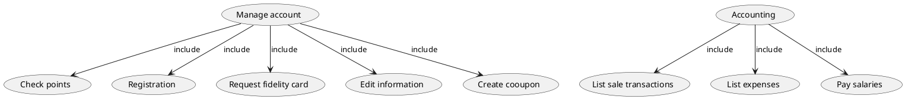
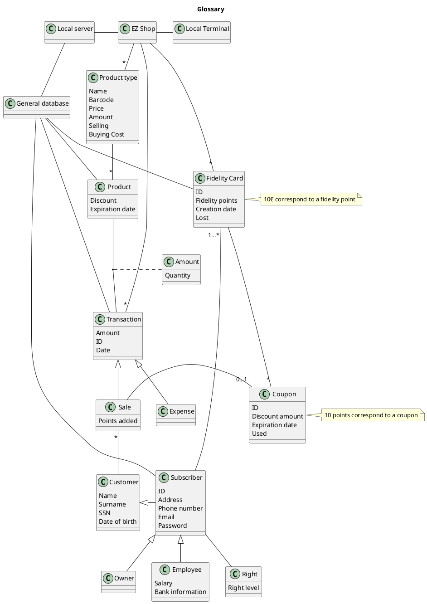
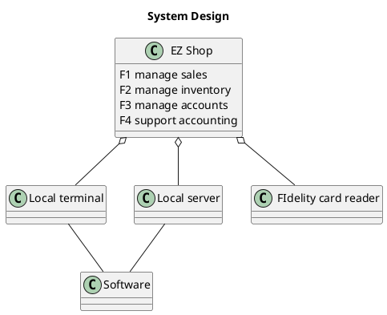
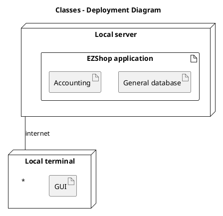

# Requirements Document 

Authors:

Date:

Version:

# Contents

- [Essential description](#essential-description)
- [Stakeholders](#stakeholders)
- [Context Diagram and interfaces](#context-diagram-and-interfaces)
	+ [Context Diagram](#context-diagram)
	+ [Interfaces](#interfaces) 
	
- [Stories and personas](#stories-and-personas)
- [Functional and non functional requirements](#functional-and-non-functional-requirements)
	+ [Functional Requirements](#functional-requirements)
	+ [Non functional requirements](#non-functional-requirements)
- [Use case diagram and use cases](#use-case-diagram-and-use-cases)
	+ [Use case diagram](#use-case-diagram)
	+ [Use cases](#use-cases)
    	+ [Relevant scenarios](#relevant-scenarios)
- [Glossary](#glossary)
- [System design](#system-design)
- [Deployment diagram](#deployment-diagram)

# Essential description

Small shops require a simple application to support the owner or manager. A small shop (ex a food shop) occupies 50-200 square meters, sells 500-2000 different item types, has one or a few cash registers 
EZShop is a software application to:
* manage sales
* manage inventory
* manage customers
* support accounting

# Stakeholders

| Stakeholder name  | Description | 
| ----------------- |:-----------:|
|   Owner     | The owner of the shop            | 
| Subscriber | A customer of that shop that registered using EZ Shop |
| Employee | An employee pf the shop |
| Product | A product sold by the shop |
| Barcode scaner | - |
| POS system | - |
| Supplier | The supplier from whom the owner buys the products |
| Bank | The bank on which the owner owns an account | 

# Context Diagram and interfaces

## Context Diagram

## Interfaces

Screen, keyboard and mouse on PC: A PC inside the shop that all subscriber can use.

Fidelity card: A card that each subscriber gets when they register.

Card reader: Hardware that reads fidelity cards.

APIs: Software to connect external systems to EZ Shop logically.

| Actor | Physical Interface | Logical Interface  |
| ------------- |:-------------:| -----:|
| Owner       | Screen keyboard mouse on PC | GUI |
| Employee       | Screen keyboard mouse on PC | GUI |
| Subscriber       | Screen keyboard mouse on PC | GUI |
| Barcode scanner       | Usb cable | Drivers |
| Supplier       | Screen keyboard mouse on PC | GUI |
| POS system       | Internet connection | Creditcard API |
| Product       | Laser beam | Barcode |
| Fidelity card printer       | Usb cable | Drivers |

# Stories and personas

	-Paolo is 24, he's a student at Polytechnic of Turin. He cannot spend a lot of money because he has a limited budget. For this reason he looks to the biggest discounts in the shop. 	He likes the fact that he can use fidelity to have more discounts.
	-Mattia is 32, he works in a little shop in Turin as a cashier. He loves his job and he wants to be as productive as possible. Because of that, he likes to work with a simple system that guarantees simple operations. He hates when there are too many customers in the queue in front of his cash register. Hence he wants to process as many customers as possible.
	-Hossein is 34, he works as an owner in a small shop. He must handle his job and make business decisions. The important part of his task is managing employees in an easy way (He must have an easy Managing App to manage working hours, gain money, reduce human acting …)
	-Stefania is 42, she’s a family mother and she often needs to buy a lot of food  a few times a week. To  quicken this process she would like to waste as little time as possible in line or with the cashier. Due to her fidelity to the shop she would also like to have some kind of reward, such as discounts, based on how much she spends.

# Functional and non functional requirements

## Functional Requirements

| ID        | Description  |
| ------------- |:-------------:| 
|  FR1     | Manage sales |
|  FR1.1     | Handle sale transaction  |
| FR1.2  | Start sale transaction | 
| FR1.3  | End sale transaction| 
| FR1.4  | Apply discount| 
| FR2  | Manage Inventory| 
| FR2.1  | Add new product|
| FR2.2  | Warning on low stock product| 
| FR2.3  | Buy product| 
| FR2.4  | Check inventory| 
| FR2.5  | Mark product as "not sold anymore"| 
| FR2.6  | Increase stock amount| 
| FR2.7  | Decrease stock amount| 
| FR2.8  | Edit product information| 
| FR3  | Manage accounts| 
| FR3.1  | Check fidelity points| 
| FR3.2  | Registration| 
| FR3.3  | Edit account information| 
| FR3.4  | Add fidelity points| 
| FR3.5  | Create a coupon with fidelity points| 
| FR3.6  | Request fidelity card| 
| FR3.7  | Login| 
| FR3.8  | Logout| 
| FR3.9  | Manage rights| 
| FR3.10  | Forgot Password| 
| FR4  | Support accounting| 
| FR4.1  | Keep track of sale transactions| 
| FR4.2  | Keep track of expenses| 
| FR4.3  | Pay salaries| 
| FR4.4  | List sale transactions| 
| FR4.5  | List expenses| 

## Access right, actor vs function
| Function| Owner| Employee| Subscriber|
| ------------- |:-------------:| :-----:| -----:|
| FR1| Yes| Yes| No|
| FR2.1| Yes| No| No|
| FR2.2| Yes| Yes| No|
| FR2.3| Yes| No| No|
| FR2.4| Yes| Yes| No|
| FR2.5| Yes| No| No|
| FR2.6| Yes| Yes| No|
| FR2.7| Yes| Yes| No|
| FR2.8| Yes| No| No|
| FR3.1| Yes| Yes| Yes|
| FR3.2| Yes| Yes| Yes|
| FR3.3| Yes| Yes| Yes|
| FR3.4| Yes| Yes| No|
| FR3.5| Yes| Yes| Yes|
| FR3.6| Yes| Yes| Yes|
| FR3.7| Yes| Yes| Yes|
| FR3.8| Yes| Yes| Yes|
| FR3.9| Yes| No| No|
| FR3.10| Yes| Yes| Yes|
| FR4| Yes| No| No|

## Non Functional Requirements

\<Describe constraints on functional requirements>

| ID        | Type (efficiency, reliability, ..)           | Description  | Refers to |
| ------------- |:-------------:| :-----:| -----:|
|  NFR1     | Usability  | EZ Shop is easy to undestand and use in less than 5 minutes | All|
|  NFR2     | Efficiency | Operations should take less than 10 seconds | All|
|  NFR3     | Portability | EZ Shop should be available on several OS (Windows, MacOS and Linux)| All|
| NFR4 | Privacy | Database data are encrypted| Fr3, Fr4| 

# Use case diagram and use cases

## Use case diagram

### Use case 1, UC1 Manage sale transaction
| Actors Involved        | Employee or Owner |
| ------------- |:-------------:| 
|  Precondition     | There are one or more product(s) in the shop|  
|  Post condition     | New transaction added, decrease amount of the product(s)) |
|  Nominal Scenario     | Read the bar code(s). Start sale transaction. Read the bar code of each product.End sale transaction. Hand product(s) to the customer |
|  Variants     | if there is a discount on a product -> apply discount |
|      | if a subscriber requests a discount and also have a coupon -> apply discount |
|      | if the customer is a subscriber -> add fidelity points |
 
##### Scenario 1.1
| Scenario | Coupon usage |
| ------------- |:-------------:| 
|  Precondition     |There are one or more product(s) in the shop and the customer is a subscriber with at least a coupon that is not expired |
|  Post condition     | A subscriber bought the product(s)|
| Step#        | Description  |
|  1     | The subscriber approaches the cashier with the products they intent to buy and at least a coupon |  
|  2     | The cashier reads the barcode(s) |
|  3     | Start sale transaction |
|  4     | The cashier asks the subscriber if they want to use a coupon |
|  5     | The subscriber accepts to use a coupon |
|  6     | The coupon is consumed and a discount is applied |
|  7     | End sale transaction |
 
 
### Use case 2, UC2 Waring on low stock, Buy product
| Actors Involved        | Owner |
| ------------- |:-------------:| 
|  Precondition     | One or more products are low stock and maked as sold | 
|  Post condition     | A decision about whether to buy the product or not is made (Ambiguous)| 
|  Nominal Scenario     | Owner decides to buy the product |
|  Variants     | The owner decide to not buy the product(s)|
 
##### Scenario 2.1
| Scenario  | Owner decides to buy the product(s)|
| ------------- |:-------------:| 
|  Precondition     | One or more products are low stock |
|  Post condition     | The product amount is increased |
| Step#        | Description  |
|  1     | The system shows that one on more products are low on stock (less than 10 units)  |  
|  2     | The owner select the product(s) and the quantity that he/she want to buy |
|  3     | The owner decides to buy the product(s) |
|  4 	 | The product(s) is/are added to the list of expenses |
|  5     | An order is issued |
|  6     | The product(s) is/are delivered |
|  7     | The amount of the product(s) is increased |
 

##### Scenario 2.2
| Scenario  | Owner decides not to buy the product(s)|
| ------------- |:-------------:| 
|  Precondition     | One or more products are low stock (less than 10 units)|
|  Post condition     | - |
| Step#        | Description  |
|  1     | The system shows that one on more products are low on stock (less than 10 units) |  
|  3     | The owner decides not to buy the product(s) |
 
### Use case 3, UC3 Add product
 

| Actors Involved        | Product, Owner |
| ------------- |:-------------:| 
|  Precondition     | The product is not in the inventory or marked as “not sold anymore” |  
|  Post condition     | Product is added in the inventory and marked as sold |
|  Nominal Scenario     | New product is added to the system  |
|  Variants     | if the product  is marked as “not sold anymore”, then will be marked as sold |
 
 ##### Scenario 3.1
| Scenario  | New product is added to the inventory |
| ------------- |:-------------:| 
|  Precondition     | The product is not in the inventory |
|  Post condition     | Product is added in the inventory and marked as sold|
| Step#        | Description  |
|  1     | Owner inserts information about the product(s) that he wants to add to the inventory |  
|  2     | The product is added to the inventory |
|  3     | The system show the product as low in stock |

### Use case 4, UC4 Check inventory

| Actors Involved        | Owner, Employee |
| ------------- |:-------------:| 
|  Precondition     | - |  
|  Post condition     | - |
|  Nominal Scenario     | Prouct(s) is found |
|  Variants     | Prouct(s) not found |

##### Scenario 4.1
| Scenario  | Prouct(s) is found |
| ------------- |:-------------:| 
|  Precondition     | The product(s) is in the inventory |
|  Post condition     | - |
| Step#        | Description  |
|  1     | Owner inserts the information about the product(s) that he wants to search |  
|  2     | The product(s) is/are shown |

##### Scenario 4.2
| Scenario  | Prouct(s) is not found |
| ------------- |:-------------:| 
|  Precondition     | The product(s) is not in the inventory |
|  Post condition     | - |
| Step#        | Description  |
|  1     | Owner inserts the information about the product(s) that he wants to search |  
|  2     | The system shows an empty list |

### Use case 5, UC5 Mark product as "not sold anymore"

| Actors Involved        | Owner, Inventory and catalogue system |
| ------------- |:-------------:| 
|  Precondition     | There is/are a/some product(s) not marked as “not sold anymore” |  
|  Post condition     | The product(s) is/are marked as not sold anymore|
|  Nominal Scenario     | Product(s) are not sold anymore |
|  Variants     | - |
 
##### Scenario 5.1
| Scenario  | Product(s) are not sold anymore |
| ------------- |:-------------:| 
|  Precondition     | The product(s) is/are in the inventory |
|  Post condition     | Product(s) is/are marked as not sold anymore|
| Step#        | Description  |
|  1     | Owner inserts the barcode about the product(s) that he wants to not sell anymore |  
|  2     | The system add the product(s) into a list |
|  3     | The owner checks if everything is correct |
|  4     | The owner commit the changes |
|  5     | The product(s) is/are then marked as not sold anymore |

 
### Use case 6, UC6 Edit information 

| Actors Involved        | Subscriber  |
| ------------- |:-------------:| 
|  Precondition     | The subscriber is logged in|  
|  Post condition     | New Informations are committed |
|  Nominal Scenario     | The subscriber logs in and changes one or fields regarding their information. The subscriber logs out.|
|  Variants     | - |

#### Scenario 6.1
|Scenario | Edit informations |
| ------------- |:-------------:| 
|  Precondition     | The subscriber is logged in |
|  Post condition     | New Informations are committed |
| Step#        | Description  |
|  1     | The subscriber log in |
|  2     | The subscriber clicks on edit informations in the home page |
| 3      | The subscriber changes personal information (e-mail, password, date of birth, address(optional), phone number (optional))|
| 4 	   | The subscriber confirms their information clicking on save |

### Use case 7, UC7 Registration, Request fidelity card
| Actors Involved        | Owner, Employee, Subscriber |
| ------------- |:-------------:| 
|  Precondition     | New registration requested |  
|  Post condition     | New account is created |
|  Nominal Scenario     | Someone requests the registration, new fidelity card is created associated to the subscriber |
|  Variants     | if subscriber entry is already present in the system -> create only the new fidelity card |
 
#### Scenario 7.1
|Scenario | Registration and card requested|
| ------------- |:-------------:| 
|  Precondition     | The subscriber to-be clicks on “register” button at the terminal|
|  Post condition     | New fidelity card is created|
| Step#        | Description  |
|  1     | New Registration request is issued |
| 2      | The subscriber inserts personal information (e-mail, password, name, surname, SSN, date of birth, address(optional), phone number (optional))|
| 3 	   | The subscriber confirms their information |
| 4	   | The system links the subscriber with a new already printed card  (they will receive it from the cashier when they ask for it)|
 
#### Scenario 7.2
| Scenario | Lost card requested|
| ------------- |:-------------:| 
|  Precondition     | Subscriber is logged in|
|  Post condition     | New fidelity card is created |
| Step#        | Description  |
|  1     | The subscriber clicks on “Lost card”|  
|  2     | The system marks the previous card as lost |
|  3     | The system links the subscriber with a new already printed card |
|  4     | The system transfer fidelity points (if any) from the lost fidelity card to the new one |
|  5     | The system transfer coupons (if any) from the lost fidelity card to the new one |
 
 
### Use case 8, UC8 Create a coupon
| Actors Involved        | Subscriber  |
| ------------- |:-------------:| 
|  Precondition     | The subscriber is logged in, the subscriber has at least 10 fidelity points|  
|  Post condition     | A new coupon is added to the Subscriber account and his amount of point is decreased by 10|
|  Nominal Scenario     | new coupon is generated and added to the Subscriber account, 10 points are subtracted from the subscriber’s total, the subscriber perform a logout |
|  Variants     | - |

#### Scenario 8.1
| Scenario | Create coupon|
| ------------- |:-------------:| 
|  Precondition     | Subscriber is logged in|
|  Post condition     | New coupon is created |
| Step#        | Description  |
|  1     | The subscriber clicks on “Coupon” in the home page|  
|  2     | The subscriber chooses the amount of the coupon |
|  3     | The subscriber clicks on “Create coupon”  |
|  4     | The system adds the coupon on the fidelity card |
 
### Use case 9, UC9 Check points
| Actors Involved        | Subscriber |
| ------------- |:-------------:| 
|  Precondition     | The subscriber is logged in |  
|  Post condition     | The subscriber logs out|
|  Nominal Scenario     | The Subscriber views their points |

#### Scenario 9.1
| Scenario | Check Points|
| ------------- |:-------------:| 
|  Precondition     | Subscriber is logged in |
|  Post condition     | - |
| Step#        | Description |
|  1     | The subscriber checks points in the homepage | 
|  Variants     | - |
 
### Use case 10, UC10 Add Fidelity point
| Actors Involved        | Subscriber, Cashier |
| ------------- |:-------------:| 
|  Precondition     | The subscriber has Fidelity card |  
|  Post condition     | Fidelity point added |
|  Nominal Scenario     |  Adding new points  |
|  Variants     | - |
 
#### Scenario 10.1
| Scenario | Adding new points|
| ------------- |:-------------:| 
|  Precondition     | The subscriber has Fidelity card and is a part of a transaction |
|  Post condition     | Fidelity point added |
| Step#        | Description  |
|  1     | The subscriber buys one or more products |  
|  2     | The cashier reads the fidelity card via card reader  |
|  3     | The system calculates the points based on the total of the transaction (Every 10 euro buying have 1 Fidelity point)|
|  4     | The points are added  to the subscriber total in the database |
 
 
 
### Use case 11, UC11 Manage rights
| Actors Involved        | Owner |
| ------------- |:-------------:| 
|  Precondition     | The owner is logged in|  
|  Post condition     | The owner logs out and one or more subscribers’ rights have changed|
|  Nominal Scenario     | The owner logs in, accesses the rights of one or more users and changes them. The owner then logs off|
|  Variants     | This operation is performed both when there is a new employee or when an employee is dismissed|

#### Scenario 11.1
| Scenario | Manage Rights|
| ------------- |:-------------:| 
|  Precondition     | The owner is logged in |
|  Post condition     | New changes are committed |
| Step#        | Description  |
|  1     | The owner clicks on “Manage Rights” |  
|  2     | The owner clicks on the box to change rights |
|  3     | The owner select the new right for the specific subscriber (O: Owner, E: Employee, S: Subscriber)|
|  4     | The owner clicks on “Save”  |

 
### Use case 12, UC12 List sale transaction
| Actors Involved        | Owner |
| ------------- |:-------------:| 
|  Precondition     | There are one or more transactions recorded |  
|  Post condition     | - |
|  Nominal Scenario     | The owner requests the list of transactions. The list is printed |
|  Variants     | - |

#### Scenario 12.1
| Scenario | Print List of sale transaction|
| ------------- |:-------------:| 
|  Precondition     | There are one or more transactions recorded |
|  Post condition     | The list of sale transaction is printed |
| Step#        | Description  |
|  1     | The owner logs in |  
|  2     | The owner clicks on the accounting button on their home page  |
|  3     | The owner clicks on the "Sale transactions" button|
|  4     | The system dispalys a list of all sale transactions |
|  5 	 | The owner clicks on the print button |
|  6	 | The list is printed |
 
### Use case 13, UC13 List expenses
| Actors Involved        | Owner |
| ------------- |:-------------:| 
|  Precondition     |There are one or more expenses recorded|  
|  Post condition     | - |
|  Nominal Scenario     |The owner requests a list of expenses. The list is printed|
|  Variants     | Information about payment and delivery is stored in this list |

#### Scenario 13.1
| Scenario | Print List of expenses|
| ------------- |:-------------:| 
|  Precondition     | There are one or more expenses recorded |
|  Post condition     | The list of sale transaction is printed |
| Step#        | Description  |
|  1     | The owner logs in |  
|  2     | The owner clicks on the accounting button on their home page  |
|  3     | The owner clicks on the "Expenses" button|
|  4     | The system dispalys a list of all expenses |
|  5 	 | The owner clicks on the print button |

#### Scenario 13.2
| Scenario | Update information about expenses|
| ------------- |:-------------:| 
|  Precondition     | There are one or more expenses recorded |
|  Post condition     | The inforamtion about an expense is changed |
| Step#        | Description  |
|  1     | The owner logs in |  
|  2     | The owner clicks on the accounting button on their home page  |
|  3     | The owner clicks on the "Expenses" button|
|  4     | The system dispalys a list of all expenses |
|  5 	 | The owner clicks on one of the checkboxes regurding a specific expense (Invoice, payment or delivery) |
|  6	 | The state of the checkbox is changed and saved by the system |

 
### Use case 14, UC14 Pay salaries 
| Actors Involved        | Owner, Employee |
| ------------- |:-------------:| 
|  Precondition     | Employee(s) can receive their salaries  |  
|  Post condition     | Paying Salaries |
|  Nominal Scenario     | If Employee(s) does not receive their salary, system announce the adjourned salaries, or Employee(s) can send their request to the Owner for pay the salaries |
|  Variants     | Customer orientation have encouragement |

#### Scenario 14.1
| Scenario | Print list of salaries|
| ------------- |:-------------:| 
|  Precondition     | There are one or more employees working in the shop |
|  Post condition     | The list is printed |
| Step#        | Description  |
|  1     | The owner logs in |  
|  2     | The owner clicks on the accounting button on their home page  |
|  3     | The owner clicks on the "Pay salaries" button|
|  4     | The system dispalys a list of all employees and their respective salary |
|  5 	 | The owner clicks on the print button |

#### Scenario 14.2
| Scenario | Pay a salary|
| ------------- |:-------------:| 
|  Precondition     | There are one or more employees working in the shop |
|  Post condition     | A salary is payed |
| Step#        | Description  |
|  1     | The owner logs in |  
|  2     | The owner clicks on the accounting button on their home page  |
|  3     | The owner clicks on the "Pay salaries" button|
|  4     | The system dispalys a list of all employees and their respective salary |
|  5 	 | The owner clicks on one of the record in the table |
|  6	 | The system highlights the record |
|  7	 | The "Pay" button is enabled by the system |
|  8	 | The onwer clicks on the button |
|  8	 | The system opens a web page on the bank web site |
|  9 	 | The system initiates a transfer to the employee bank account with the correct amount |
| 10	 | The owner completes the transfer |

### Use case 15, UC15 Forgot Password 
| Actors Involved        | Subscriber |
| ------------- |:-------------:| 
|  Precondition     | Forgot Password requested  |  
|  Post condition     | Password updated |
|  Nominal Scenario     | Subscriber insert the email, SSN and the new password. |
|  Variants     | if subscriber is not in the system -> error: Subscriber not found |

#### Scenario 15.1
| Scenario | Forgot Password|
| ------------- |:-------------:| 
|  Precondition     | Forgot Password Requested|
|  Post condition     | Password updated|
| Step#        | Description  |
|  1     | The subscriber clicks on Forgot Password |  
|  2     | The subscriber insert the email, SSN and new password  |
|  3     | The subscriber clicks on save |

#### Scenario 15.2
| Scenario | Forgot Password but subscriber not found |
| ------------- |:-------------:| 
|  Precondition     | Forgot Password Requested|
|  Post condition     | Password not updated|
| Step#        | Description  |
|  1     | The subscriber clicks on Forgot Password |  
|  2     | The subscriber inserts the email, SSN and new password  |
|  3     | The subscriber clicks on save |
|  4     | The system shows an error: Subscriber not found |

### Use case 16, UC16 Login
| Actors Involved        | Subscriber |
| ------------- |:-------------:| 
|  Precondition     | There is a subscriber that wants to log in  |  
|  Post condition     | Subscriber is logged in |
|  Nominal Scenario     | The subscriber logs in |
|  Variants     | if subscriber is not in the system -> error: Subscriber not found |

#### Scenario 16.1
| Scenario | Login |
| ------------- |:-------------:| 
|  Precondition     |  There is a subscriber that wants to log in |
|  Post condition     | Subscriber is logged in |
| Step#        | Description  |
|  1     | The subscriber inserts email and password |  
|  2     | The subscriber click on log in |

#### Scenario 16.2
| Scenario | Login but subscriber not found |
| ------------- |:-------------:| 
|  Precondition     | There is a subscriber that wants to log in|
|  Post condition     | Subscriber not logged in|
| Step#        | Description  |
|  1     | The subscriber insert email and password |  
|  2     | The subscriber clicks on log in |
|  3     | The system shows an error: Subscriber not found |

### Use case 17, UC6 Edit product information

| Actors Involved        | Owner |
| ------------- |:-------------:| 
|  Precondition     | There is a not marked as “not sold anymore” |  
|  Post condition     | - |
|  Nominal Scenario     | Edit product information |
|  Variants     | - |

##### Scenario 17.1
| Scenario  | Product(s) are not sold anymore |
| ------------- |:-------------:| 
|  Precondition     | There is a product not marked as “not sold anymore” |
|  Post condition     | Product's information are changed |
| Step#        | Description  |
|  1     | Owner inserts the barcode about the product that he wants to edit |  
|  3     | The onwner edits the product's informations |
|  4     | The onwner commit the changes |

# Glossary

# System Design

# Deployment Diagram

