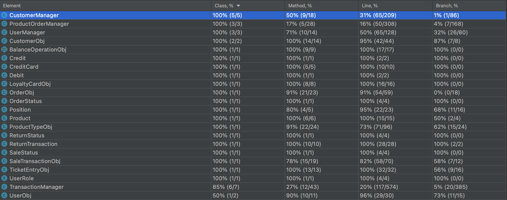

# Unit Testing Documentation

Authors: Stefano, Mattia, Nicola, Hossein

Date: 19 May 2021

Version: 1.0

# Contents

- [Black Box Unit Tests](#black-box-unit-tests)

- [White Box Unit Tests](#white-box-unit-tests)

# Black Box Unit Tests

    <Define here criteria, predicates and the combination of predicates for each function of each class.
    Define test cases to cover all equivalence classes and boundary conditions.
    In the table, report the description of the black box test case and (traceability) the correspondence with the JUnit test case writing the 
    class and method name that contains the test case>
    <JUnit test classes must be in src/test/java/it/polito/ezshop   You find here, and you can use,  class TestEzShops.java that is executed  
    to start tests
    >
### **Class *TransactionManager* - method *luhn***

**Criteria for method *luhn*:**

-Sign of number
-Correctness of String
-Presence of non-numerical values
-Emptiness

**Predicates for method *luhn*:**

| Criteria | Predicate |
| -------- | --------- |
|        Sign of number  |    postive       |
|          |   negative        |
|    Correctness of String      |    79927398713       |
|          |      5     |
| Presence of non-numerical values | iduhsidh|
| Emptiness | ""|
| null | null|

**Combination of predicates**:

| Sign of number | Correctness of String | Presence of non-numerical values|Emptiness |null| Valid / Invalid | Description of the test case | JUnit test case |
|-------|-------|-------|-------|-------|-------|-------|-------|
|Positive|Correct|No|No|No|valid|luhn("79927398713")-> true|it.polito.ezshop.classes.TransactionMangerTest::**testLuhn**|
|Negative|*|*|*|*|invalid|luhn("-79927398713")|it.polito.ezshop.classes.TransactionMangerTest::**testLuhn**|
|*|Incorrect|*|*|*|Invalid|luhn("5")|it.polito.ezshop.classes.TransactionMangerTest::**testLuhn**|
|*|*|Yes|*|*|Invalid|luhn("iduhsidh")|it.polito.ezshop.classes.TransactionMangerTest::**testLuhn**|
|*|*|*|Yes|*|Invalid|luhn("")|it.polito.ezshop.classes.TransactionMangerTest::**testLuhn**|
|*|*|*|*|Yes|Invalid|luhn(null)|it.polito.ezshop.classes.TransactionMangerTest::**testLuhn**|

### **Class *ProductOrderManager* - method *checkBarcode***

**Criteria for method *checkBarcode*:**

-Length of string -Validity of the String

**Predicates for method *checkBarcode*:**

| Criteria                                            | Predicate          |
| --------------------------------------------------- | ------------------ |
|    Validity of the string                           |       yes          |
|                                                     |       no (null)    |
|    Length of the String parameter                   |       < 12         |
|                                                     |       [ 12,14 ]    |
|                                                     |       > 14         |
| Validity of the String according to the check-digit |       yes          |
|                                                     |       no           |
|    Presence of non-numerical values                 |       yes          |
|                                                     |       no           |

**Boundaries**:

| Criteria | Boundary values |
| -------- | --------------- |
|    Length of the String parameter      |       12         |
|                                        |       14         |

**Combination of predicates**:

| Validity of the string | Presence of non-numerical values | Length of the String parameter | Validity of the String according to the check-digit | Description of the test case                                 | JUnit test case                                              |
| ---------------------- | -------------------------------- | ------------------------------ | --------------------------------------------------- | ------------------------------------------------------------ | ------------------------------------------------------------ |
| null                   | *                                | *                              | *                                                   | T1(null; false)                                              | it.polito.ezshop.classes.ProductOrderManagerTest::**testCheckBarcodeNull** |
| yes                    | yes                              | *                              | *                                                   | T2("a2bcde!"; false)                                         | it.polito.ezshop.classes.ProductOrderManagerTest::**testCheckBarcodeNonNum** |
| yes                    | no                               | < 12                           | *                                                   | T3("1234567"; false)                                         | it.polito.ezshop.classes.ProductOrderManagerTest::**testCheckBarcodeLenghtLessThan12** |
| yes                    | no                               | > 14                           | *                                                   | T4("123456789012345"; false)                                 | it.polito.ezshop.classes.ProductOrderManagerTest::**testCheckBarcodeLenghtGreaterThan14** |
| yes                    | no                               | [ 12,14 ]                      | no                                                  | T5("123456789013"; false) T5b("1234567890137"; false) T5c("12345678901377"; false) | it.polito.ezshop.classes.ProductOrderManagerTest::**testCheckBarcodeCheckDigitNotValid** |
| yes                    | no                               | [ 12,14 ]                      | yes                                                 | T6("123456789012"; true) T6b("1234567890128"; true) T6c("12345678901286"; true) | it.polito.ezshop.classes.ProductOrderManagerTest::**testCheckBarcodeCheckDigitValid** |

### **Class *UserObj* - method *setRole***

**Criteria for method *setRole*:**

- Validity of the String parameter

**Predicates for method *setRole*:**

| Criteria | Predicate |
| -------- | --------- |
|    Validity of the String parameter      |     Valid      |
|                                          |      Invalid   |
|                                          |      NULL      |

**Boundaries**:

| Criteria | Boundary values |
| -------- | --------------- |
|    Validity of the String parameter      |        "ADMINISTRATOR", "CASHIER", "SHOPMANAGER"        |

**Combination of predicates**:

| Validity of the String parameter | Valid / Invalid | Description of the test case | JUnit test case |
|-------|-------|-------|-------|
|Valid|Valid|T1("ADMINISTRATOR") -> role set|it.polito.ezshop.classes.UserObjTest::**testSetRoleShopManager**|
|Valid|Valid|T2("CASHIER") -> role set|it.polito.ezshop.classes.UserObjTest::**testSetRoleCashier**|
|Valid|Valid|T3("SHOPMANAGER") -> role set|it.polito.ezshop.classes.UserObjTest::**testSetRoleShopManager**|
|Invalid|Valid|T4("t") -> role not set|it.polito.ezshop.classes.UserObjTest::**testSetRoleInvalidString**|
|NULL|Valid|T5(null) -> role not set|it.polito.ezshop.classes.UserObjTest::**testSetRoleNull**|

# White Box Unit Tests

### Test cases definition

    <JUnit test classes must be in src/test/java/it/polito/ezshop>
    <Report here all the created JUnit test cases, and the units/classes under test >
    <For traceability write the class and method name that contains the test case>

| Unit name | JUnit test case |
|-----------|-----------------|
|src.main.java.it.polito.ezshop.classes.ProductOrderManager | src.test.it.polito.ezshop.classes.ProductOrderManagerTest::**testCheckBarcodeNull**|
| | src.test.it.polito.ezshop.classes.ProductOrderManagerTest::**testCheckBarcodeNonNum** |
| | src.test.it.polito.ezshop.classes.ProductOrderManagerTest::**testCheckBarcodeLenghtLessThan12** |
| | src.test.it.polito.ezshop.classes.ProductOrderManagerTest::**testCheckBarcodeLenghtGreaterThan14** |
| | src.test.it.polito.ezshop.classes.ProductOrderManagerTest::**testCheckBarcodeCheckDigitNotValid** |
| | src.test.it.polito.ezshop.classes.ProductOrderManagerTest::**testCheckBarcodeCheckDigitValid** |
| src.main.java.it.polito.ezshop.classes.CustomerObj  | src.test.it.polito.ezshop.classes.CustomerObjTest::**testSetLoyaltyCard**|
|   |  src.test.it.polito.ezshop.classes.CustomerObjTest::**testSetCustomerName**|
|   |  src.test.it.polito.ezshop.classes.CustomerObjTest::**testSetCustomerCard**|
|   | src.test.it.polito.ezshop.classes.CustomerObjTest::**testSetId** |
|   | src.test.it.polito.ezshop.classes.CustomerObjTest::**testSetPoints** |
|  src.main.java.it.polito.ezshop.classes.UserObj | src.test.it.polito.ezshop.classes.UserObjTest::**testSetId**  |
|   |  src.test.it.polito.ezshop.classes.UserObjTest::**testSetUsername** |
|   |  src.test.it.polito.ezshop.classes.UserObjTest::**testSetPassword** |
|   |  src.test.it.polito.ezshop.classes.UserObjTest::**testSetRoleShopManager**  |
|   | src.test.it.polito.ezshop.classes.UserObjTest::**testSetRoleAdministrator**   |
|   |  src.test.it.polito.ezshop.classes.UserObjTest::**testSetRoleCashier**   |
|   | src.test.it.polito.ezshop.classes.UserObjTest::**testSetRoleInvalidString**   |
|   |  src.test.it.polito.ezshop.classes.UserObjTest::**testSetRoleNull**  |
| src.main.java.it.polito.ezshop.classes.BalanceOperationObj  | src.test.it.polito.ezshop.classes.BalanceOperationObjTest::**testCredit**  |
|   | src.test.it.polito.ezshop.classes.BalanceOperationObjTest::**testDebit**  |
|  src.main.java.it.polito.ezshop.classes.CreditCard |  src.test.it.polito.ezshop.classes.CreditCardTest::**testSetBalance**  |
| src.main.java.it.polito.ezshop.classes.LoyaltyCardObj |  src.test.it.polito.ezshop.classes.LoyaltyCardObjTest::**testSetIsAttached**  |
|  |  src.test.it.polito.ezshop.classes.LoyaltyCardObjTest::**testSetCardCode**  |
|  |  src.test.it.polito.ezshop.classes.LoyaltyCardObjTest::**testSetPoints**  |
| src.main.java.it.polito.ezshop.classes.OrderObj |  src.test.it.polito.ezshop.classes.OrderObjTest::**testSetBalanceOperation**  |
|   |  src.test.it.polito.ezshop.classes.OrderObjTest::**testSetProductCode**  |
|   |  src.test.it.polito.ezshop.classes.OrderObjTest::**testSetPricePerUnit**  |
|   |  src.test.it.polito.ezshop.classes.OrderObjTest::**testSetQuantity**  |
|   |  src.test.it.polito.ezshop.classes.OrderObjTest::**testSetOrderId**  |
|   |  src.test.it.polito.ezshop.classes.OrderObjTest::**testSetBalanceId**  |
|   |  src.test.it.polito.ezshop.classes.OrderObjTest::**testSetProduct**  |
|   |  src.test.it.polito.ezshop.classes.OrderObjTest::**testSetSupplier**  |
|   |  src.test.it.polito.ezshop.classes.OrderObjTest::**testConstructors**  |
| src.main.java.it.polito.ezshop.classes.Position |  src.test.it.polito.ezshop.classes.PositionTest::**testConstructors**  |
| src.main.java.it.polito.ezshop.classes.ProductTypeObj |  src.test.it.polito.ezshop.classes.ProductTypeObjTest::**testSetPosition**  |
|   |  src.test.it.polito.ezshop.classes.ProductTypeObjTest::**testSetDiscountRate**  |
|   |  src.test.it.polito.ezshop.classes.ProductTypeObjTest::**testSetQuantity**  |
|   |  src.test.it.polito.ezshop.classes.ProductTypeObjTest::**testSetLocation**  |
|   |  src.test.it.polito.ezshop.classes.ProductTypeObjTest::**testSetNote**  |
|   |  src.test.it.polito.ezshop.classes.ProductTypeObjTest::**testSetProductDescription**  |
|   |  src.test.it.polito.ezshop.classes.ProductTypeObjTest::**testSetBarCode**  |
|   |  src.test.it.polito.ezshop.classes.ProductTypeObjTest::**testSetPricePerUnit**  |
|   |  src.test.it.polito.ezshop.classes.ProductTypeObjTest::**testSetId**  |
| src.main.java.it.polito.ezshop.classes.ReturnTransaction |  src.test.it.polito.ezshop.classes.ReturnTransactionTest::**testBalanceId**  |
|  |  src.test.it.polito.ezshop.classes.ReturnTransactionTest::**testLocalDate**  |
|  |  src.test.it.polito.ezshop.classes.ReturnTransactionTest::**testMoney**  |
|  |  src.test.it.polito.ezshop.classes.ReturnTransactionTest::**testReturningId**  |
|  |  src.test.it.polito.ezshop.classes.ReturnTransactionTest::**testEntries**  |
|  |  src.test.it.polito.ezshop.classes.ReturnTransactionTest::**testPrice**  |
|  |  src.test.it.polito.ezshop.classes.ReturnTransactionTest::**testStatus**  |
|  |  src.test.it.polito.ezshop.classes.ReturnTransactionTest::**testType**  |
|  |  src.test.it.polito.ezshop.classes.ReturnTransactionTest::**testCopyContructor**  |
| src.main.java.it.polito.ezshop.classes.SaleTransactionObj |  src.test.it.polito.ezshop.classes.SaleTransactionObjTest::**testEntries**  |
|   |  src.test.it.polito.ezshop.classes.SaleTransactionObjTest::**testPrice**  |
|   |  src.test.it.polito.ezshop.classes.SaleTransactionObjTest::**testDiscountRate**  |
|   |  src.test.it.polito.ezshop.classes.SaleTransactionObjTest::**testBalanceId**  |
|   |  src.test.it.polito.ezshop.classes.SaleTransactionObjTest::**testLocalDate**  |
|   |  src.test.it.polito.ezshop.classes.SaleTransactionObjTest::**testMoney**  |
|   |  src.test.it.polito.ezshop.classes.SaleTransactionObjTest::**testType**  |
|   |  src.test.it.polito.ezshop.classes.SaleTransactionObjTest::**testTicketNumber**  |
|   |  src.test.it.polito.ezshop.classes.SaleTransactionObjTest::**testStatus**  |
|   |  src.test.it.polito.ezshop.classes.SaleTransactionObjTest::**testCopyContructor**  |
| src.main.java.it.polito.ezshop.classes.TicketEntryObj |  src.test.it.polito.ezshop.classes.TicketEntryObjTest::**testBarCode**  |
|  |  src.test.it.polito.ezshop.classes.TicketEntryObjTest::**testProductDescription**  |
|  |  src.test.it.polito.ezshop.classes.TicketEntryObjTest::**testAmount**  |
|  |  src.test.it.polito.ezshop.classes.TicketEntryObjTest::**testPricePerUnit**  |
|  |  src.test.it.polito.ezshop.classes.TicketEntryObjTest::**testDiscountRate**  |
|  |  src.test.it.polito.ezshop.classes.TicketEntryObjTest::**testCopyConstructor**  |
| src.main.java.it.polito.ezshop.classes.TransactionManager |  src.test.it.polito.ezshop.classes.TransactionManagerTest::**testBalanceUpdate**  |
|  |  src.test.it.polito.ezshop.classes.TransactionManagerTest::**testLuhn**  |
|  |  src.test.it.polito.ezshop.classes.TransactionManagerTest::**testComputeBalance**  |
| src.main.java.it.polito.ezshop.classes.UserManager |  src.test.it.polito.ezshop.classes.UserManagerTest::**testLogin**  |
|  |  src.test.it.polito.ezshop.classes.UserManagerTest::**testLogout**  |

### Code coverage report

### Loop coverage analysis

    <Identify significant loops in the units and reports the test cases
    developed to cover zero, one or multiple iterations >

|Unit name | Loop rows | Number of iterations | JUnit test case |
|---|---|---|---|
|src.main.java.it.polito.ezshop.classes.ProductOrderManager|88-91|11|**testCheckBarcodeCheckDigitValid**|
|||12|**testCheckBarcodeCheckDigitValid**|
|||13|**testCheckBarcodeCheckDigitValid**|
|||0|**testCheckBarcodeNonNum**|
|src.main.java.it.polito.ezshop.classes.TransactionManager|636-653|11|**testLuhn**|
|||1|**testLuhn**|
|||0|**testLuhn**|

